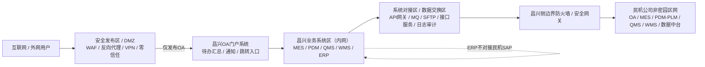

# 昌兴06B厂房接入民机非密园区网——分层分域安全架构设计说明（草案）

> **文档定位**：本文件用于在原《昌兴06B厂房接入民机非密园区网预研方案》基础上，进一步明确“外网访问、OA门户、昌兴内网业务系统、系统对接区、民机非密园区网”的分层分域关系。  
> **适用阶段**：需求澄清、技术预研、网络信息室评审前沟通、领导汇报准备。  
> **重要说明**：本文为草案，不作为最终施工图、费用结论、安全定级结论或正式网络策略配置依据。正式方案需结合设备型号、VLAN/IP规划、访问控制矩阵、等保评审意见和现场条件进一步细化。

---

## 1. 架构升级背景

原有拓扑重点表达“办公楼2F核心机房、厂房主机柜、辅房弱电井、办公楼各楼层接入”等物理链路关系，适合说明弱电主干和接入位置。

随着业务需求进一步明确，单纯的物理链路图已经不足以支撑安全评审。当前新增或明确了以下关键业务关系：

1. **所有昌兴信息化系统均部署在昌兴内网**，包括OA、ERP、MES、PDM、QMS、WMS。
2. **OA系统需要支持外网访问**，但不能直接暴露公网，应通过安全发布区、反向代理、WAF、VPN或零信任方式受控发布。
3. **OA系统承担统一门户角色**，作为待办通知汇总、消息提醒、业务系统跳转入口。
4. **昌兴内网系统需要与民机对应系统进行对接**，但ERP除外，ERP不与民机SAP对接。
5. **外网访问链路与民机非密园区网接入链路必须隔离**，禁止形成“互联网 → 昌兴OA → 昌兴内网 → 民机非密园区网”的跳板路径。

因此，本项目建议由“简单网络拓扑”升级为“分层分域安全架构”。

---

## 2. 总体设计原则

### 2.1 边界先行

所有跨边界访问必须经过安全边界设备，包括：

- 外网访问昌兴OA；
- 昌兴系统访问民机对应系统；
- 民机侧系统与昌兴系统的数据交互；
- 运维访问、接口调用、文件交换、消息同步等场景。

不得私拉线路、私设路由、私建VPN、私自开放公网端口，也不得绕过边界防火墙直连核心交换设备或业务系统服务器。

### 2.2 默认拒绝，按需放行

跨域访问采用“默认拒绝、按需开通、白名单授权、全程审计”的原则。每一条跨域访问策略均应明确：

- 源地址；
- 目标地址；
- 端口协议；
- 访问方向；
- 业务用途；
- 责任部门；
- 开通期限；
- 日志留存要求；
- 应急关闭方式。

### 2.3 OA是门户，不是跳板

OA系统可作为昌兴统一工作门户、待办中心、通知中心和跳转入口，但不得成为外网进入昌兴内网其他系统或民机非密园区网的跳板。

外网用户访问OA时：

- 可以访问经授权的OA页面、待办、通知和审批功能；
- 不得直接访问ERP、MES、PDM、QMS、WMS；
- 不得通过OA间接跳转访问民机非密园区网；
- 如确需从外网访问其他业务系统，应逐系统、逐场景、逐接口单独安全评审。

### 2.4 系统对接统一收敛

昌兴内网系统与民机对应系统对接时，不建议各系统分散直连民机侧系统。建议统一收敛到“系统对接区/数据交换区”，通过API网关、接口服务、消息队列、SFTP、文件交换、数据同步服务等方式集中管控。

---

## 3. 分层分域总体架构

建议形成以下六类安全域：

| 序号 | 安全域 | 主要内容 | 安全定位 |
|---|---|---|---|
| 1 | 外网访问域 | 互联网用户、移动办公用户、外部访问入口 | 外部不可信区域 |
| 2 | 安全发布区 / DMZ | WAF、反向代理、VPN、零信任访问网关 | 外网访问缓冲区，只发布OA |
| 3 | 昌兴办公与生产终端区 | 办公楼终端、厂房终端、生产/办公终端 | 内网用户接入区 |
| 4 | 昌兴业务系统区（内网） | OA、ERP、MES、PDM、QMS、WMS | 昌兴核心业务系统区 |
| 5 | 系统对接区 / 数据交换区 | API网关、接口服务、消息队列、SFTP、数据同步服务、接口审计 | 跨系统、跨组织数据交换收敛区 |
| 6 | 民机互联边界区 | 昌兴侧边界防火墙/安全网关、专线或经审批链路、白名单策略 | 昌兴与民机非密园区网之间的安全边界 |

逻辑关系如下：



---

## 4. 分层说明

### 4.1 第一层：外网访问域

外网访问域包括互联网用户、移动办公用户、外部协同用户等。该区域不可信，不得直接访问昌兴内网业务系统。

允许的访问原则：

- 仅允许访问安全发布区暴露的OA入口；
- 不允许直接访问OA服务器真实地址；
- 不允许直接访问ERP、MES、PDM、QMS、WMS；
- 不允许访问民机非密园区网；
- 不允许通过OA跳板进入其他系统。

### 4.2 第二层：安全发布区 / DMZ

安全发布区用于承接OA外网访问需求。可根据安全评审选择以下一种或多种技术方式：

- WAF；
- 反向代理；
- SSL VPN；
- 零信任访问网关；
- 双因素认证；
- 统一身份认证；
- 访问日志审计；
- 上传下载安全检测。

安全发布区的基本要求：

1. OA不直接暴露公网；
2. 安全发布区只发布OA必要服务；
3. 安全发布区不得路由到民机非密园区网；
4. 安全发布区到OA的访问策略应最小化；
5. 外网访问行为必须记录日志；
6. 支持应急封禁和快速下线。

### 4.3 第三层：昌兴办公与生产终端区

该区域包括：

- 办公楼1F至4F办公终端；
- 厂房1F主机柜下挂生产/办公终端；
- 辅房2F弱电井下挂终端；
- 厂房2F员工活动区弱电间下挂终端。

建议按终端类型进一步划分VLAN：

| VLAN类型 | 建议用途 |
|---|---|
| 办公终端VLAN | OA、门户、日常办公访问 |
| 生产终端VLAN | MES、工位终端、生产看板等 |
| 质量终端VLAN | QMS、检验终端 |
| 仓储终端VLAN | WMS、RF/PDA、条码打印 |
| 运维管理VLAN | 网络设备、服务器管理 |
| 访客/临时终端VLAN | 临时接入，默认不得访问核心业务系统 |

### 4.4 第四层：昌兴业务系统区（内网）

业务系统区部署昌兴内部系统：

| 系统 | 部署位置 | 外网访问 | 是否对接民机 |
|---|---|---|---|
| OA | 昌兴内网 | 允许经安全发布区受控访问 | 是，需与民机OA按模块对接 |
| ERP | 昌兴内网 | 不开放外网 | 不对接民机SAP |
| MES | 昌兴内网 | 默认不开放外网 | 是，按生产数据、工艺文件等场景评审 |
| PDM | 昌兴内网 | 默认不开放外网 | 是，按文件访问、图纸、模型数据评审 |
| QMS | 昌兴内网 | 默认不开放外网 | 是，按质量标准、检验数据等场景评审 |
| WMS | 昌兴内网 | 默认不开放外网 | 是，按库存、物料主数据等场景评审 |

OA的特殊定位：

- OA是统一工作门户；
- OA可展示其他系统待办摘要；
- OA可承载通知中心；
- OA可提供系统跳转入口；
- OA外网访问态下不得穿透其他系统；
- OA与其他系统的数据交互应优先通过内部接口或消息机制实现。

### 4.5 第五层：系统对接区 / 数据交换区

系统对接区是昌兴系统与民机系统之间进行数据互联的统一收敛区域。

建议部署能力包括：

| 能力 | 用途 |
|---|---|
| API网关 | 统一管理系统接口、鉴权、限流、日志 |
| 接口服务 | 承接OA/MES/PDM/QMS/WMS对接逻辑 |
| 消息队列 | 承接异步通知、状态同步、事件推送 |
| SFTP/文件交换 | 承接图纸、工艺文件、质量文件等文件传输 |
| 数据同步服务 | 承接主数据、计划、质量、库存等同步 |
| 接口审计 | 记录接口调用、失败重试、异常告警 |
| 数据脱敏/校验 | 对敏感字段进行过滤、校验和控制 |

核心原则：

- ERP不接入民机SAP；
- OA/MES/PDM/QMS/WMS不得分散直连民机系统；
- 所有跨民机边界的接口统一进入系统对接区；
- 系统对接区再经过昌兴侧边界防火墙/安全网关访问民机非密园区网。

### 4.6 第六层：民机互联边界区

民机互联边界区用于控制昌兴与民机非密园区网之间的跨边界访问。

路径应为：

```text
昌兴系统对接区 / 数据交换区
        ↓
昌兴侧边界防火墙 / 安全网关
        ↓
专线或其他经审批链路
        ↓
民机公司非密园区网
```

民机非密园区网不得直连昌兴办公楼核心交换机。所有跨边界流量均应先经过边界防火墙/安全网关。

---

## 5. 关键业务流向

### 5.1 外网访问OA

```text
互联网 / 外网用户
        ↓
安全发布区 / DMZ
        ↓
WAF / 反向代理 / VPN / 零信任网关
        ↓
昌兴OA门户系统
```

控制要求：

- 仅发布OA；
- 不直接发布OA服务器真实IP；
- 外网访问不得穿透ERP、MES、PDM、QMS、WMS；
- 外网访问不得转发到民机非密园区网；
- 应启用强身份认证、访问日志和异常告警。

### 5.2 内网用户访问昌兴业务系统

```text
办公/生产终端
        ↓
办公楼2F核心机房
        ↓
昌兴业务系统区
        ↓
OA / ERP / MES / PDM / QMS / WMS
```

控制要求：

- 终端分区分VLAN；
- 按岗位授权；
- 生产终端与办公终端适当隔离；
- 重要系统访问应具备日志记录。

### 5.3 OA作为待办与通知入口

```text
MES / PDM / QMS / WMS
        ↓
内部接口 / 消息队列 / 数据同步
        ↓
OA待办中心 / 通知中心
        ↓
用户查看待办并按权限跳转
```

控制要求：

- OA汇总“待办摘要”和“通知消息”；
- 业务详情仍在源系统处理；
- 外网访问OA时，默认只允许查看OA授权范围内内容；
- 外网态跳转其他业务系统需单独审批。

### 5.4 昌兴系统对接民机系统

```text
昌兴OA / MES / PDM / QMS / WMS
        ↓
系统对接区 / 数据交换区
        ↓
昌兴侧边界防火墙 / 安全网关
        ↓
民机非密园区网对应系统
```

控制要求：

- ERP不与民机SAP对接；
- 所有接口需建立接口清单；
- 所有接口需建立访问矩阵；
- 所有接口需纳入日志审计；
- 重要数据需明确脱敏、加密和留存要求。

---

## 6. 建议访问控制矩阵

| 来源区域 | 目标区域 | 是否允许 | 说明 |
|---|---|---:|---|
| 外网访问域 | 安全发布区 | 允许 | 仅允许访问OA发布入口 |
| 外网访问域 | 昌兴业务系统区 | 禁止 | 不允许直连内网系统 |
| 外网访问域 | 民机非密园区网 | 禁止 | 严禁形成外网到民机的通道 |
| 安全发布区 | OA系统 | 允许 | 仅开放OA必要端口 |
| 安全发布区 | ERP/MES/PDM/QMS/WMS | 默认禁止 | 如需开放必须单独评审 |
| OA系统 | MES/PDM/QMS/WMS | 允许，按需 | 用于待办汇总、通知、内部跳转 |
| OA系统 | 民机非密园区网 | 受控 | 仅限经审批的OA对接场景 |
| MES/PDM/QMS/WMS | 系统对接区 | 允许，按需 | 用于系统接口收敛 |
| ERP | 民机SAP | 禁止 | 当前口径为ERP不对接民机SAP |
| 系统对接区 | 民机非密园区网 | 允许，白名单 | 按接口清单逐项开放 |
| 民机非密园区网 | 昌兴业务系统区 | 受控 | 仅限经审批的回调或同步场景 |
| 饭卡机/一卡通网络 | 本项目网络 | 不纳入 | 仅作为边界识别 |
| 安防监控网络 | 本项目网络 | 不纳入 | 仅作为边界识别 |

---

## 7. 网络拓扑表达建议

本项目建议在正式汇报材料中同时保留两类图：

### 7.1 分层分域安全架构图

用于向网络信息室和领导说明：

- 外网如何访问OA；
- OA如何作为门户；
- 昌兴业务系统如何部署在内网；
- 系统如何通过数据交换区对接民机；
- 外网访问链路与民机互联链路如何隔离。

### 7.2 弱电物理链路拓扑图

用于说明现场施工和接入位置：

- 办公楼2F核心机房；
- 办公楼1F至4F接入；
- 1#厂房1F主机柜；
- 辅房2F弱电井；
- 厂房2F员工活动区弱电间；
- 24芯光缆和2芯预留光缆关系。

---

## 8. 民机侧可能关注的问题与建议口径

| 问题 | 建议口径 |
|---|---|
| OA外网访问会不会形成跳板？ | 不会。外网只到安全发布区和OA，禁止转发到民机非密园区网。 |
| 昌兴系统是不是整体接入民机？ | 不是。仅通过系统对接区和边界防火墙按白名单逐项放行。 |
| OA是否直接暴露公网？ | 不直接暴露，必须经WAF/反向代理/VPN/零信任等安全发布能力。 |
| ERP是否对接民机SAP？ | 不对接。 |
| PDM/MES/QMS/WMS如何对接？ | 通过系统对接区/API网关/文件交换/消息队列统一收敛。 |
| 民机非密园区网是否直连核心交换机？ | 不直连，必须先经过昌兴侧边界防火墙/安全网关。 |
| 饭卡机和安防是否纳入？ | 不纳入本次接入范围，仅做边界识别。 |
| 如何审计？ | 外网访问、接口调用、边界访问、文件交换均需留痕审计。 |

---

## 9. 后续需补充材料

正式方案形成前，还需补充：

1. 设备型号、数量、端口规格；
2. 光缆类型、芯数使用计划、预留芯数；
3. 服务器部署位置；
4. VLAN/IP规划；
5. 安全域划分；
6. 访问控制矩阵；
7. 系统接口清单；
8. 数据流向清单；
9. OA外网访问方式选型；
10. 身份认证和账号管理方案；
11. 日志审计方案；
12. 应急封禁和故障处理流程；
13. 运维责任边界；
14. 费用测算；
15. 等保合规评估意见。

---

## 10. 结论

昌兴06B厂房接入民机非密园区网不应按“简单接入办公网”处理，而应采用“分层分域安全架构”。

推荐最终架构为：

```text
外网访问域
    ↓
安全发布区 / DMZ
    ↓
昌兴OA门户系统
    ↓
昌兴业务系统区（内网）
    ↓
系统对接区 / 数据交换区
    ↓
昌兴侧边界防火墙 / 安全网关
    ↓
民机公司非密园区网
```

其中关键红线为：

1. OA可以作为门户，但不得成为外网进入民机网络的跳板；
2. 外网只允许受控访问OA，不开放ERP、MES、PDM、QMS、WMS；
3. ERP不与民机SAP对接；
4. OA/MES/PDM/QMS/WMS如需对接民机系统，应统一通过系统对接区；
5. 所有跨边界访问必须经过防火墙/安全网关，按白名单策略审批、审计和管理；
6. 饭卡机/一卡通网络、安防监控网络不纳入本次接入范围。
