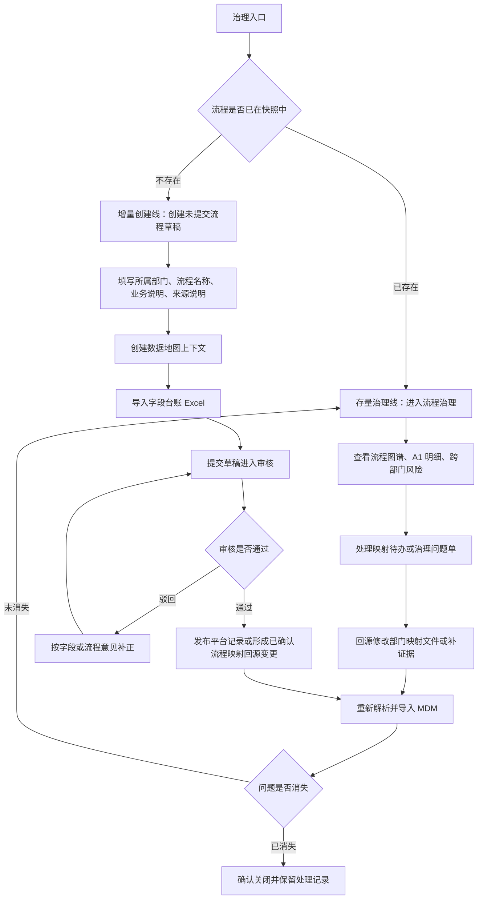

# MDM 治理承接流程

> 状态：流程治理补充说明
> 适用范围：流程地图、字段台账、待确认主数据和治理闭环
> 归属口径：当前按信息化工作组 / MDM 工作组项目执行架构管理，正式常设部门归属待组织真源确认。
> 边界：本文件不替代 `docs/norms/{部门}部门-能力-流程-系统映射关系.md`，也不把 MDM 写入应用系统（S1）。

## 一、补充的能力流程条目

MDM 既是平台入口，也是信息化治理中的一项能力。当前先按“治理承接流程”补充为待确认流程条目，待组织真源明确常设部门归属后，再决定是否进入标准部门三件套。

| 项 | 内容 |
|---|---|
| 责任主体 | 信息化工作组 / MDM 工作组 |
| 部门归属 | 待确认；不得临时并入某个常设部门 |
| 能力域（L1） | 信息化治理与数据治理 |
| 业务能力（L2） | 主数据治理与数据地图承接 |
| 业务流程（L3） | 流程治理快照承接、字段台账沉淀与治理闭环 |
| 制度依据 | `docs/organization/组织架构和部门职责.md` 第四节“信息化工作组与项目执行架构” |
| 应用系统（S1） | 留空；MDM 不是 DCM/BBM 合同允许的 S1 |
| 处理入口 | MDM `角色工作台`、`流程治理`、`数据地图字段域` |
| 完成标准 | 流程地图可追溯到部门映射文件；字段台账有上下文、来源文件和来源锚点；治理问题重新导入后进入可关闭状态 |

## 二、两条治理主线

MDM 平台的治理流程分两条线。第一条线治理“已经进入快照的流程”，第二条线治理“还没有提交的新流程”。两条线最终都要落到字段、证据、审核和发布，区别在于起点不同。

| 主线 | 起点 | 处理对象 | 前端入口 | 结果 |
|---|---|---|---|---|
| 存量治理线 | 已从 `docs/norms/` 解析并导入的流程治理快照 | 已有 L3/A1、跨部门风险、映射待办、治理问题单 | `流程治理` | 回源整改、重新导入、关闭问题 |
| 增量创建线 | 填报人发现现有快照里没有该流程 | 新建流程草稿、字段台账上下文、字段清单、证据说明 | `报送管理`、`能力与流程申报`、`数据地图字段域` | 草稿提交、审批、字段确认、发布或退回 |

“创建”不等于“凭空生效”。填报人可以从无到有创建未提交流程草稿并添加字段，但正式生效前必须补齐：

| 必填内容 | 为什么必须填 |
|---|---|
| 所属部门 | 决定谁负责确认和维护 |
| 流程名称 / L3 描述 | 决定治理对象是什么 |
| 触发情景和业务对象 | 防止只写一个抽象标题 |
| 来源文件 / 来源锚点 | 证明流程不是个人口头理解 |
| 字段台账上下文 | 让字段能追溯到该流程或 A1 |
| 字段清单 | 支撑后续数据地图、黄金源和待确认主数据 |
| 提交说明 | 说明为什么新增、影响哪些部门、是否需要跨部门确认 |

没有来源文件的新增流程可以先作为草稿或待确认保存，但应标为“待部门确认 / 待补证据”，不能直接进入正式流程地图。

## 三、A1 行为拆分

| A1 编号 | 业务行为（A1） | 执行角色 | 输入 | 输出 | 处理入口 |
|---|---|---|---|---|---|
| MDM-L3-01-A01 | 同步组织和流程治理快照 | 信息化负责人 / 管理员 | 组织真源、部门映射文件、公司级快照 | MDM 流程治理快照 | 仓库脚本、`流程治理` |
| MDM-L3-01-A02 | 查看流程图谱并定位部门问题 | 项目组长 / 工作组组长 / 业务对接人 | 流程数、A1 明细、跨部门风险 | 需复核的 L3/A1 清单 | `流程治理 -> 流程图谱` |
| MDM-L3-01-A03 | 处理映射待办 | 业务对接人 / 数据质量员 | 映射待办、来源位置、整改建议 | 处理备注、整改状态 | `流程治理 -> 映射工作` |
| MDM-L3-01-A04 | 建立字段台账上下文 | 业务对接人 / 数据质量员 | L3/A1、来源文件、来源锚点 | 数据地图上下文 | `数据地图字段域` |
| MDM-L3-01-A05 | 导入字段台账 | 业务对接人 / 数据质量员 | Excel 字段清单 | 字段台账记录、字段质量问题 | `数据地图字段域 -> 字段导入` |
| MDM-L3-01-A06 | 复核待确认主数据对象和黄金源 | 数据质量员 / 审核员 | 数据对象、关键字段、消费系统、维护部门 | 待确认主数据、黄金源确认意见 | `流程治理 -> 证据来源`、`数据质量` |
| MDM-L3-01-A07 | 重新导入并关闭治理问题 | 信息化负责人 / 数据质量员 | 已整改的部门映射文件、处理说明 | `source_resolved` 或关闭记录 | `流程治理 -> 治理闭环` |
| MDM-L3-02-A01 | 创建未提交流程草稿 | 填报人 / 业务对接人 | 新流程名称、所属部门、业务说明、来源说明 | 流程映射草稿 | `报送管理`、`能力与流程申报` |
| MDM-L3-02-A02 | 为新流程建立字段上下文 | 填报人 / 业务对接人 | 草稿流程、L3/A1、来源文件、来源锚点 | 数据地图上下文 | `数据地图字段域` |
| MDM-L3-02-A03 | 为新流程导入字段清单 | 填报人 / 业务对接人 | Excel 字段清单 | 字段台账记录 | `数据地图字段域 -> 字段导入` |
| MDM-L3-02-A04 | 提交新流程进入审核 | 填报人 | 流程草稿、字段台账、提交说明 | 审批任务 | `报送管理 -> 提交` |
| MDM-L3-02-A05 | 审核新增流程和字段 | 业务负责人 / 审核员 / 数据质量员 | 流程说明、字段台账、证据说明、跨部门影响 | 通过、驳回或补正意见 | `待办收到`、`评审记录` |
| MDM-L3-02-A06 | 发布或纳入回源整改 | 管理员 / 信息化负责人 | 已通过的新增流程 | 发布记录，或待回写的已确认流程映射变更 | `报送管理`、仓库已确认流程映射文件 |

## 四、总流程图



## 五、流程地图形成方式

流程地图不是在 MDM 页面里直接手工画出来的。它先由部门资料形成标准映射，再由脚本解析成快照，最后进入 PMO 和 MDM。

### 5.1 部门提交什么

| 提交物 | 填什么 | 最低要求 |
|---|---|---|
| 制度 / 规程 | 文件号、版次、条款、流程描述 | 能说明该流程为什么存在 |
| 表单 / 台账 | 表单名、字段名、填写角色、流转节点 | 能说明业务对象和字段从哪里来 |
| 流程图 | 节点、发起角色、审核角色、输出物 | 能说明动作顺序和审批链 |
| 部门确认意见 | 哪些流程有效、哪些待废止、哪些待补 | 能由部门责任人确认 |

### 5.2 仓库侧怎么形成流程地图

| 步骤 | 操作 | 输入 | 输出 |
|---|---|---|---|
| 1 | 在对应部门映射文件补 L1/L2/L3 | 部门资料和条款依据 | `docs/norms/{部门}部门-能力-流程-系统映射关系.md` 主表 |
| 2 | 在同一文件补 A1 行为 | 角色、触发情景、数据输入输出、审批、验收标准 | `## 业务行为（A1）映射` |
| 3 | 运行流程地图解析 | 部门映射文件、组织真源 | `docs/company-sankey-data.json` 和 PMO 驾驶舱内嵌快照 |
| 4 | 同步组织和导入 MDM | 公司级快照 | MDM 流程治理快照 |
| 5 | 在前端复核 | 部门标签、A1 明细、跨部门风险 | 映射待办、治理问题单、处理记录 |

仓库侧命令：

```powershell
cd E:\CA001\Infomat
node scripts/parse-sankey-data.mjs

cd apps/mdm-platform
npm run sync:process-org
npm run import:process-governance
npm run check:process-governance
```

## 六、前端里怎么治理已有流程

| 你要做什么 | 在页面点哪里 | 看什么 | 填什么 / 点什么 |
|---|---|---|---|
| 看本部门流程是否进入 MDM | 登录后进入 `角色工作台`，点“我现在该做什么”里的流程治理事项，或顶部点 `流程治理` | `总览` 中的流程数、A1 行为、跨部门风险 | 不填；先确认有没有当前快照 |
| 定位本部门流程 | `流程治理 -> 流程图谱`，点击本部门标签 | 流程地图、A1 明细、跨部门风险 | 点击 A1 明细行，可带出证据链关注对象 |
| 看证据是否够 | `流程治理 -> 证据来源` | 源文件覆盖、待确认主数据对象、证据链 | 不直接改；记录缺少的文件、条款、页码或表单 |
| 处理映射问题 | `流程治理 -> 映射工作`，在 `映射待办` 表点 `查看` | 类型、部门、目标部门、A1、说明、整改建议 | 点 `标记处理中`；在备注框写“已核对哪份文件、准备调整哪个 L3/A1”；点 `记录备注` |
| 提交处理说明 | 同一条待办详情 | 处理历史和按钮含义 | 点 `提交处理`，备注写“已修改原文 / 等待重新导入验证” |
| 关闭映射待办 | 重新解析并导入后，再回 `映射待办` | 状态变为 `待关闭确认` | 点 `确认关闭`；如果问题仍在，点 `重开` |
| 处理质量问题 | `流程治理 -> 治理闭环`，在问题单点 `查看` | 严重度、来源、说明、整改建议 | 点 `标记整改中`、`提交整改`；重新导入后状态变成 `待关闭确认` 才能点 `确认关闭` |

按钮含义：

| 按钮 | 业务含义 |
|---|---|
| 标记处理中 / 标记整改中 | 责任人已经开始核验或修改原始流程资料 |
| 提交处理 / 提交整改 | 已经写明处理结论，等待重新解析和导入验证 |
| 确认关闭 | 重新导入后问题不再出现，允许关闭 |
| 重开 | 复核后发现问题仍存在，继续跟踪 |

## 七、前端里怎么创建未提交流程并添加字段

这条线处理“现有流程治理快照里没有，但部门认为确实存在”的流程。它的目标不是绕过 `docs/norms/`，而是先在 MDM 形成草稿、字段和审核记录，再由信息化工作组决定是否回写已确认流程映射。

| 步骤 | 在页面点哪里 | 输入什么 | 结果 |
|---|---|---|---|
| 1 | `角色工作台 -> 我现在该做什么` | 先确认是否有“新增流程 / 补流程 / 字段补录”类事项 | 明确是新增线，不是存量待办 |
| 2 | `报送管理` 或 `能力与流程申报` | 新流程名称、所属部门、业务说明、触发情景 | 形成流程或映射草稿 |
| 3 | 草稿说明区 | 填“为什么新增”“依据哪份制度/表单/访谈记录”“涉及哪些部门” | 给审核人判断依据 |
| 4 | `数据地图字段域` | 创建上下文，标题建议写“部门-流程-对象字段上下文” | 字段有归属锚点 |
| 5 | `来源文件` | 填制度、表单、台账、访谈纪要或会议确认记录名称 | 标明证据来源 |
| 6 | `来源锚点` | 填条款、页码、表格名、行号；没有时填“待部门确认” | 标明证据成熟度 |
| 7 | `创建上下文` | 保存上下文 | 新上下文进入下拉框 |
| 8 | `选择上下文` | 选中刚创建的上下文 | 确认字段导入位置 |
| 9 | `字段导入` | 选择 Excel 字段清单，点 `导入字段台账` | 字段进入字段列表 |
| 10 | `报送管理 -> 提交` | 提交说明写清新增原因、字段范围和待确认事项 | 进入审批 |
| 11 | 审核人进入 `待办收到` 或 `评审记录` | 查看流程说明和字段台账 | 通过、驳回或要求补正 |

当前平台需要注意：字段台账的 `数据地图字段域` 入口已经明确；新建流程 / 新建映射的完整前端表单仍在补齐阶段。如果页面没有完整新增按钮，应先按项目约定通过后端接口、导入模板或管理员入口建立草稿，并在文档中保留“待补前端入口”的状态，不要让业务人员误以为已经正式发布。

新增流程的状态边界：

| 状态 | 含义 |
|---|---|
| 草稿 | 填报人正在补流程说明、证据和字段 |
| 已提交 | 等待部门内审、跨部门确认或字段确认 |
| 已驳回 | 审核人认为证据、字段或流程边界不足，退回补正 |
| 已通过 | 平台审批通过，可进入发布或回源整改 |
| 已发布 | 平台记录可被正式引用 |
| 待回源 | 需要同步补入 `docs/norms/{部门}部门-能力-流程-系统映射关系.md` 后重新解析 |

## 八、字段台账形成方式

字段台账不是从系统清单倒推出来的，而是从 L3/A1 里的业务对象和表单字段沉淀出来的。

| 步骤 | 判断问题 | 输出 |
|---|---|---|
| 1 | 这个 A1 处理什么对象？ | 数据对象，例如项目、物料、供应商、合同、设备、工装 |
| 2 | 这个对象在表单或台账里有哪些字段？ | 中文字段名、英文字段名、字段类型 |
| 3 | 字段从哪里产生？ | 来源文件、来源锚点、维护部门 |
| 4 | 谁会消费这个字段？ | 消费系统或消费场景 |
| 5 | 字段如何同步或更新？ | 同步方式、频率、维护责任 |
| 6 | 是否可能成为主数据？ | 待确认主数据对象、待确认黄金源 |

### 8.1 Excel 字段清单怎么填

当前前端推荐用 Excel 导入字段台账。模板可在 `数据地图字段域 -> 下载模板` 获取。至少准备这些列：

| 列 | 怎么填 |
|---|---|
| 数据对象 | 业务对象名称，例如“物料”“供应商”“项目”“工装” |
| 字段说明 | 这个字段的业务含义，不写技术缩写 |
| 中文字段名 | 页面显示的中文名称 |
| 英文字段名 | 接口或数据库可用的英文名；没有就先留空待补 |
| 字段类型 | 文本、数值、日期、枚举、编码、金额等 |
| 消费系统 | 使用该字段的系统或业务场景；多个值用逗号或顿号 |
| 同步方式 | 手工维护、导入、接口同步、只读引用、待确认 |

### 8.2 前端里怎么建字段台账

| 步骤 | 在页面点哪里 | 输入什么 |
|---|---|---|
| 1 | 顶部点 `数据地图字段域` | 进入字段台账工作区 |
| 2 | 在 `上下文标题` 输入框 | 填“部门 + L3/A1 + 对象”，例如“物资保障部-采购入库-物料字段上下文” |
| 3 | 在 `所属部门` 下拉框 | 选择该字段上下文的责任部门 |
| 4 | 在 `来源文件` 输入框 | 填制度、表单、台账或访谈记录名称，例如“GLTX-XM-05-A 项目存货管理程序” |
| 5 | 在 `来源锚点` 输入框 | 填真实条款、页码、表格名或行号，例如“§5.4 入库存储管理” |
| 6 | 点 `创建上下文` | 页面会把新上下文放入 `选择上下文` 下拉框 |
| 7 | 在 `选择上下文` 下拉框 | 确认选中刚创建的上下文 |
| 8 | 点文件选择框 | 选择已整理好的 Excel 字段清单 |
| 9 | 点 `导入字段台账` | 导入成功后页面提示“已导入 N 行” |
| 10 | 看下方 `字段列表` | 核对中文字段名、英文字段名、数据对象、类型、同步方式、消费系统、质量状态 |

如果导入失败，优先检查三件事：

| 现象 | 先查什么 |
|---|---|
| 提示请选择上下文和 Excel 文件 | 是否已经选择 `数据地图上下文`，是否选择了 `.xlsx` 或 `.xls` |
| 字段名被拒绝 | 字段名是否命中禁用词或过于笼统 |
| 导入后字段为空 | Excel 是否使用模板列名，是否至少有 `数据对象` 和 `字段说明` |

## 九、关闭和发布标准

| 对象 | 不能关闭的情况 | 可以关闭的情况 |
|---|---|---|
| 映射待办 | 只在 MDM 写了备注，但原文没有改；或者重新导入后问题还在 | 原文已改，重新导入后状态变成 `待关闭确认` |
| 治理问题单 | 只说“已处理”，没有重新跑质检和导入 | 重新导入后该问题不再出现 |
| 字段台账 | 只有字段名，没有来源文件、来源锚点或业务对象 | 字段能追溯到 L3/A1、来源文件和数据对象 |
| 待确认主数据 | 只看到字段相似，未确认维护部门和黄金源 | 维护部门、审批部门、消费场景和待确认黄金源已记录 |
| 新增流程草稿 | 只有流程名称，没有证据、字段或审核记录 | 已提交审核，字段台账可追溯，必要时已形成回源变更 |

结论：MDM 的治理闭环不是“点了关闭按钮”，而是“源文件已修正，重新导入后问题消失，并留下处理记录”。
