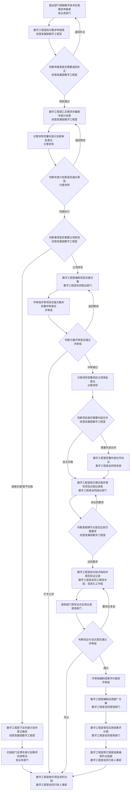

# 沈阳昌兴复材航空科技有限责任公司

## 程序文件

| 项目 | 内容 |
|---|---|
| 文件名称 | 数字化技术研究与应用管理程序 |
| 文件编号 | GLTX-JY-32 |
| 版次 | A |
| 文件类别 | 新建 |
| 发文部门 | 经营发展部 |
| 共 　 页 | （定稿排版后填写） |
| 实施日期 | （批准后填写） |

### 更 改 记 录

| 序号 | 更改单编号 | 更改者签字 | 更改日期 |
|---|---|---|---|
| | | | |
| | | | |

### 分发路线

| 部门 | 经营发展部 | 行政人事部 | 工程技术部 | 财务部 | 质量管理部 | 项目管理部 | 物资保障部 | 复材车间 | 运维安环部 |
|---|---|---|---|---|---|---|---|---|---|
| 份数 | 1 | 1 | 1 | 1 | 1 | 1 | 1 | 1 | 1 |

| 编制 | 校对 | 审核 | 标准化 | 批准 | 归档 | 会签 |
|---|---|---|---|---|---|---|
| | | | | | | |

---

## 1 目的

为规范公司数字化技术研究与应用活动的任务形成、立项、实施、验证评价、推广应用和成果固化，推动人工智能、工业软件等数字技术在公司业务场景中落地，提高公司数字化能力和业务效能，特制定本程序。

## 2 适用范围

2.1 本程序适用于公司各部门提出的数字技术应用需求，以及经批准立项的数字化技术研究与应用项目的全过程管理。

2.2 下列事项不适用本程序，按公司相关制度执行：

a）业务信息系统建设、软硬件采购、网络与基础设施建设；

b）外部合作的合作单位寻源与比价，按采购周期管理程序执行；

c）对外签署合作协议的合同审签，按公司合同审签流程执行；

d）成果固化涉及的管理体系文件修订，按管理体系程序文件编制管理规定执行；

e）需要对外申报政府项目、专利或者软件著作权的，按政策研究与项目申报管理程序执行。

2.3 本程序对上述跨流程事项只规定转办、登记和归档要求。

## 3 术语和定义

3.1 数字技术：人工智能、工业软件、大数据、物联网、数字孪生等可以应用于公司业务的技术。

3.2 数字化技术研究：针对数字技术开展的技术调研、可行性分析、试验开发和验证活动。

3.3 数字技术应用：把研究形成的成果投入公司实际业务场景使用并产生效果的活动。

3.4 试点应用：在限定的部门和业务范围内先行使用数字技术成果并观察效果的应用方式。

3.5 成果固化：把验证有效的成果纳入公司制度、标准、流程文件或者作业指南的活动。

3.6 评审组：为评审数字化技术研究与应用项目而组建的临时评审组织，由数字工程室、提出部门、工程技术部相关人员组成，涉及费用预算时应当有财务部人员参加。

3.7 数字工程室过渡期：数字工程室是公司规划中的内设机构，正式成立前由经营发展部在信息化工作组内指定人员代行其在本程序中的职责；正式成立后由经营发展部更新本程序的执行角色。

## 4 职责

| 部门或者角色 | 主要职责描述 |
|---|---|
| 经营发展部（数字工程室） | 负责核对各部门需求申报表并判定是否退回补正；汇总需求并编制年度数字技术研究与应用计划表；下达年度计划；判定事项实施方式；编制项目实施方案；判定是否需要外部合作；签署外部合作协议；实施研究开发并填写项目过程记录表；判定里程碑节点是否达到方案要求；核对技术指标并填写验证记录；编制应用推广方案；填写应用效果评价表；办理成果固化和项目资料移交。数字工程室正式成立前，由经营发展部在信息化工作组内指定人员代行上述职责 |
| 各业务部门 | 负责填报本部门数字技术应用需求申报表并出具部门负责人意见；按年度计划执行事项并反馈完成情况；指定业务人员配合需求研判、业务试点和应用推广；填写试点应用记录，在应用效果评价表上签署使用部门意见 |
| 评审组 | 负责评审项目实施方案并签署评审意见；判定方案评审是否通过；判定验证与试点是否通过；编制数字技术研究与应用成果评价报告 |
| 工程技术部 | 负责核对工业软件、工艺数字化和产品数据相关的技术指标；参加项目方案评审 |
| 财务部 | 负责项目费用预算审核；参加涉及费用投入的方案评审；对外部合作费用出具核价意见 |
| 信息化工作组 | 负责核对信息安全、网络使用、系统接入、权限和数据传输要求；在需求研判、技术验证环节出具意见 |
| 分管领导 | 负责签署年度计划表审批意见并判定是否通过；签署项目立项审批意见；批准项目中止或者终止事项 |
| 行政人事部 | 负责接收项目归档资料并签收 |

## 5 规定

### 5.1 任务形成

**5.1.1 需求申报**

各部门业务人员根据本部门业务现状和现有系统使用情况，填写 GLTX-JY-32-01-A《数字技术应用需求申报表》，经部门负责人签字确认后提交经营发展部。一份申报表只对应一个业务场景，涉及多个业务场景的应当分别填报。

**5.1.2 需求核验与退回补正**

5.1.2.1 数字工程室收到申报表后逐份核对填写要素。要素完整且业务场景具体的，在“核验结论”栏记明通过并签字；要素缺失或者业务场景不具体的，在“退回补正要求”栏写明具体缺失项和补正期限。

5.1.2.2 补正期限为 3 个工作日。提出部门逾期未补正的，按暂不纳入本年度计划处理并在申报表上注明。

**5.1.3 年度计划编制**

数字工程室合并同类需求并在“备注”列注明合并关系，逐项在“实施方式”列标注立项研究、直接实施或者暂不实施，编制 GLTX-JY-32-02-A《年度数字技术研究与应用计划表》。计划表明细一项一行并标注来源部门。

涉及数据使用、系统接入或者保密要求的需求，数字工程室应当征询信息化工作组意见后再标注实施方式。

**5.1.4 年度计划审批**

5.1.4.1 分管领导审批年度计划表，在“分管领导意见”栏写明同意执行或者退回修改，签字并注明日期。退回时应当写明需要补充的具体内容。

5.1.4.2 年度计划表退回修改的，数字工程室修改后重新报批。

**5.1.5 实施方式判定**

5.1.5.1 数字工程室按下列规则逐项判定事项的实施方式：

a）符合下列任一情形的，确定为立项研究：

1）预算金额 5 万元及以上；

2）涉及 2 个及以上部门；

3）实施周期 3 个月及以上；

4）涉及生产、质量、财务数据，或者需要系统接口改造；

5）需要试验验证且无可用的成熟方案。

b）同时符合下列全部情形的，确定纳入年度计划直接实施：预算金额低于 5 万元、单部门实施、实施周期不足 1 个月、使用成熟工具。

c）年度资源不足，或者与公司年度重点任务不符的，确定为暂不实施，并在“备注”列写明原因。

5.1.5.2 实施方式判定结论随年度计划表一并报分管领导审批。

**5.1.6 计划下达与执行反馈**

5.1.6.1 数字工程室在计划表批准后 5 个工作日内向实施部门下达，在“下达登记”区填写下达日期、接收部门，由接收人签字。

5.1.6.2 确定为直接实施或者暂不实施的事项，实施部门按年度计划执行，在计划表“执行反馈”明细逐项登记事项名称、完成情况和完成日期；完成情况分为已完成、进行中、未启动三档，属于进行中或者未启动的应当写明原因。反馈时点为年度终了后 10 个工作日内。

### 5.2 立项

**5.2.1 实施方案编制**

确定为立项研究的事项，由数字工程室会同提出部门编制 GLTX-JY-32-03-A《数字技术研究与应用项目实施方案》，写明项目目标、研究内容、技术路线、参与人员、资源与费用需求和风险应对措施。

“实施步骤”明细填写实施步骤、时间节点和责任人；“技术指标”明细逐项填写指标名称、指标要求值和验证方法，每项指标必须给出可测量的要求值。

**5.2.2 方案评审**

评审组按目标合理性、技术可行性、资源充分性、风险可控性四项各按 1 至 5 分评分，在“评审意见”栏填写评审结论，全体评审成员在“评审组成员签字”栏签字并注明日期。

**5.2.3 评审结论判定**

5.2.3.1 评审组按下列规则判定评审结论：

a）四项评分合计 16 分及以上，且无单项 2 分及以下的，结论为通过；

b）合计 12 分至 15 分，或者存在单项 2 分及以下的，结论为退回修改；

c）合计低于 12 分的，结论为不予立项。

5.2.3.2 结论为退回修改的，数字工程室修改后重新评审。连续两次评审未通过，或者明确不具备实施条件的，报分管领导同意后终止立项并归档，在实施方案上注明终止理由。

**5.2.4 立项审批**

分管领导在“分管领导审批意见”栏写明同意立项或者不予立项，签字并注明日期。预算金额 10 万元及以上的，按公司预算和授权规则报总经理批准；低于 10 万元的由分管领导批准。

### 5.3 研究开发

**5.3.1 外部合作判定**

数字工程室在项目立项后，按技术路线和公司现有技术能力与资源情况判定是否需要外部合作。符合下列任一情形的，确定为需要外部合作：

a）公司无该领域的专职人员或者专用工具；

b）需要外部授权、资质或者标准符合性认证；

c）外部成熟产品的采购成本较自主开发低 30% 以上，或者实施周期短 50% 以上；

d）需要与外部系统或者平台对接，且对方要求由原厂实施。

不符合上述情形的，确定为自主实施。

**5.3.2 外部合作协议**

5.3.2.1 确定需要外部合作的，由数字工程室会同财务部办理。合作单位选定与比价转采购周期管理程序办理；合同审签转公司合同审签流程办理。

5.3.2.2 预估费用 10 万元及以上的，由财务部出具书面核价意见；低于 10 万元的，由数字工程室比价并附报价单。

5.3.2.3 合作协议应当写明合作内容、交付成果、验收标准、费用、知识产权归属和保密要求。外部合作形成的研究成果归公司所有。协议签署后，数字工程室在实施方案“是否需要外部合作”栏登记协议编号。

**5.3.3 实施与过程记录**

5.3.3.1 数字工程室会同提出部门按实施方案“实施步骤”明细逐步实施，在 GLTX-JY-32-04-A《数字技术研究与应用项目过程记录表》“过程记录”明细逐条登记记录日期、节点或事项、实施情况和实施人。

5.3.3.2 实施过程中发生重要技术选择、方案调整或者异常情况的，应当在对应列写明。涉及数据使用和系统接入的，应当符合公司信息安全和保密要求。

5.3.3.3 到达里程碑节点且阶段成果达成方案要求的，在“确认人签字”和“确认日期”栏签署后转入下一节点。

**5.3.4 里程碑节点判定**

5.3.4.1 数字工程室按实施方案“实施步骤”明细中该节点的阶段成果要求，判定里程碑节点是否达到方案要求。

5.3.4.2 未达到要求的，在“异常情况”列写明差距、补救措施和新的完成期限后退回继续实施。无法继续实施的，报分管领导同意后中止或者终止，并形成书面结论。

### 5.4 验证与评价

**5.4.1 技术验证**

全部里程碑节点达到方案要求后，数字工程室会同工程技术部、信息化工作组开展技术验证，填写 GLTX-JY-32-05-A《技术验证与试点应用记录表》。

在“指标核对”明细逐条填写指标名称、方案要求值、实际结果、偏差比例和结论；填写验证环境、验证内容与方法和“技术验证结论”栏。涉及系统接入和数据传输的，由信息化工作组在“信息化工作组意见”栏确认信息安全和网络使用要求。

**5.4.2 业务试点**

技术验证结论达到方案要求的，由使用部门在限定的部门和业务范围内开展试点，填写“试点记录”明细，包括试点部门、试点范围、试点时间、业务效果记录、问题与反馈和试点结论。

业务效果记录应当对照实施方案的预期成果填写并给出量化对比。试点周期不少于 2 周。试点期间发现的问题反馈数字工程室处理。

**5.4.3 验证与试点结论判定**

5.4.3.1 评审组按下列规则判定验证与试点结论：

a）全部指标实际结果达到方案要求值的 90% 及以上，安全性和精度类关键指标 100% 达到要求，且试点期间无停工或者数据错误、使用部门可以独立操作的，结论为通过；

b）指标实际结果达到方案要求值的 70% 至 90%，或者存在可以整改的操作问题的，结论为整改后复验；

c）指标实际结果低于方案要求值的 70%，或者无法满足业务要求的，结论为终止。

5.4.3.2 结论为整改后复验的，整改完成后重新进行技术验证。结论为终止的，报分管领导同意后归档，并将终止结论记入记录表。

**5.4.4 成果评价**

评审组编制 GLTX-JY-32-06-A《数字技术研究与应用成果评价报告》，填写项目完成情况、技术水平说明、业务价值、应用范围与推广条件、费用投入与效果，给出评价结论和推广应用建议，全体评审成员签字。

技术水平分国内先进、行业领先、公司首次应用三档；业务价值分显著（效率提升 30% 及以上）、一般（效率提升 10% 至 30%）、有限（效率提升低于 10%）三档。技术水平和业务价值均不低于“一般”的，判定为具备应用条件。

### 5.5 应用推广与固化

**5.5.1 应用推广方案**

成果评价结论为具备应用条件的，由数字工程室会同使用部门编制 GLTX-JY-32-07-A《应用推广方案》，在“推广范围”和“实施步骤”明细中写明推广部门、实施步骤、责任部门与人员，填写时间安排、培训要求、数据与权限要求。

推广实施前应当完成不少于 1 轮操作培训。推广过程中涉及系统权限和数据使用的，应当符合公司相关要求。

**5.5.2 应用效果评价**

推广实施满 1 个月后，由数字工程室会同使用部门填写 GLTX-JY-32-08-A《应用效果评价表》，逐项填写预期目标、实际效果、差异与原因。实际效果应当对照项目目标填写可核对的数据或者事实。使用部门在“使用部门意见”栏签署意见。

**5.5.3 成果固化**

5.5.3.1 验证有效的成果，由数字工程室按下列方式固化：

a）按公司管理体系程序文件编制管理规定办理制度修订或者新增；

b）编制作业指南并纳入受控文件。

5.5.3.2 需要对外申报政府项目、专利或者软件著作权的，转政策研究与项目申报管理程序办理。

5.5.3.3 固化情况在应用效果评价表“后续建议”栏登记。

**5.5.4 资料归档**

5.5.4.1 项目完成后，数字工程室按表单编号顺序整理全套资料，填写 GLTX-JY-32-09-A《项目资料移交清单》，逐项登记资料名称、表单编号和份数。

5.5.4.2 行政人事部核对份数后在“接收人签字”栏签收并填写接收日期。资料不齐备的退回数字工程室补齐后重新移交。

### 5.6 过渡期安排

5.6.1 数字工程室正式成立前，本程序中数字工程室的职责由经营发展部在信息化工作组内指定人员代行。信息化工作组为司人字〔2026〕63号文件成立的正式工作组。

5.6.2 数字工程室正式成立后，由经营发展部更新本程序的执行角色，并按公司工作角色管理规定向行政人事部申请正式工作角色编码。

## 6 流程

6.1 本程序流程共 25 个节点，其中判断节点 7 个；流转关系共 33 条，其中退回与复验回路 5 条。

6.2 流程图为“行为名／执行部门”两行节点的纵向流程图，节点顺序如下：

**阶段一 任务形成**

1. 提出部门填报数字技术应用需求申报表 —— 各业务部门
2. 数字工程室核对需求申报表 —— 经营发展部数字工程室
3. 数字工程室判断申报表是否需要退回补正 —— 经营发展部数字工程室（判断）
4. 数字工程室汇总需求并编制年度计划表 —— 经营发展部数字工程室
5. 分管领导签署年度计划表审批意见 —— 分管领导
6. 分管领导判断年度计划表是否通过审批 —— 分管领导（判断）
7. 数字工程室判断事项是否需要立项研究 —— 经营发展部数字工程室（判断）
8. 数字工程室下达年度计划并登记接收 —— 经营发展部数字工程室
9. 实施部门反馈年度计划事项完成情况 —— 各业务部门

**阶段二 立项**

10. 数字工程室编制项目实施方案 —— 经营发展部数字工程室会同提出部门
11. 评审组评审项目实施方案并签署评审意见 —— 评审组
12. 评审组判断方案评审是否通过 —— 评审组（判断）
13. 分管领导签署项目立项审批意见 —— 分管领导

**阶段三 研究开发**

14. 数字工程室判断项目是否需要外部合作 —— 经营发展部数字工程室（判断）
15. 数字工程室签署外部合作协议 —— 经营发展部数字工程室会同财务部
16. 数字工程室按方案实施并填写项目过程记录表 —— 经营发展部数字工程室会同提出部门
17. 数字工程室判断里程碑节点是否达到方案要求 —— 经营发展部数字工程室（判断）

**阶段四 验证与评价**

18. 数字工程室核对技术指标并填写验证记录 —— 经营发展部数字工程室会同工程技术部、信息化工作组
19. 使用部门填写试点应用记录 —— 使用部门
20. 评审组判断验证与试点是否通过 —— 评审组（判断）
21. 评审组编制成果评价报告 —— 评审组

**阶段五 应用推广与固化**

22. 数字工程室编制应用推广方案 —— 经营发展部数字工程室会同使用部门
23. 数字工程室填写应用效果评价表 —— 经营发展部数字工程室会同使用部门
24. 数字工程室修订制度或者编制作业指南 —— 经营发展部数字工程室会同行政人事部
25. 数字工程室移交项目资料归档 —— 经营发展部数字工程室会同行政人事部

6.3 流程图（供制图使用）：

## 7 规定表格

| 序号 | 表格编码 | 表格名称 |
|---|---|---|
| 1 | GLTX-JY-32-01-A | 数字技术应用需求申报表 |
| 2 | GLTX-JY-32-02-A | 年度数字技术研究与应用计划表 |
| 3 | GLTX-JY-32-03-A | 数字技术研究与应用项目实施方案 |
| 4 | GLTX-JY-32-04-A | 数字技术研究与应用项目过程记录表 |
| 5 | GLTX-JY-32-05-A | 技术验证与试点应用记录表 |
| 6 | GLTX-JY-32-06-A | 数字技术研究与应用成果评价报告 |
| 7 | GLTX-JY-32-07-A | 应用推广方案 |
| 8 | GLTX-JY-32-08-A | 应用效果评价表 |
| 9 | GLTX-JY-32-09-A | 项目资料移交清单 |

## 8 记录控制

本程序涉及的 9 张关联表单由经营发展部归档，保存期限为长期，不设销毁节点，期满后按公司档案管理规定处置。

数字化技术研究与应用项目资料由数字工程室整理成套后移交行政人事部，行政人事部按公司档案管理要求保存。

---

## 编制说明（非制度正文，定稿时删除）

### 一、本稿的来源与状态

本稿由结构化编制文件 `GLTX-JY-32-A数字化技术研究与应用管理程序-3001编制文件-v7.json`（`process-governance-v7`）生成，流程事实、判据数值和表单编号与该文件一致。文件尚未经审批发布。

### 二、判据数值的确认状态

下列数值为业界通行的分档参考值，用于消除判据留白。**在制度正式发布前，应当由经营发展部确认或者替换为公司的实际口径**：

| 条款 | 判据 | 本稿取值 |
|---|---|---|
| 5.1.5.1 a） | 立项研究阈值 | 预算 5 万元、涉及 2 个部门、周期 3 个月 |
| 5.2.3.1 | 方案评审分档 | 四项各 1–5 分，通过 ≥ 16 且无单项 ≤ 2，不予立项 < 12 |
| 5.2.4 | 立项审批授权层级 | 10 万元及以上报总经理批准 |
| 5.3.1 | 外部合作判据 | 成本低 30% 以上、周期短 50% 以上等四项情形 |
| 5.3.2.2 | 财务部核价限额 | 10 万元及以上出具书面核价意见 |
| 5.4.3.1 | 验证通过标准 | 指标 ≥ 要求值 90%、关键指标 100% 达标 |
| 5.4.4 | 成果评价分档 | 效率提升 30% / 10% 分档 |
| 5.1.6.2 | 反馈时点 | 年度终了后 10 个工作日内 |
| 5.4.2 | 试点周期 | 不少于 2 周 |

### 三、需要确认的事实

1. 数字工程室为规划中的内设机构，尚未正式成立，本稿按第 5.6 条处理过渡期；正式成立后应当更新执行角色并申请正式工作角色编码。
2. 评审组为临时组织，本稿在术语中明确其构成；如需正式建制，应当由公司另行发文。
3. 分发路线中的部门名称按组织现状填写；定稿时由发文部门按行政人事部要求核对。
4. 本稿的 9 张关联表单均为拟新建表单，公司现有表单中无同编号文件。
