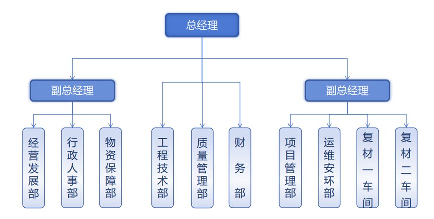

# 公司组织架构及部门职能

## 5.1 组织架构

## 5.2 经营发展部

### 5.2.1 负责公司市场、战略规划；

- 负责制定公司发展战略，制定公司中长期发展规划；
- 负责制定和调整公司发展战略规划，负责分解战略目标为年度计划；
- 负责公司业务拓展、投资、合资、并购及战略重组；

### 5.2.2 负责公司组织绩效；

负责公司组织绩效考核方案的制定，并进行考核；

### 5.2.3 负责公司技改、管理体系；

- 负责公司管理体系的搭建，管理流程、业务流程的梳理及管理；
- 负责公司基建和技改的组织工作；
- 负责公司技改材料的归档

### 5.2.4 负责制定公司企业文化；

### 5.2.5 负责所管辖的公司资产管理；

### 5.2.6 政府项目申报和管理

- 负责公司项目申报规划；
- 负责组织公司各类项目申报；
- 负责公司项目申报情况跟进；
- 负责组织公司项目结题验收；
- 负责公司项目资料归档。

### 5.2.7 新项目招投标工作

- 根据市场客户需求负责制作标书、报价、谈价等各项经营活动，为公司业务承接主要对接部门；
- 根据公司法人委托代理权限的要求负责产品销售合同的签订、执行及管理；
- 负责提供市场价格信息并按客户要求提出价格调整意见；
- 负责完成质量体系、环境体系与其它管理体系所规定的职责。

### 5.2.8 销售工作

- 负责收集整理市场各类信息，对产品市场趋势进行分析预测，并对产品开展市场调研；
- 负责组织签订合同后与甲方保持良好的沟通，维护客户关系；
- 负责公司各项目销售订单的下发；
- 负责制定回款计划，并按计划清收货款；
- 负责收集客户需求，并按客户要求提出合理意见；
- 负责产品的售前、售中、售后服务，维护公司信誉；
- 负责完成质量体系、环境体系与其它管理体系所规定的职责。

### 5.2.9 工时定额工作

- 负责掌握了解车间各工种，岗位劳动力使用情况；
- 负责按照公司规定及工序实际情况制订工时标准；
- 负责各工种、工序的工时情况收集、整理及汇报；
- 负责各车间工时制定的合理性并对不合理项进行优化调整；
- 根据工艺规程并结合工作实际情况，负责计算各车间人员工时定额；
- 负责各车间工时定额的统计分析工作，保证工时定额的合理性。

### 5.2.10 采购管理

- 负责公司物料的采购管理；
- 负责公司设备、原材料、消耗品等物资采购的供应商寻源工作,确定任务价格，保证采购任务质量；
- 确定候选供应商，组织开展招（议）标工作；
- 负责签订工具、劳保用品、办公用品的寻源定点、定价工作；
- 负责建立和维护合格供应商资源库；
- 负责采购结算依据的确认，并按公司流程做好付款手续；
- 负责制订供应商年度降本计划及推进商务谈判；
- 负责建立采购订单跟踪流程，负责订单的检查、修订及异常情况上报与处理；
- 负责组织到货物资、物品的质量、数量进行验收；
- 定期汇总数据，评判外协厂家加工能力，积极开发新采购厂家，持续推进降低公司采购成本。

### 5.2.11 负责法律事务及合同审查相关工作，确保公司经营管理工作依法进行，防范公司经营管理过程中出现的法律风险，应对法律纠纷。

### 5.2.12 负责公司证照管理

- 负责公司证照管理、保管及使用登记，包括但不限于营业执照（正副本）、不动产权证书等证书，确保证照存放安全，防止滥用和丢失；
- 负责制定证照管理办法，建立证照使用登记台帐并组织实施；
- 负责证照变更、年审、换证；
- 负责证照遗失与处置。

### 5.2.13 软件工程-数字化治理

- 负责公司数字化建设的规划、治理与工程实施。
- 建立数字化项目、业务流程、数据、应用及技术架构的统一管理体系，组织业务流程梳理、优化与结构化，推进主数据、数据标准、数据质量及数据资产治理。
- 负责数字化项目全过程管理、供应商技术管理及成果验收，持续提升公司业务数字化、数据治理和系统工程能力。
- 负责信息系统规划、需求分析、架构设计、系统集成、自主开发及实施交付，统筹ERP、PLM、MES、OA等业务系统建设与协同。
- 开展人工智能、工业软件等数字技术研究与应用。
- 负责拟定数字化治理管理制度；
- 负责组织主数据编码标准的制定，一物一码；

### 5.2.14 硬件工程

- 网络物理基础设施建设与施工，包括光纤、网线、信息点、桥架、配线架等综合布线及现场施工任务；
- 网络硬件设备安装与日常维护，包括交换机、路由器、无线AP等设备的上架、布线、故障维修和硬件更换；
- 办公终端及通用外设运维，包括台式机、笔记本、打印机、扫描仪、显示器等设备的安装、维修、搬迁和现场故障处理；
- 会议及多媒体硬件保障，包括会议电脑、投影仪、电视、麦克风、音响、视频会议终端等设备的布置、调试、值守和故障处理；
- 机房及弱电配套工程实施，包括机柜、UPS、PDU、供配电、制冷、门禁、监控及其他机房环境设施的安装、施工和日常硬件维护；
- 负责拟定硬件管理制度，并形成管理台账；
- 负责弱电管理，保障公司弱电系统使用正常运行，及权限管理（包括但不限于电梯、监控、通信等）；

### 5.2.15 定期与客户、供应商核对往来款项，防止呆账、坏账；

### 5.2.16 负责总部沈阳地区的工装经营相关工作（不含沈飞军机）；

### 5.2.17 组织召开月度经营例会，定时汇报公司经营状况。

### 5.2.18 负责本部门岗位说明书的编写；

### 5.2.19 负责本部门新入职员工的岗位培训，核心包括岗位说明书解读、岗位职责、具体工作操作规范、三级安全培训、岗位所需技能、绩效目标等；

### 5.2.20 负责本部门相关文档的管理工作；

### 5.2.21 负责完成公司领导交办的其他工作。

## 5.3 行政人事部

### 5.3.1 会务、接待

- 负责组织安排公司级各类活动的会务支持，负责组织召开由总经理/副总经理主持的公司级会议，并作好会议纪要整理下发以及督办落实工作；其它部门组织召开的公司级会议，由组织部门负责整理并下发会议纪要并督办落实工作。行政人事部负责定期检查各部门会议纪要的完成情况；
- 负责公司公共会议室管理及总经理办公室、公共会议室等区域办公设备、设施等固定资产的管理工作；
- 负责水果、烟酒、矿泉水、礼品等的招待物质的采购提报，负责公司行政库房的领用及出入库管理；
- 负责起草董事长/总经理讲话稿、会议材料等，安排董事长/总经理差旅和接待事务；
- 负责公司外联接待工作；
- 负责前台接待。

### 5.3.2 用印管理

- 负责公司印章管理；
- 负责公司公章、法人章、签字章的保管，对需要盖章的所有材料进行审核，确认领导审批后再进行盖章；
- 负责拟定及完善印章管理制度，并建立管理台帐。

### 5.3.3 公文、档案

- 负责公文的日常接收与发布；
- 负责公文的撰写、编号及登记；
- 负责管理和维护公司各部门档案，确保合规性和可追溯性；
- 负责拟定及完善公文和档案管理制度；

### 5.3.4 车队管理

- 负责日常公司车队及领导车辆的维护和保养；
- 负责公司车队小车的调度；
- 负责拟定及完善车辆管理制度，并建立管理台帐，有明确出车记录；
- 负责车辆年检、及保险的办理。

### 5.3.5 办公用品管理

- 负责办公用品的需求统计并配合采购进行选品；
- 负责办公用品的领用；
- 负责办公用品的入库与出库；
- 负责办公用品的盘点；
- 负责办公用品的采购与损坏修理工作（桌椅柜等）；
- 负责拟定及完善办公用品管理制度，建立管理台帐。

### 5.3.6 总务后勤

- 负责公司食堂日常及菜品管理，日常管理包括：营业执照、健康证办理，食品监督局的检查与整改等事项；
- 负责员工宿舍、租房管理；
- 负责对接公司水、电、电信、气费用的缴纳，食材配送、员工通勤、矿泉水、垃圾清运等工作事宜；
- 负责统筹办公环境管理，负责安保、保洁、绿化的管理工作。

### 5.3.7 保密管理

- 负责对接机要局、保密局，完成日常接收、发送文件；
- 负责对接公安机关，做好保密委成员护照管理；
- 负责公司保密文件的管理和登记；
- 负责日常保密学习资料的制作和保密委成员的保密学习；
- 负责公司保密证书的管理和申请；
- 负责保密室保密设施的使用和管理；
- 负责公司日常各部门电脑保密事项检查；
- 负责涉密人员年度考核和新员工保密培训；
- 负责涉密载体的导入、导出、登记管理。

### 5.3.8 企业文化

- 负责公司企业文化的展示及宣传工作，维护企业形象；
- 负责公司厂区企业文化宣传氛围的打造；
- 负责组织公司宣传材料（文字材料和视频材料）的收集、整理、制作、审核、发布，以及各平台信息的更新维护。

### 5.3.9 党团及工会工作

- 负责公司党群、工团的各项工作，制定党群、工团年度工作目标计划，并按照目标管理责任制完成工作；
- 负责公司的党组织建设工作，包括三会一课、主题党日活动等党的组织生活工作，进行党费收缴、党员管理、党员发展、党员学习等党务管理活动；
- 负责制作完成并做好纪律检查工作，确保党的章程和各项党规、党纪的贯彻落实；
- 负责工会的组织建设，指导并组织公司工会的日常工作；
- 负责工会日常，如员工体检、慰问、福利、宿舍等事项；
- 负责党团及工会的组织建设、宣传工作和各项活动，做到定期；
- 负责对接上级党委、工会、团委，积极配合完成相关工作。

### 5.3.10 物业管理

- 外来人员安全管理；

负责外来人员的准入审核，杜绝无证入厂长期施工、外协、驻厂人员必须完成备案登记，留存身份证复印件，办理临时出入证后方可进厂作业；

负责进厂登记表及进厂承诺书的制度及管理：确保接待人员按要求落实来访人员进厂手续办理；

随身物品与违禁品进厂检查：对外来人员随身包裹、工具、行李进行必要查验，严禁携带火种、香烟、打火机、管制器具、易燃易爆物品、无合规手续的危化品进入厂区、车间和仓库；

外来车辆与物资精细化管理：A06B外来送货、提货、施工车辆入厂必登记车牌、司机信息、随车物资。A06由按综合保税区及民机要求执行；

离场核验与闭环管理：外来人员离场时，核对离场时间、人员身份、随身物品及携带物资，回收临时出入证件；

台账留存与异常上报：完整留存外来人员登记表、车辆进出记录（A06B）、临时证件台账、违规处置记录等资料。

- 负责环境卫生管理，确保厂区内环境卫生的整洁、定期做好垃圾清运（每周一次）；
- 负责外包服务商管理（保洁、安保），每月进行结算；
- 负责宿舍管理，确保入住、退宿及宿舍安全、卫生管理工作；
- 负责客房管理，及时进行客房打扫，办理客人入住及早餐就餐安排，确保房间设施齐全；
- 负责食堂管理，保障按时开餐，确保就餐质量及食堂卫生。

### 5.3.11 其他行政类事务

- 负责公司快递和物流的费用进行核算，整理完毕请领导审核后安排财务汇款；
- 负责组织公司级员工各项活动；
- 负责所管辖的公司资产管理；
- 负责工作服的统计与发放；
- 负责配合处理公司一些突发事件；
- 负责本部门相关文档的管理工作。

### 5.3.12 人力资源规划

- 掌握并贯彻实施国家和地方人力资源法规和政策；
- 负责编制公司人力资源规划，并组织实施；
- 负责公司编制定员的管理及用工计划的审核。

### 5.3.13 组织机构及职责

- 负责研究、建立和完善公司相关人事制度，根据公司战略和业务发展，定期对公司组织机构运行情况进行诊断，并对存在的问题提出整改意见；
- 负责公司各单位职责范围的制订与调整。

### 5.3.14 干部管理

- 负责公司领导干部的管理；
- 负责公司干部队伍的规划，并组织实施；
- 负责公司干部资质审核工作；
- 负责公司后备干部的的培养和选拔；

### 5.3.15 职位管理

- 负责员工职业发展通道的规划与管理，进行优秀员工测评与选拔；
- 负责公司各单位岗位名称的修订；
- 负责组织岗位说明书和任职资格标准的编制与修订；
- 负责公司人力资源信息（库）的维护。

### 5.3.16 招聘工作

- 负责制订公司人力资源需求计划，并组织实施；
- 负责公司人力资源需求的招聘工作；
- 负责新员工入职体检的组织。

### 5.3.17 人员管理

- 负责公司劳动合同、劳务合同、返聘协议等合同的编写、修订及管理；
- 负责新员工试用期的考核及转正手续的办理，负责新员工所需办公系统的申请，胸卡、食堂、班车等相关入职手续的办理；
- 负责员工岗位调整管理制度及流程的制订与实施；
- 负责员工关系的管理（含员工入职审批、劳动合同的签订、解除，员工离职离岗、待岗等管理）；
- 负责公司员工人事、薪酬等档案资料的管理。

### 5.3.18 薪酬及福利管理

- 负责制定公司年度人力资源预算工作；
- 负责公司员工薪酬制度、福利政策的制订及实施；
- 负责员工社会保险和住房公积金政策的制订及实施；
- 负责员工工伤认定、鉴定及工伤保险申报理赔，建立工伤档案，跟进员工治疗、康复与返岗管理；
- 负责制订员工考勤管理制度及实施。

### 5.3.19 员工绩效管理

- 负责制订和完善干部、员工绩效考核方案并组织实施；
- 负责对各单位员工绩效考核工作执行情况的监督、检查和指导。

### 5.3.20 员工培训

- 负责公司培训体系的搭建，负责归口管理公司员工培训工作；
- 负责制订员工培训计划，并组织及监督各部门培训计划的实施；
- 负责组织公司员工岗位技能大赛工作；
- 负责员工职称申报工作；
- 负责员工的上岗位办理。

### 5.3.21 其他人事事务

- 负责校企合作的组织、协调及工作对接；
- 负责与人社局、劳动局、仲裁委、人力资源服务中心等业务对口单位工作的对接；

### 5.3.22 负责本部门岗位说明书的编写；

### 5.3.23 负责本部门新入职员工的岗位培训，核心包括岗位说明书解读、岗位职责、具体工作操作规范、三级安全培训、岗位所需技能、绩效目标等；

### 5.3.24 负责本部门相关文档的管理工作；

### 5.3.25 负责完成公司领导交办的其他工作。

## 5.4 物资保障部

### 5.4.1 基础数据管理

- 负责物料、工具、量具、耗材台账建立；
- 负责系统基础数据准确性、一致性管控。

### 5.4.2 需求与采购计划管理

- 负责收集生产物料、工具、量具需求；
- 负责编制采购计划、补货计划；
- 负责监控库存、缺料、有效期预警；
- 负责滚动计划调整，保障供应。

### 5.4.3 到货与入库管理

- 负责物料、工具、量具到货接收、清点、核对；
- 负责协调 IQC 检验，合格入库、不合格拒收；
- 负责批次分配、标签粘贴、库位分配、上架；
- 负责退料入库、余料入库、盘盈入库办理；
- 负责系统入账、库存更新；

### 5.4.4 仓储与环境管理

- 负责仓库定置、标识、5S、安全、温湿度管控；
- 负责特殊物料、试验物料、贵重物料专区管理；
- 负责FIFO 先进先出、近效期优先执行；
- 负责库存台账、账物一致、防火防盗防潮。

### 5.4.5 生产发料与领用管理

- 负责标准领料、表外领料审核、发料；
- 负责耗材、辅料按需发放、登记领用；
- 负责大卷物料分卷、拆分发放；
- 负责批次核对、数量确认、出库记录。

### 5.4.6 工装全流程管理

- 负责工装到货清点、组织验收、登记、建档；
- 负责工装按生产需求配送、交接、签收；
- 负责工装跨部门 / 跨项目调出、调入、审批、记录；
- 负责工装定检计划编制、下达、跟踪提醒；
- 负责工装借用、归还、组织验收、状态确认、逾期追踪；
- 负责工装损坏受理、返修派工、过程跟踪、验收回用；
- 负责工装台账、唯一编号、状态管理、定期盘点。

### 5.4.7 工具与量具管理

- 负责工具借用、归还、验收、损坏登记；
- 负责工具 / 量具盘点、账实核对。
- 负责工具报废管理。

### 5.4.8 退库与余料管理

- 负责生产取消、计划变更、多余物料退库办理；
- 负责退库验收、状态检查、批次核对；
- 负责余料专区存放、标识、有效期监控；
- 负责余料优先使用、处置计划执行、闭环；
- 负责系统退库入账、库存回冲。

### 5.4.9 材料降本与利库管控

- 负责余料优先发料、优先利用、短料代用；
- 负责近效期物料优先发放、快速消化；
- 负责呆滞物料识别、统计、推动处置；
- 负责严控超领、严控不合理报废；
- 负责推动替代料使用、降低成本损耗。

### 5.4.10 特殊物料管理

- 负责试验物料专管、领用审批、使用跟踪；
- 负责辅料需求汇总、计划、发放；
- 负责报废物料回收、隔离、防误用。

### 5.4.11 物资报废管理

- 负责过期、不合格、损坏物料报废申请、审核；
- 负责报废审批、出库执行、台账核销；
- 负责合规处置、记录留存、防止流失。

### 5.4.12 盘点管理

- 负责日盘、月盘、年度盘点、专项盘点；
- 负责工装、工具、量具、余料专项盘点；；
- 负责差异核对、原因调查、审批调整；
- 负责确保账、物、卡、系统一致。

### 5.4.13 物料追溯管理

- 负责全流程追溯：入库→批次→发料→使用→退库→报废；
- 负责按批次、物料、时间、人员追溯查询；
- 负责操作日志、变更日志、全程留痕可查。

### 5.4.14 预警管理

- 负责物料有效期分级预警（30/15/7 天）；
- 负责库存低于安全库存预警；
- 负责量具校准到期预警；
- 负责呆滞料、异常消耗预警与处理。

### 5.4.15 跨部门协同

- 负责与生产：需求提报、退料、工装使用反馈；
- 负责与质量：检验、判定、校准、报废评估；
- 负责与采购：订单、到货、供应商、成本优化；
- 负责与工艺：物料替代、试验物料、技术确认。

### 5.4.16 负责所管辖的公司资产（运输车辆）管理，运输车辆调配及管理;

### 5.4.17 负责本部门岗位说明书的编写；

### 5.4.18 负责本部门新入职员工的岗位培训，核心包括岗位说明书解读、岗位职责、具体工作操作规范、三级安全培训、岗位所需技能、绩效目标等；

### 5.4.19 负责本部门相关文档的管理工作；

### 5.4.20 负责完成公司领导交办的其他工作。

## 5.5 工程技术部

### 5.5.1 负责公司新项目、新工艺、新技术的研发；

- 负责公司新项目、新工艺、新技术的识别及论证工作；
- 负责公司新项目、新工艺、新技术的立项评审；
- 负责公司新项目、新工艺、新技术的组织工作；
- 负责新项目结题报告编制及评审结题工作。

### 5.5.2 负责公司各项目技术文件的编制与下发、负责公司技术管理工作；

- 负责公司各类技术管理文件编制工作；
- 负责公司各类技术管理文件按流程组织审批及下发工作；
- 负责公司技术文件各部门执行情况监督工作；
- 负责公司各类技术管理文件按输入及时更新工作。

### 5.5.3 负责公司研制项目管理工作

- 负责公司新项目立项组织工作；
- 负责公司新项目立项书编制；
- 负责组织公司领导及各部门进行新项目立项评审；
- 负责新项目研制攻关计划编制；
- 负责新项目研发人员研发工时管理工作；
- 负责新项目研发与客户或公司上下游技术人员对接工作；
- 负责新项目结题报告编制及评审结题工作。

### 5.5.4 负责公司专利、论文等知识产权的申报和管理工作；

- 负责组织公司各部门进行专利、论文等知识申报工作；
- 负责跟踪公司知识申报工作进度；
- 负责将公司知识申报成果进行管理工作。

### 5.5.5 负责公司工艺布局、技术改造论证工作；

- 负责组织公司工艺布局图设计论证工作；
- 负责组织对工艺布局进行评审及下发；
- 负责公司技改项目技术论证及技改方案编制。

### 5.5.6 负责公司产线识别及维护工作

- 负责进行公司生产所需通过的特种工艺、工艺能力鉴定识别；
- 负责组织进行特种工艺、工艺能力鉴定识别及公司内部要求贯彻；
- 负责按规范进行特种工艺、工艺能力鉴定工作的组织工作；
- 负责进行公司产线自审，对现场的“人”、“机”、“料”、“法”、“环”、“测”进行评审并出具自审报告；
- 负责进行公司产线鉴定方案编制及审批提交；
- 负责公司产线鉴定文件编制及下发；
- 负责对公司产线鉴定所需工装工具、物料等前置条件识别；
- 负责公司产线鉴定现场目击技术支持工作；
- 负责公司产线鉴定报告编制及审签提交；
- 负责公司产线周期性鉴定工作的组织；
- 负责公司产线周期性客户审核技术问题支持。

### 5.5.7 负责公司批产项目维护工作；

- 负责批产项目材料定额维护；
- 负责批产项目工装返修申请及效率工装申请；
- 负责批产项目工装有效目录编制及维护工作；
- 负责批产项目损坏工装、旧构型工装报废申请流程提出及审批工作；
- 负责批产项目构型更改要求接受并组织内部构型更改会议传递；
- 负责批产项目构改引起的技术文件升版、更改评估、工装工具、定额申请等工作；
- 负责批产项目产能论证及论证报告编制工作；
- 负责批产项目工装预算方案编制及维护工作；
- 负责批产项目制造大纲等技术管理文件编制及维护工作；
- 负责批产项目投影、下料、铣切、铺带等程序进行编制及维护；
- 负责批产项目技术文件有效目录编制及维护工作；
- 负责批产项目出现的问题进行分析及处理工作；
- 负责批产项目拒收原因分析及与客户设计沟通工作；
- 负责批产项目方案优化及成本改进工作；

### 5.5.8 负责各项目新增材料定额、工装、工具的申请

- 负责各项新增材料定额计算、定额表格编制提出及审批工作；
- 负责各项新增工装工具论证，技术条件编制及申请单提出、审批工作。

### 5.5.9 配合行政人事部完成上岗证人员的培训及考核；

### 5.5.10 负责本部门岗位说明书的编写；

### 5.5.11 负责本部门新入职员工的岗位培训，核心包括岗位说明书解读、岗位职责、具体工作操作规范、三级安全培训、岗位所需技能、绩效目标等；

### 5.5.12 负责本部门相关文档的管理工作；

### 5.5.13 负责完成公司领导交办的其他工作。

## 5.6 质量管理部

### 5.6.1 质量体系建设及维护

- 协助管理者代表组织公司质量管理体系的策划、建立、保持、实施、质量改进和内部质量管理体系审核工作，确保质量管理体系运行的适宜性、充分性和有效性；
- 负责组织质量管理体系策划所需要文件的编制、实施，保持改进质量管理体系；
- 负责质量管理体系文件的控制和管理、发放、更改和质量记录的管理、审查、标识、登记、建档、监督、检查工作，确保产品实现全过程文件的有效性；
- 负责准备并迎接公司二、三方质量审核。

### 5.6.2 实物质量控制

- 负责产品采购、过程产品采购（外协件、外委件）、半成品和成品的质量检验工作；
- 负责公司理化测试、无损检测的技术文件编制、下发与维护工作；
- 负责检验人员的管理，要求检验人员认真执行“首检、巡检、完工检”，对产品的错检、漏检、错判负责；
- 严格按“三不放过”原则对发生的不合格品做到“责任不明、原因不清、措施不力”不放过，确保“不合格的原材料、毛坯不投入生产、不合格的零件不转入下道工序、不合格的产品不准出厂”并实施监控和措施落实；
- 对检验和试验的产品进行标识，并负责产品的可追溯性；
- 按程序文件规定要求负责对不合格品进行标识、隔离，组织不合格品的评审，监督和督促不合格品的处置；
- 负责产品检验和试验的控制和管理，以验证产品符合要求，并提出依据。

### 5.6.3 质量技术策划

- 拟定公司产品检验的有关文件；
- 负责主管本部门质量问题的分析、处理协调和工艺规程或指令的审查会签工作；
- 负责编制质量协议和合格供应商目录，翻译采购器材的外文质量证明文件；
- 参与主管部门的首件（鉴定）审查和特殊过程确认工作；
- 负责主管部门特殊过程、关键过程持续能力的监督检查工作。

### 5.6.4 监视和测量设备的管控

- 负责监视和测量装置的控制和监督管理，为产品符合要求提供依据；
- 根据公司规定对监视和测量设备进行周期校准或在每次使用前进行校准或检定的技术支持工作；
- 对监视和测量设备进行识别，确定其偏离标准的状态，保证量值传递的准确性。

### 5.6.5 组织内部检验人员素质提升

- 对质量人员和公司质量体系管理相关人员进行素质提升及相关质量知识培训和考核；
- 对检验人员实施持续考核和奖惩，保证质量监控的有效性。

### 5.6.6 产品质量稳定提升

- 负责组织管理评审的实施、制定、纠正和预防措施并跟踪和验证；
- 负责组织每月的质量分析，沟通质量信息，协调处理公司内、外重大质量问题，落实质量责任并进行处罚；
- 负责质量检验数据分析的归档管理，制定质量指标并进行考核。

### 5.6.7 外协供应商质量管理

- 负责参与生产组织的供应商走访或供应商入册审核；
- 负责组织对外协供应商每月的质量分析，沟通质量信息，协调外协供应商提高质量保证能力；
- 负责对供应商进行质量考核排名并对产生的质量成本进行追责。

### 5.6.8 体系运行

定期开展体系的管理评审、内审、监督审核工作，维护体系正常运行。

### 5.6.9 量具管理

- 负责不合格量具禁用、处置；
- 负责建立量具台账、跟踪校准周期、到期预警、组织送检及送检后取回；

### 5.6.10 客反问题的归集跟踪及处置，保障问题得到及时处理；

### 5.6.11 负责高温测量工作及文件归档；

### 5.6.12 负责提交设备周期性检测计划；

### 5.6.13 负责首件检验计划及过程跟踪；

### 5.6.14 负责本部门岗位说明书的编写；

### 5.6.15 负责本部门新入职员工的岗位培训，核心包括岗位说明书解读、岗位职责、具体工作操作规范、三级安全培训、岗位所需技能、绩效目标等；

### 5.6.16 负责本部门相关文档的管理工作；

### 5.6.17 负责完成公司领导交办的其他工作。

## 5.7 财务部

### 5.7.1 财务战略与规划

- 根据公司发展战略，制订公司中长期财务战略规划及年度财务工作目标；
- 制订年度、月度财务工作计划，并负责解释、沟通与分解落实；
- 监控各项财务计划的实施情况，定期或不定期向总经理汇报财务成果；

### 5.7.2 全面预算管理

- 建立健全公司全面预算管理制度和流程，推动预算管理全员参与；
- 组织编制公司年度投资预算、资金预算及财务预算，指导和监督各部门执行预算。

### 5.7.3 资金管理

- 负责公司资金的统筹筹措、调度与日常收付管理，确保资金安全、高效运转；
- 统一管理银行账户（基本户、一般户、专户等），办理账户开立、变更、撤销等手续；
- 编制月度资金计划及滚动资金计划，按权限审批后严格执行，防范资金风险；
- 规范现金、银行存款、网上银行及票据（银行承兑汇票、商业承兑汇票等）的管理，确保账实相符；
- 建立资金内控检查机制，定期盘点库存现金及票据，编制银行存款余额调节表。

### 5.7.4 资产管理

- 负责固定资产的编码与核算，监督使用部门做好日常维护和定期盘点；
- 负责无形资产的账务处理；
- 配合公司新项目、新产品等重大投资项目的经济核算和企业内部的审查，为领导决策提供参考；
- 负责公司报废资产的审核处理。

### 5.7.5 会计核算与财务报告

- 组织指导各部门进行规范的会计核算，严格按照《企业会计准则》进行记账、报账，做到手续完备、数字准确、账目清楚；
- 负责公司各项债权、债务的核算与对账工作，定期与经营发展核对往来款项，防止呆账、坏账；
- 定期编制财务报表（月报、季报、年报），出具财务分析报告，确保真实、完整、准确；
- 正确进行会计电算化处理，提高财务工作的速度和效率。

### 5.7.6 税务管理

- 研究国家税收政策，正确计算各种税金（增值税、企业所得税、个人所得税、印花税等），按时申报、依法缴纳；
- 开展税务筹划，在不违反法规的前提下优化税负，降低公司税务风险；
- 负责发票的开具、认证、保管和归档，规范增值税专用发票管理；
- 配合税务机关的稽查、审计工作，维护良好的税企关系；
- 建立税务风险预警机制，定期进行税务自查；

### 5.7.7 其他事务

- 制订、完善财务管理和本部门的工作流程、标准和规章制度，并督促各部门执行；
- 做好会计原始凭证、账册、报表等会计档案的整理、归档、保管与销毁工作；
- 根据公司发展需要，负责财务人员的人力资源需求、培训计划及绩效考核；
- 负责券商、会计师事务所、税务等方面的对外联络和公关工作；

### 5.7.8 负责审计合规、成本归集的相关工作；

### 5.7.9 负责本部门岗位说明书的编写；

### 5.7.10 负责本部门新入职员工的岗位培训，核心包括岗位说明书解读、岗位职责、具体工作操作规范、三级安全培训、岗位所需技能、绩效目标等；

### 5.7.11 负责本部门相关文档的管理工作；

### 5.7.12 负责完成公司领导交办的其他工作。

## 5.8 项目管理部

### 5.8.1 生产管理

- 负责建立公司生产管理机制，制订生产管理制度；
- 负责公司各销售项目生产计划的制定、下发、调整，并对执行情况跟踪、进度节点控制，对计划的执行情况进行考核；
- 负责公司研制类项目生产计划的下发和生产组织；
- 及时掌握和了解生产过程状况，负责做好过程控制及各部门之间的协调工作，确保科研与生产无缝衔接；
- 负责根据生产类型编制生产计划并下发各生产车间；
- 负责项目的风险识别、预警，并制定和落实应对方案；
- 负责参加客户三级会（按需）、生产会，满足客户产品研制和交付需求；；
- 负责制定生产流程，根据生产实际情况合理的编制及调整生产流程；
- 负责组织科研生产会议、生产周例会、月例会，协调解决项目研制生产国产中遇到的各类问题；
- 负责项目采购成本、生产成本的控制；
- 负责协调各生产车间生产任务的完成，并跟踪实施；
- 负责制定项目考核方案，对相关部门进行项目绩效考核；负责公司级行动项的下发和考核；
- 负责年度生产情况的汇总；
- 负责组织项目收尾和复盘相关工作；
- 负责首件检验的专项计划编排及跟踪；

### 5.8.2 负责本部门岗位说明书的编写；

### 5.8.3 负责本部门新入职员工的岗位培训，核心包括岗位说明书解读、岗位职责、具体工作操作规范、三级安全培训、岗位所需技能、绩效目标等；

### 5.8.4 负责本部门相关文档的管理工作；

### 5.8.5 负责完成公司领导交办的其他工作。

## 5.9 运维安环部

### 5.9.1 安全生产

- 负责公司的安全生产、消防安全、交通安全工作；
- 负责组织制定并实施安全生产相关各项规章制度，定期对制度进行评审更新；
- 负责公司环保和职业健康管理工作，全面落实安全、职业健康、环保、消防责任制，确保企业各项活动在符合政府要求的前提下进行。
- 及时识别、获取、评审、更新安全生产法律法规，修订相关制度；
- 定期或不定期地对各部门、各环节的安全生产工作进行监督检查，确保其严格按照规章制度执行；
- 及时排查生产安全事故隐患，提出改进安全生产管理的建议；
- 对发现的各类隐患及时提出整改措施，并监督落实；
- 制定完善的安全、环境、消防事件应急预案，并定期组织演练；
- 在发生安全事故时，应迅速启动应急预案，积极组织并参与救援和事故处理工作，最大限度地减少事件对企业及环境的影响；
- 组织开展公司压力容器、特种设备登记、特种设备信息申报、特种设备定期检测工作，定期组织防雷检测、职业健康因素检测、环境因素检测、有毒有害工种作业人员岗前、岗中、离岗时的职业健康检查等工作；
- 负责公司员工工伤事故上报，工伤事故定责、工伤事故分析、调查取证；
- 协助有关部门进行事故调查、处理，并上报事故调查报告；
- 负责公司各单位消防设施器材的配备与检查工作；
- 负责公司相关方及外来人员安全的统一管理。

### 5.9.2 精益生产

- 负责推行精益生产，消除生产过程各类浪费；
- 负责执行标准化作业，设置日常点检，减速少设备故障；
- 负责指导检查考核各部位开展精益管理，实施现场改善工作；
- 负责“6S”管理，制订并实施公司生产现场的“6S”管理方案，组织日常检查与考核；
- 负责公司合理化建议和改善工作，负责公司的降本增效工作。

### 5.9.3 劳保用品管理

- 负责制定公司劳保用品配备标准及管理制度，监督制度执行情况；
- 组织开展劳保用品使用培训，指导员工正确使用；
- 对劳保用品质量及使用效果进行监督检查，提出改进建议；
- 负责劳保用品需求统计、劳保用品质量监察。
- 负责劳保用品的发放及保管工作。

### 5.9.4 资产管理及维护、维修

- 负责公司生产设备全使用周期管理，提升设备使用效率；
- 负责全公司设备的维修及档案管理工作；
- 负责拟定设备资产的管理制度；
- 负责设备资产的日常管理工作，形成资产台帐；
- 负责所管辖的公司资产管理。

### 5.9.5 组织培训

- 负责组织及参与公司级安全生产教育和培训，包括入厂三级安全教育、转岗培训及其它培训；
- 负责组织特种设备和特种作业人员的取证培训；
- 负责公司各单位消防、安全、环保知识的培训、演练；
- 如实记录安全生产教育和培训情况。

### 5.9.6 负责生产所需工装的维修、定检工作，制定工装检验方案与标准，组织开展工装精度、性能等指标的检测工作；

### 5.9.7 负责生产过程中关键零件、半成品及成品的测量工作；

### 5.9.8 负责本部门岗位说明书的编写；

### 5.9.9 负责本部门新入职员工的岗位培训，核心包括岗位说明书解读、岗位职责、具体工作操作规范、三级安全培训、岗位所需技能、绩效目标等；

### 5.9.10 负责本部门相关文档的管理工作；

### 5.9.11 负责完成公司领导交办的其他工作。

## 5.10 复材车间

### 5.10.1 生产管理

- 负责公司复材车间各项目生产计划任务的落实、实时监控与生产过程管理，确保生产活动按时、按量、按质完成；
- 负责贯彻落实执行公司各项管理规章制度，组织内部开展相关的各类生产管理活动；
- 依据公司的相关管理流程，强化基础管理，组织完善内部管理办法，生产制造过程管控，内部工作有序开展。

### 5.10.2 工装及设备操作与维护

- 负责生产设备的正确操作；
- 负责生产设备的一级保养和基础维护；

### 5.10.3 物料管理

- 负责根据生产计划合理领用原材料、刀具等；
- 负责按需领用原材料，减少浪费和损耗；
- 负责车间现场的工装管理。

### 5.10.4 体系建设

- 负责车间体系文件的维护；
- 负责体系审查的资料准备、问题解答及不符合项整改，配合质量部及时完成审核工作；
- 负责车间人员培训计划的提纲并提交人事部，编制培训内容，按期组织车间人员进行培训。

### 5.10.5 生产过程控制

- 负责对生产过程中各个环节进行实时监控，包括工艺参数、生产环境、人员操作等；
- 负责优化生产过程，制定标准化作业流程、加强工序检验等减少不合格品的产生；
- 负责工艺纪律检查，提升人员的质量意识。

### 5.10.6 质量管理

- 负责对车间产品制定或贯彻质量技术要求；
- 负责对车间产品按质量技术要求进行检测；
- 负责车间班组管理、人员技能提升和持续质量改进；
- 负责提升车间产品质量水平。

### 5.10.7 6S管理

- 负责公司复材车间6S管理的推进与实施；
- 负责严格执行国家安全生产法律法规和企业安全生产规章制度；负责员工安全生产监督，提高员工安全意识和操作技能；
- 负责安全隐患的排查治理，确保生产活动在安全环境下进行，防范和减少生产安全事故的发生；
- 负责车间生产区域内的环境卫生维护，定期对生产垃圾进行处理，确保生产环境整洁有序；
- 负责车间的定置管理，优化车间生产现场管理，使作业区域、物料摆放、标识标记等能定置统一的执行标准，提升生产效率。

### 5.10.8 研发管理

- 负责按照技术部门的年度科研计划完成新产品的科研试制；
- 负责配合公司其他部门的业务，提供必要工作支持，如方案编制、技术咨询、产能评估、生产验证、价格审核等；
- 根据市场需求和公司发展布局，适时组织论证提出技术改造申请，并对专业工种的发展方向或重点，提出积极的建议，供公司领导决策。

### 5.10.9 数据统计与分析

- 负责建立完善的数据收集、整理和分析机制，对生产过程中产生的各类数据进行分析；
- 负责对数据分析过程发现生产中的问题和瓶颈所在制定改进措施和优化生产计划，提升效率、降低成本。

### 5.10.10 负责按照首件检验计划执行生产；

### 5.10.11 负责本部门岗位说明书的编写；

### 5.10.12 负责本部门新入职员工的岗位培训，核心包括岗位说明书解读、岗位职责、具体工作操作规范、三级安全培训、岗位所需技能、绩效目标等；

### 5.10.13 负责本部门相关文档的管理工作；

### 5.10.14 负责完成公司领导交办的其他工作。
