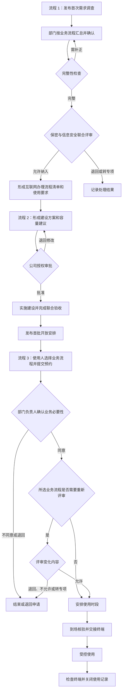

# 全公司互联网专用办公区需求收集、建设与使用管理流程（草案）

> - 状态：待评审草案，尚未作为公司制度或流程输入基线发布
> - 日期：2026-07-23
> - 流程牵头部门：经营发展部
> - 适用对象：公司各部门、信息化工作组、基础设施工作组、行政人事部及互联网专用办公区使用人员
> 说明：本文中的“互联网专用办公区”是受控物理场所，不是新的组织机构或部门办公室。

## 1. 目标

建立 3 条边界清楚、相互衔接的业务流程：首次需求收集与联合评审、首次建设与启用、日常预约与使用。员工在确有业务需要时，可以通过互联网专用办公区执行已确认的业务流程；互联网终端继续与公司内部网络、生产网络、涉密网络及其他受控网络隔离。

本流程解决五个问题：

1. 各部门为什么需要使用互联网、使用什么网站、处理什么事项。
2. 实际需要多少台终端，而不是按申报人数简单采购。
3. 哪些需求可以进入互联网专用办公区，哪些必须拒绝或专项评审。
4. 终端、房间、账号、数据导入导出和日志由谁管理。
5. 运行后如何根据使用率、安全事件和新增需求调整容量。

## 2. 范围与边界

### 2.1 纳入范围

- 访问公共网站、公开数据库、政府或客户公开门户。
- 在公共互联网办理非涉密业务申报、信息查询、资料下载和沟通。
- 使用经评审允许的公共互联网服务。
- 其他经部门负责人、保密管理和信息安全评审确认可在互联网终端执行的业务流程。

### 2.2 不纳入范围

- 存储、处理、传输或发布国家秘密信息。
- 通过互联网终端访问公司内网、生产网、涉密网或其他受控网络。
- 使用互联网终端建立到公司内部网络的 VPN、远程桌面、代理、隧道或其他连接。
- 将内网电脑、涉密设备、个人路由器、随身 Wi-Fi 或未经批准的终端接入专用办公区网络。
- 未经审查上传商业秘密、客户受限资料、个人信息、出口管制或技术管制数据。
- 将合作方专网、民机非密园区网等专用网络需求混入公共互联网需求。

如业务必须同时访问互联网和内部系统，应重新设计受控交换或专用接入方案，不得在同一终端上临时开通双网。

## 3. 管理原则

1. **按业务流程收集，不按个人愿望收集**：每个部门只提交一份部门汇总表，每一行对应一个能说明业务目的、办理对象和预期结果的业务流程。
2. **按峰值并发配置，不按申报总人数配置**：同类、错峰和低频需求合并计算终端数量。
3. **首次流程完整评审，日常使用按变化处理**：业务流程的网站、软件、数据类型、上传下载方式和其他控制要求未发生变化时，日常使用只需预约；存在需要重新评审的变化时，只评审变化内容。
4. **互联网终端只连接互联网**：不得存在到公司内部网络、生产网络、涉密网络或其他受控网络的路由。
5. **涉密信息绝对禁止进入互联网终端**：终端和房间应有醒目标识，使用人对本次处理内容负责。
6. **数据传输默认关闭、例外审批**：移动存储介质、上传、下载、打印、扫描和跨网数据交换分别受控。
7. **实名使用、全过程留痕**：人员、终端、时间、业务流程、预约和异常可追溯，网络及安全日志至少保存六个月。
8. **先建设最小可用容量，再按数据扩容**：试运行后依据峰值使用率、排队情况和新增业务流程需求决定扩容，不一次性按所有预估需求采购。

## 4. 角色与职责

| 角色 | 主要职责 | 主要产出 |
|---|---|---|
| 各部门需求联络人 | 汇总本部门需要使用互联网办理的业务流程，协调补充信息，统一反馈评审问题 | 部门需求清单、补充说明 |
| 需求申请人 | 说明业务流程、业务目的、目标网站、频次、数据类型、上传下载和软件需求 | 单条业务流程需求 |
| 各部门负责人或授权负责人 | 确认业务必要性、人员范围、数据属性和本部门责任 | 部门确认意见 |
| 经营发展部 | 发布调查、做完整性检查、合并重复需求、组织联合评审、维护互联网办理流程清单和流程变更记录、统筹容量和建设申请 | 公司需求台账、互联网办理流程清单、容量建议、建设申请 |
| 行政人事部保密管理职责 | 审查涉密和受控信息风险，制定保密提示、培训及违规处置要求 | 保密审查意见、培训记录 |
| 信息化工作组或其授权的信息安全责任人 | 审查网络边界、终端控制、账号、日志、网站、软件和数据传输方式 | 信息安全评审意见、安全配置基线 |
| 基础设施工作组 | 现场勘察、网络和终端方案、预算测算、实施协调、技术验收 | 建设方案、设备清单、验收记录 |
| 行政后勤及运维安环配合人员 | 确认房间、供电、消防、门禁、工位和现场安全条件 | 场地确认、现场安全意见 |
| 公司授权审批人 | 按预算金额、风险等级和公司授权规则批准建设、重大变更和例外事项 | 批准、退回或暂缓意见 |
| 互联网终端管理员 | 账号、终端镜像、补丁、安全软件、日志、故障和日常巡检 | 账号台账、终端台账、巡检记录 |
| 使用人 | 选择本次实际执行的业务流程并按预约时段使用，遵守保密和安全要求，发生异常立即报告 | 使用记录、异常报告 |

经营发展部是流程牵头人和需求总入口，但不代替保密审查、信息安全评审或技术验收。

## 5. 流程总览

本管理程序包含 3 条业务流程：

- **流程 1：公司级互联网使用需求收集与联合评审**，仅在首次建设时启动，结束后不因日常预约重新启动。
- **流程 2：互联网专用办公区建设与启用**，承接流程 1 的输出，完成首次建设、验收和启用。
- **流程 3：互联网专用办公区日常预约、使用与关闭**，每次使用单独发起；业务流程存在变化时，在本流程内完成必要的联合评审。



## 6. 流程 1：公司级互联网使用需求收集与联合评审

### 1.1 发起全公司调查

经营发展部发布统一通知，明确：

- 调查范围和“不纳入范围”。
- 每个部门指定一名需求联络人。
- 每部门只提交一份汇总表。
- 首轮建议填报期限为 5 个工作日。
- 不确定事项填写“待确认”，不得空白。
- 调查结果只用于需求收口、方案和预算测算，不等于批准接入。

**产出**：《互联网业务流程需求调查表》及部门联络人清单。

### 1.2 部门内部汇总和确认

部门联络人按业务流程收集需求，部门负责人或授权负责人重点确认：

- 业务目的真实且当前确有必要。
- 不能由现有合规渠道满足。
- 目标网站或互联网服务明确。
- 预计使用人数、频次、时长和峰值并发合理。
- 是否涉及上传、下载、打印、扫描、移动存储介质或外部账号。
- 数据类型和敏感性判断有依据。

部门负责人不同意的需求不进入公司级汇总。

**建议时限**：调查期内完成；部门负责人确认不超过 2 个工作日。

### 1.3 完整性检查和退回补正

经营发展部只做完整性和重复性检查，不替代专业安全判断。出现下列情况时退回补正：

- 只写“需要上网”，未说明具体业务流程。
- 未写目标网站、使用频次或预期成果。
- 未说明是否上传、下载或携带数据。
- 将公共互联网、合作方专网和公司内网需求混在一起。
- 数据属性选择“待确认”但未指定确认责任人和日期。

**建议时限**：收到部门汇总后 2 个工作日内完成。

### 1.4 合并业务流程需求和容量依据

经营发展部合并重复的业务流程需求，并区分：

- 高频固定流程。
- 低频预约流程。
- 短期项目流程。
- 需要上传或下载数据的高风险流程。
- 需要安装专用软件、驱动或外设的特殊流程。
- 不应纳入互联网专用办公区的业务流程。

终端数量按评审通过后的**峰值并发需求**计算，不按总申请人数相加。应同时记录排队可接受时长、业务截止时间和可否错峰。

**产出**：《公司互联网使用需求台账》《拟评审互联网办理流程清单》《容量测算表》。

### 1.5 保密与信息安全联合评审

采用分级评审，减少普通需求的审批负担：

| 风险等级 | 判断条件 | 处理方式 |
|---|---|---|
| 常规 | 只浏览公开信息；不上传内部资料；不安装软件；不使用移动介质 | 纳入互联网办理流程清单并记录常规使用要求 |
| 受控 | 需要登录外部账号、下载文件、打印，或处理一般内部工作资料 | 明确账号、文件检查、留存和清理要求后批准 |
| 高风险 | 需要上传资料、导入导出数据、安装软件/驱动、使用 USB 或特殊外设 | 单独形成安全控制措施和操作记录 |
| 禁止 | 涉及国家秘密；要求访问公司内网/生产网/涉密网；要求双网、私接线路、个人热点或绕过审计 | 不纳入，必要时转专项方案 |

商业秘密、客户受限资料、个人信息、出口管制或技术管制数据不得仅凭申请人自判后上传，应由对应业务责任人、保密管理和信息安全责任人共同确认。

**建议时限**：完整需求提交后 5 个工作日内形成意见。

**流程结束结果**：互联网办理流程清单、各业务流程的现行使用要求、退回事项和专项评审事项。流程 1 完成后关闭，不因日常预约重新启动；后续变化在流程 3 内处理。

## 7. 流程 2：互联网专用办公区建设与启用

流程 2 在流程 1 形成互联网办理流程清单、使用频次和容量依据后启动。该流程用于首次建设和启用；后续扩容或重大改造作为独立变更任务办理，不重新启动流程 1。

### 2.1 编制建设方案和容量建议

基础设施工作组依据互联网办理流程清单和容量测算形成最小可用方案，至少包括：

- 场地位置、工位数量、供电、消防、门禁和日常管理条件。
- 互联网接入线路、出口、安全边界和与其他网络的隔离方式。
- 终端数量、编号、配置、标准镜像和备用策略。
- 禁用或受控的无线网卡、蓝牙、USB、打印、扫描和本地管理员权限。
- 实名账号、强认证、浏览器和软件白名单。
- 补丁、防病毒或终端安全、防火墙、日志和时间同步。
- 下载文件检查、数据导入导出、文件临时保存和定期清理方式。
- 故障、恶意代码、误传、疑似泄密和违规外联的应急处置。
- 建设费用、运行费用、维护责任和计划工期。

专用办公区不得设置在保密要害部位，不得与涉密终端或涉密信息设备混用同一受控空间。

### 2.2 审批建设方案

公司授权审批人按照现行预算和授权规则审批建设方案、设备清单和预算建议。批准后进入实施；退回时说明修改事项；暂缓时记录原因和重新受理条件。未批准的方案不得采购设备或实施建设。

### 2.3 实施建设

基础设施工作组按照批准方案完成场地、网络、终端、账号、安全配置和运行保障准备。实施中确需改变批准方案时，应先完成变更审批，不得由实施人员自行扩大范围。

### 2.4 完成联合验收

基础设施工作组、行政人事部保密管理责任人和信息化工作组信息安全责任人分别完成职责范围内的验收。验收至少覆盖：

| 验收类别 | 验收标准 |
|---|---|
| 网络隔离 | 终端无法访问公司内网、生产网、涉密网和其他受控网络；不存在双网连接和非授权路由 |
| 终端控制 | 终端编号、标准镜像、补丁、安全软件、账号权限、USB/无线能力和软件清单符合方案 |
| 实名与日志 | 能对应到具体使用人、终端、时间、预约单号和业务流程；网络及安全日志可查询并按要求保存 |
| 场地安全 | 房间、供电、消防、门禁、标识、工位和设备摆放符合批准方案 |
| 业务可用 | 选取代表性业务流程完成实际操作，不需要连接公司内部网络 |
| 管理准备 | 预约、钥匙或门禁、账号、巡检、故障、数据传输和异常报告责任已明确 |

阻断项未关闭时，责任主体完成整改后重新验收，不得返回流程 1 重新收集全公司需求。

### 2.5 发布首批开放安排

所有阻断项关闭，使用规则、联系人和醒目标识已经发布，首批使用人完成培训后，经营发展部发布首批开放安排并启动日常预约。流程 2 至此关闭。

启用后建议观察 4 周的峰值并发、平均使用时长、排队、取消、空置、故障和安全告警。扩容或减少终端应形成独立变更任务，并以实际运行数据为依据。

## 8. 流程 3：互联网专用办公区日常预约、使用与关闭

### 3.1 选择业务流程并提交预约

使用人从互联网办理流程清单中选择本次实际执行的业务流程，填写使用日期、计划开始时间和预计时长。页面显示业务流程名称，底层保存稳定的业务流程引用；申请人不填写流程编码、版本或额外的办理目标。建议常规预约至少提前 1 个工作日。

### 3.2 确认业务必要性

使用人所在部门负责人判断本次使用是否具有实际业务需要。同意后进入业务流程变更判断；退回时说明需要补充的内容；不同意时记录原因并结束本次申请。

### 3.3 判断业务流程是否需要重新评审

经营发展部需求管理员根据互联网办理流程清单和流程变更记录，核对所选业务流程是否存在需要重新评审的变化。申请人不负责判断，也不在预约单中重复填写变化内容。

以下变化应进入联合评审：

- 目标网站、互联网服务或外部账号的使用方式发生变化。
- 新增上传、下载、打印、扫描或移动存储介质。
- 数据类型、敏感性或数据去向发生变化。
- 需要安装新软件、驱动或连接新外设。
- 其他现行流程使用要求无法覆盖的变化。

要求访问公司内部网络、生产网络、涉密网络或其他受控网络的申请不进入排期，应结束申请或转专项处理。

### 3.4 评审业务流程变更内容

行政人事部保密管理责任人和信息化工作组信息安全责任人只评审变化内容。允许后进入排期；需补充时退回申请人或流程变更提出人；不允许时结束本次申请；需要独立方案时转专项处理。该节点只连接流程 3 内的步骤，不返回流程 1 或流程 2。

### 3.5 安排使用时段

所选业务流程无需重新评审，或者变化内容已经通过联合评审后，经营发展部依据终端可用情况、业务截止时间和提交顺序安排时段。无法按申请时段安排时，应与申请人确认替代时段。

### 3.6 到场核验和终端交接

互联网终端管理员核对：

- 使用人身份与预约记录一致。
- 预约单号、业务流程、终端编号和计划时段一致。
- 使用人已知悉禁止事项。
- 本次需要的数据导入导出或特殊外设操作已经取得相应处理结果。

不得借用他人账号，不得将终端交给未登记人员使用。

### 3.7 受控使用

使用期间：

- 只执行预约单绑定的业务流程，并遵守该流程的现行使用要求。
- 不连接个人热点、路由器、内网设备或其他未经批准的网络。
- 不擅自安装软件、插件、证书、驱动或远程控制工具。
- 不擅自使用 USB、移动硬盘、手机、打印机、扫描仪等设备交换数据。
- 发现恶意网页、异常弹窗、账号异常、误传、疑似泄密或设备故障时立即停止操作并报告。

### 3.8 检查终端并关闭使用记录

使用结束后：

1. 使用人退出外部账号并关闭浏览器会话。
2. 使用人按已确认的方式移交本次业务成果。
3. 使用人清理不需要保留的临时文件，不自行删除安全日志。
4. 互联网终端管理员检查终端、外设和异常情况。
5. 互联网终端管理员通过预约单号登记实际开始时间、实际结束时间、完成情况和异常情况，并关闭使用记录。

下载文件或业务成果不得通过未经批准的介质带离；确需带离时，执行数据导入导出流程。

## 9. 数据导入导出专项卡口

数据跨越互联网专用区边界时，必须记录：

- 数据名称、来源、去向和业务用途。
- 数据责任部门和责任人。
- 数据分类、是否涉密、是否含商业秘密、个人信息、客户受限或管制数据。
- 文件数量、格式、大小和哈希或其他完整性标识。
- 使用的专用介质、检查终端和查杀结果。
- 审批人、操作人、时间和最终去向。

基本规则：

1. 涉密信息不得进入互联网专用区。
2. 移动存储介质默认禁用，只能使用登记的专用介质和批准的操作终端。
3. 从互联网下载的文件进入其他受控环境前，应完成恶意代码检查和内容确认。
4. 向互联网发送内部资料前，应完成业务审批、保密审查和信息安全确认。
5. 数据传输完成后，按批准的保留期限清理互联网终端中的临时副本，并保留操作记录。

## 10. 表单与台账

### 10.1 《互联网业务流程需求调查表》字段

| 字段 | 填写说明 |
|---|---|
| 部门、联络人 | 部门统一汇总，不由员工分别报送 |
| 业务流程 | 用“办理某项业务/查询某类信息”等可理解名称 |
| 业务目的和预期成果 | 说明完成什么工作，形成什么结果 |
| 目标网站或服务 | 写明域名、平台名称和外部服务所有方 |
| 使用人员范围 | 岗位或人员范围，不填模糊的“全员” |
| 频次和单次时长 | 每日/每周/每月/临时，预计使用多久 |
| 峰值并发 | 同一时段最多需要多少人使用 |
| 业务截止时间 | 是否存在申报、投标、报送等固定期限 |
| 上传、下载、打印、扫描 | 逐项选择并说明对象 |
| 数据类型和敏感性 | 公开、一般内部、商业秘密、个人信息、客户受限、管制数据、涉密或待确认 |
| 外部账号 | 是否实名、账号归属、是否多人共用 |
| 软件和外设 | 是否需要安装软件、驱动、USB 或其他外设 |
| 现有替代方式 | 是否已有合规渠道，为什么不能满足 |
| 部门确认 | 部门负责人或授权负责人意见和日期 |

### 10.2 《互联网专用办公区使用预约单》字段

| 字段 | 填写说明 |
|---|---|
| 申请人、申请部门 | 从当前申请人身份和组织信息取得 |
| 业务流程 | 必填；页面显示业务流程名称，底层保存业务流程引用 |
| 使用日期、计划开始时间、预计时长 | 用于排期和容量校验 |
| 部门负责人意见 | 记录同意、退回或不同意结果及必要说明 |

### 10.3 《互联网专用办公区使用记录》字段

| 字段 | 填写说明 |
|---|---|
| 预约单号 | 必填；通过预约单号追溯业务流程和前序处理结果 |
| 使用人、使用部门 | 由预约单带出并在到场时核对 |
| 终端编号 | 到场交接时登记 |
| 实际开始时间、实际结束时间 | 按实际使用情况登记 |
| 完成情况、异常情况、现场管理员 | 关闭使用记录时登记 |

表单只保留以下关系：

```text
业务流程 → 使用预约 → 使用记录
```

### 10.4 运行台账

至少维护以下受控记录：

1. 公司互联网使用需求台账。
2. 互联网办理流程清单及流程变更记录。
3. 建设方案、设备清单和验收记录。
4. 互联网终端、账号和权限台账。
5. 预约及实际使用记录。
6. 数据导入导出审批和操作记录。
7. 巡检、补丁、恶意代码和故障记录。
8. 安全事件、违规事项、处置和复盘记录。

## 11. 状态与处理规则

### 11.1 流程 1 状态

`待部门汇总 → 待经营发展部复核 → 待联合评审 → 已形成互联网办理流程清单 → 已关闭`

可选终止状态：

- `退回补正`：信息不完整，可补充后再次提交。
- `转专项评审`：超出互联网专用办公区标准能力。
- `不纳入`：违反安全边界或已有合规替代渠道。

### 11.2 流程 2 状态

`待编制方案 → 待方案与预算审批 → 建设中 → 待验收 → 已启用 → 已关闭`

可选状态：

- `退回修改`：建设方案存在需修改事项。
- `暂缓`：业务存在但当前无预算、无场地或优先级不足。
- `整改后复验`：验收存在阻断项，责任主体完成整改后重新验收。

### 11.3 流程 3 状态

`待部门确认 → 待变更判断 → 待联合评审（按需） → 待排期 → 已排期 → 使用中 → 已关闭`

异常状态：

- `变更待评审`：业务流程的网站、软件、数据类型、上传下载方式或其他控制要求发生需要重新评审的变化。
- `异常挂起`：出现恶意代码、误传、疑似泄密、违规外联或设备异常。
- `取消`：申请人或部门取消，并记录原因。

## 12. 建议时限

| 环节 | 建议时限 |
|---|---:|
| 首轮公司级需求收集 | 5 个工作日 |
| 经营发展部完整性检查 | 2 个工作日 |
| 保密与信息安全联合评审 | 5 个工作日 |
| 基础设施方案和预算初稿 | 5 个工作日 |
| 常规日常预约 | 至少提前 1 个工作日 |
| 高风险变更评审 | 原则上 2 个工作日内给出受理或补充材料意见 |
| 试运行复核 | 启用后 4 周 |
| 互联网办理流程清单和流程变更记录复核 | 每季度一次，发生重大变化时即时复核 |

审批和采购时限按公司现行授权及采购规则执行，不在本草案中另造审批层级。

## 13. 运行指标

| 指标 | 目标 |
|---|---|
| 部门首轮调查覆盖率 | 100% |
| 需求必填信息完整率 | 100% 后进入联合评审 |
| 使用预约与业务流程关联率 | 100% |
| 使用记录与预约单号关联率 | 100% |
| 实名使用和终端对应率 | 100% |
| 网络隔离验收通过率 | 100% |
| 网络及安全日志留存 | 不少于 6 个月 |
| 未经批准的双网、热点、移动介质和软件安装 | 0 起 |
| 安全异常闭环率 | 100% |

终端利用率不设越高越好的单一目标。长期排队说明容量不足，长期空置说明可减少设备或调整开放时段。

## 14. 发布前必须确认的事项

本草案进入正式制度或流程输入基线前，应由责任人逐项确认：

1. 经营发展部是否正式承担流程牵头、需求台账和排期职责。
2. 行政人事部、信息化工作组和基础设施工作组的具体审核人及替补人。
3. 建设、扩容、重大例外的审批权限和预算阈值。
4. 专用办公区位置、开放时段、门禁和现场管理责任。
5. 公共互联网、民机非密园区网、合作方专网和公司内网的名称及边界。
6. 商业秘密、客户受限、个人信息和管制数据的审批口径。
7. 移动存储介质、打印、扫描、下载、上传和文件清理的技术实现。
8. 日志、预约记录、数据传输记录和安全事件记录的具体保存期限。
9. 首批互联网办理流程清单、各流程的现行使用要求、峰值并发和最小终端数量。
10. 使用规则违反后的暂停权限、调查责任和恢复条件。

以上事项未确认前，本草案只用于讨论和首轮需求调研，不作为已发布制度。

## 15. 依据与设计参考

### 15.1 仓库内依据

- `docs/organization/组织架构和部门职责.md`：确认经营发展部、信息化工作组、信息化项目管理工作室和基础设施工作组的现有职责边界。
- `docs/HardwareResearch/06B厂房接入民机非密园区网需求调查表_抽取文本.txt`：仅作为需求字段、安全边界、终端清单和日志检查项的设计参考，不视为本流程已经批准的制度依据。
- `docs/norms/经营发展部部门-能力-流程-系统映射关系.md`：当前未发现已确认的公司级互联网专用办公区流程，本草案不直接写入该输入基线。

### 15.2 外部安全依据

- [《中华人民共和国网络安全法》](https://www.cac.gov.cn/2025-12/29/c_1768735112911946.htm)：内部安全制度、网络安全责任、恶意代码和攻击防护、网络运行及安全事件记录、日志留存等要求。
- [《中华人民共和国保守国家秘密法实施条例》](https://www.mee.gov.cn/zcwj/gwywj/202407/t20240723_1082257.shtml)：互联网使用保密管理、非涉密信息设备不得处理国家秘密、泄密事件处置等要求。
- [《计算机信息系统国际联网保密管理规定》](https://ynbm.yn.gov.cn/html/2022/xuanjiaoziyuan_0830/285.html)：涉密系统与互联网物理隔离、涉密信息不得在互联网系统中存储处理传递、上网信息保密审查等要求。
