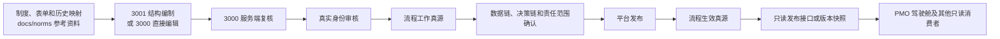

# MDM 业务数据链、业务决策链与仓库真源边界迁移计划

> 状态：待评估，未批准执行  
> 编制日期：2026-08-09  
> 适用对象：信息化项目负责人、流程治理人员、MDM 平台实施人员、PMO 展示维护人员  
> 前置条件：第一批 3001 JSON 已通过 3000 服务端复核和真实身份审核完成导入。  
> 启动规则：前置条件满足后，由信息化项目负责人根据实际导入结果明确决定是否执行；系统和执行人员不得自动启动本计划。  
> 当前口径：`docs/norms` 已不再是流程真源。仓库中尚未修改的旧表述属于待迁移内容，不得作为新的真源判断依据。

## 1. 文档目的

本计划用于评估和设计 3000 的业务数据链、业务决策链及正式业务工作角色治理能力，同时规定仓库流程真源边界的迁移方向。

本文件只记录待评估方案，不表示相关功能、数据库、接口、仓库说明或 PMO 数据源已经修改。第一批 3001 JSON 导入 3000 后，信息化项目负责人应先组织只读评估，再从“执行、缩减后执行、继续暂缓”中选择后续处理方式。

## 2. 已确认口径与目标边界

### 2.1 真源层级

| 内容 | 定位 | 当前或目标状态 |
|---|---|---|
| `docs/norms` | 制度、表单、历史映射和分析参考资料 | 已确认不再是流程真源 |
| 3001 | 无状态结构编制与结构校验工具 | 导出的 JSON 是待审核输入，不是审核凭证 |
| 3000 已审核修订 | 流程工作真源 | 第一批导入后根据真实审核结果确认 |
| 3000 已发布不可变版本 | 流程生效真源 | 本计划执行后建设 |
| PMO 驾驶舱 | 3000 生效流程版本的展示投影 | 本计划执行后迁移数据源 |

“工作真源”是已经在 3000 中通过服务端复核和真实身份审核、可以继续补充数据链和决策链的流程修订。“生效真源”是完成必要确认并由平台发布的不可变流程版本。工作真源尚未发布时，不得作为已生效流程向其他系统提供。

### 2.2 目标数据流

正式流程变更应进入 3000。任何人员或系统不得通过修改 `docs/norms`、重新运行历史解析脚本或修改 PMO 展示数据，绕过 3000 的复核、审核、确认和发布。

3000 允许授权人员直接编辑基础流程。授权人员保存修改后，3000 应使原审核状态和受影响的确认结果失效，并生成重新复核或确认任务。未经重新审核和确认的修改不得进入新的生效版本。

## 3. 建设目标与首期边界

### 3.1 建设目标

本计划执行后，3000 应提供以下能力：

1. 业务人员以流程步骤为主线设计业务数据链和业务决策链。
2. 审核人员查看数据对象、关键字段、决策依据、决策结果和后续路径之间的关系。
3. 治理人员维护正式业务工作角色、共享决策和跨流程引用。
4. 平台根据对象、字段、决策或工作角色的变更计算影响范围，并生成重新确认任务。
5. 平台只发布已经通过结构校验、责任范围确认和发布检查的不可变流程版本。
6. PMO 和其他只读消费者按发布版本读取数据，并能够识别数据版本和更新时间。

### 3.2 首期不处理事项

- 不执行实际业务决策，不替代业务流程管理系统或规则运行引擎。
- 不引入可执行的决策模型与表示法（Decision Model and Notation，DMN）XML。
- 不把业务数据链扩展为数据库字段级技术血缘。
- 不自动生成正式制度文件。
- 不为 3001 增加数据库、服务端草稿、浏览器持久化或与 3000 的通信。
- 不根据岗位名称、人员姓名、历史角色或原文称谓自动生成正式业务工作角色。

## 4. 成熟案例及采用方式

本项目只借鉴成熟产品和标准中与当前目标直接相关的设计，不照搬完整产品架构。

| 案例 | 可借鉴能力 | 本项目采用方式 |
|---|---|---|
| [Palantir Data Lineage](https://www.palantir.com/docs/foundry/data-lineage/overview) | 数据对象的来源、去向、上下游关系和影响追踪 | 支持业务对象与关键字段的流程级上下游追溯 |
| [Palantir Action Log](https://www.palantir.com/docs/foundry/action-types/action-log) | 业务动作、操作者和变更记录关联 | 将审核、确认、发布和修改记录关联到流程修订及生效版本 |
| [OMG DMN](https://www.omg.org/dmn/index.htm) | 决策、输入数据、规则和决策服务的标准概念 | 底层概念与 DMN 对齐，页面使用业务人员可理解的中文字段 |
| [Camunda Decision Requirements Graph](https://docs.camunda.io/docs/components/modeler/dmn/decision-requirements-graph/) | 决策、子决策和输入数据依赖图 | 支持决策逻辑链和共享决策依赖视图 |
| [Microsoft Purview Data Lineage](https://learn.microsoft.com/en-us/purview/data-gov-classic-lineage) | 数据处理链路、来源标识和血缘展示 | 借鉴版本化来源标识和只读影响分析，不引入技术扫描器 |
| [OpenLineage](https://openlineage.io/docs/) | 开放的运行、作业、数据集和血缘事件模型 | 借鉴稳定标识、版本和来源元数据，不在首期建设运行时事件采集 |
| [SAP Master Data Governance Change Request](https://help.sap.com/docs/SAP_MASTER_DATA_GOVERNANCE/1b769cd8013643adac309014c812427e/7382ee50b351bb7ee10000000a445394.html) | 草稿、变更请求、审核和生效状态分离 | 分离待审核输入、工作真源和生效真源，并保留变更记录 |

## 5. 仓库说明与主线迁移

本章列出的修改只有在信息化项目负责人明确批准执行后才允许实施。

### 5.1 先纠正当前入口，再开发功能

实施人员应先更新以下当前入口：

- 根入口：`AGENTS.md`、`CODEX.md`、`README.md`、`REPOSITORY_BOUNDARY.md`、`DIRECTORY_OWNERSHIP.md`、`MAINLINE_MAP.md`。
- 应用入口：3000、3001、PMO 和仓库脚本相关的 `AGENTS.md`、README、需求说明、技术规格、接口说明和数据库说明。
- 治理入口：`docs/README.md`、`docs/norms/AGENTS.md`、`docs/norms/README.md`、流程映射字段说明、架构说明和 `docs/glossary.md`。
- AI 协作入口：当前仍把 `docs/norms` 描述为“流程输入基线”的项目技能和技能索引。
- 项目记忆：实施形成长期决策后更新项目 `MEMORY.md`，但不得记录敏感信息。

根 `AGENTS.md` 中“MDM 平台开发暂时搁置”的阶段说明应在计划批准后同步调整。目标口径是：3000 承接流程工作真源、生效真源、业务数据链和业务决策链治理。

在上述入口完成纠正前，实施人员不得修改业务链数据库结构、接口或页面。该顺序用于防止后续执行人员继续按照旧真源边界开发。

### 5.2 用新架构决策记录替代旧口径

实施人员应新增架构决策记录（Architecture Decision Record，ADR），明确替代现有 ADR 中“`docs/norms` 是发布真源”或等效含义的条款。旧 ADR 应保留原文作为历史记录，不应静默改写已经接受的历史决策。

新 ADR 应固定以下规则：

- `docs/norms` 只能作为来源证据、分析参考或历史快照。
- 3001 JSON 中的 `approved`、`status` 或其他自带状态不能作为 3000 的审核凭证。
- 3000 的真实账号、服务端复核和审核记录共同形成流程工作真源。
- 只有完成业务链校验、责任范围确认和平台发布的不可变版本才是流程生效真源。
- 3000 直接编辑基础流程后，受影响的审核和确认结果必须失效。
- 正式业务工作角色转由 3000 治理；人员和部门组织事实继续沿用现有组织及身份真源，不在本计划中整体迁移。

### 5.3 历史材料与当前说明分开处理

- 当前入口文档、运行说明、项目技能和测试说明必须改为新口径。
- 历史计划、报告、会议记录和归档材料不批量改写；当前导航可能造成误用时，应增加“历史口径，已被新 ADR 替代”的提示。
- `docs/company-sankey-data.json` 及由 `scripts/parse-sankey-data.mjs` 生成的数据应降级为历史或参考投影，不得进入正式 MDM 发布主线。
- 原 `docs/norms → parser → PMO → MDM` 同步方向应退出主线。系统不得自动把参考资料提升为工作真源或生效真源。

### 5.4 PMO 数据源迁移

3000 应提供已发布流程的只读导出接口。PMO 只消费该接口生成的版本化快照。

每个快照至少包含发布版本号、发布时间、内容摘要和导出时间。PMO 页面应显示数据来源、发布版本和更新时间。

3000 暂时不可用时，PMO 可以使用最后一次成功取得的生效快照，但必须显示“数据可能已过期”。PMO 不得静默回退到 `docs/norms`、`docs/company-sankey-data.json` 或其他历史解析结果。

### 5.5 防止旧口径回流

仓库应新增 `test:process-truth-boundary` 检查。该检查至少阻止当前入口文档、项目技能和运行说明出现以下有效断言：

- `docs/norms` 是流程真源、正式发布入口或已确认流程输入基线。
- PMO 驾驶舱或其内嵌数据是流程真源。
- 3001 JSON 自带状态可以证明内容已经审核。
- parser 结果可以绕过 3000 成为生效流程。

历史引文、否定句和明确标注为旧口径的归档材料不应被误报。

## 6. 业务数据链设计

### 6.1 设计粒度

首期数据链以业务对象和关键字段为粒度。业务人员先在流程步骤中登记候选数据，再由治理人员映射到正式数据目录或创建目录建设任务。

每条数据使用或产生关系至少说明：

- 所属流程步骤；
- 业务对象；
- 关键字段；
- 动作类型，包括读取、产生、修改和传递；
- 数据来源和接收方；
- 对应正式目录项或候选状态；
- 来源证据和确认状态；
- 所属流程修订和生效版本。

系统不得根据表单名称、字段同名或系统名称自动确认正式数据对象。自动分析只能生成候选关系。

### 6.2 候选数据处理

- 存在正式目录项时，业务人员可以提出映射，治理人员确认映射结果。
- 不存在正式目录项时，3000 应保留候选内容并生成正式目录建设任务。
- 候选数据未完成确认时，平台应按照发布规则判断是否阻止发布，不得用默认对象替代。
- 正式目录项发生变化时，平台应计算受影响流程、步骤、决策和确认责任范围。

## 7. 业务决策链设计

### 7.1 决策范围

首期只收录影响流程路径、业务结果、责任主体或关键数据的业务决策。普通录入、通知和无分支的处理动作不单独建立决策。

业务决策链同时表示两类关系：

1. 决策结果链：决策结果选择哪条后续路径，并影响哪些步骤和业务结果。
2. 决策逻辑链：一个决策依赖哪些输入数据、前置决策、子决策和设计型规则表。

### 7.2 决策内容

每个决策至少说明：

- 决策名称和业务目的；
- 所属流程步骤或共享决策目录；
- 正式业务工作角色；
- 输入业务对象和关键字段；
- 前置决策和子决策；
- 设计型规则表；
- 可能结果及对应后续路径；
- 异常或无法判断时的处理方式；
- 来源证据、确认状态和版本。

首期页面使用中文引导式编辑。底层概念应与 DMN 的决策、输入数据和决策依赖保持映射关系，但不得生成或执行 DMN XML。

### 7.3 局部决策与共享决策

业务人员应先在具体流程中编制局部决策。治理人员确认该决策可以跨流程复用后，3000 才能把局部决策提升到共享决策目录。

流程引用共享决策时，应引用明确版本。共享决策的新版本不得直接改变已经发布的流程版本。平台应计算受影响流程并生成重新确认任务，相关流程负责人确认后才能发布引用新版本的流程修订。

## 8. 正式业务工作角色设计

正式业务工作角色用于说明某项业务行为或业务决策由什么职责角色承担。正式业务工作角色不同于人员、岗位、部门、原文角色称谓和 MDM 的基于角色的访问控制（Role-Based Access Control，RBAC）角色。

计划执行后，正式业务工作角色目录由 3000 治理，初始目录保持为空。治理人员根据业务确认结果创建角色，系统不得把历史角色或岗位自动映射为正式业务工作角色。

正式业务工作角色至少包含：

- 稳定角色编码和名称；
- 角色目标和职责说明；
- 适用业务范围；
- 角色状态和版本；
- 维护责任及审核记录；
- 与流程步骤、业务决策和组织岗位的已确认关系。

人员和部门组织事实继续由现有组织及身份真源提供。业务工作角色迁入 3000 不表示人员、部门或岗位真源同时迁移。

## 9. 分阶段实施

### 9.1 阶段一：真源边界与正式业务工作角色

- 更新当前仓库说明、主线图、ADR、术语表、项目技能和项目 `MEMORY.md`。
- 在 3000 建立正式业务工作角色目录，初始目录为空。
- 把现有角色关系标为待确认，不自动映射非固定历史角色。
- 保留原有已发布流程的效力，并标记“数据链和决策链待补齐”；流程下一次修订发布前必须按新规则补齐。
- 把既有 norms 派生记录标记为 `legacy_reference`，不得自动转成已审核或已发布状态。

### 9.2 阶段二：业务链核心能力

平台采用 `business-chain-v1` 受控 JSON 结构，以同一底层模型支持流程视图、数据视图和决策视图。

首个试点使用“不合格品处置”流程，验证以下能力：

- 业务数据链编制和关键字段追溯；
- 决策结果链和决策逻辑链编制；
- 局部决策提升为共享决策；
- 候选数据映射或正式目录任务生成；
- 业务人员确认内容，平台发布角色执行最终发布；
- 跨部门确认按责任范围分派，必要确认未完成时阻止发布。

### 9.3 阶段三：共享复用与影响分析

- 建立共享决策目录并显示引用流程和引用版本。
- 修改数据对象、关键字段、决策或正式业务工作角色时，计算受影响流程和责任范围。
- 生成重新确认任务；必须关闭的任务未关闭时，平台阻止发布。
- 使用“不合格工装处置”流程验证共享处置模式和共享决策复用。
- 检查财务组合场景“出差申请→差旅报销→通用报销或付款→ERP 入账”的现有 JSON。只有能够证明该 JSON 已经在 3000 完成真实审核时，才能把相应内容视为工作真源；否则应作为候选输入重新审核。

## 10. 计划中的数据结构与接口

本章记录目标接口和字段，不能作为当前系统已经提供这些接口或字段的证明。计划批准后，实施人员应先核对 3000 当前结构，再在技术规格和接口说明中确定兼容方案。

### 10.1 核心版本信息

- `reviewed_revision_id`
- `working_truth_at`
- `published_version_id`
- `effective_at`
- `source_schema_version`
- `content_hash`
- 来源类型、审核记录、发布记录和失效原因

### 10.2 目标接口

- `GET/POST/PUT /api/business-work-roles`
- `GET/PUT /api/process-design/drafts/:id/business-chain`
- `GET /api/process-design/drafts/:id/business-chain/views`
- `GET /api/process-design/drafts/:id/impact`
- `POST /api/process-design/import/preview`
- `POST /api/process-design/import/apply`
- `GET /api/business-decisions`
- `GET/PATCH /api/chain-governance-tasks`
- `POST /api/process-design/drafts/:id/publish`
- `GET /api/process-design/effective-export`

发布操作应在同一事务中完成版本冻结、审核状态核验、确认任务核验、审计记录和生效版本切换。发布后的版本不可原地修改。

## 11. 旧数据迁移与恢复

实施人员应按 dry-run、apply、幂等重跑、回滚或补偿四段处理旧数据。迁移程序不得猜测缺失的数据对象、决策或正式业务工作角色关系。

迁移范围至少包括：

- 3000 现有持久化流程及其发布状态；
- 仍在支持范围内的 3001 历史 JSON；
- norms 和 parser 派生的历史导入记录；
- PMO 当前展示快照；
- 历史工作角色绑定和共享引用。

实施前应备份 3000 持久化数据。迁移后应核对记录数量、关键字段、稳定引用、审核记录和发布版本。迁移失败时，实施人员应恢复备份或执行经验证的补偿步骤，并保留失败记录。

3001 的历史 JSON 兼容处理仍只能发生在用户导入后的当前页面内存中。兼容处理不得修改用户选择的源文件，也不得为迁移增加持久化能力。

## 12. 第一批 JSON 导入后的评估门槛

第一批 3001 JSON 通过 3000 服务端复核和真实身份审核完成导入后，信息化项目负责人应先组织只读评估，不得自动启动本计划。

评估至少检查：

1. 导入对象、字段、稳定引用、审核记录和来源信息是否完整。
2. 现有内容是否足以识别业务对象、关键字段、关键业务决策及上下游关系。
3. 哪些对象、关键字段、决策和正式业务工作角色仍需业务人员补充确认。
4. 旧流程版本、PMO 展示和历史 norms 派生记录的迁移范围及恢复成本。
5. 现有 3000 数据结构能否安全承接 `business-chain-v1`，以及旧数据是否可以无损迁移。
6. “不合格品处置”“不合格工装处置”和财务组合场景是否具备试点条件。

评估结论只能是以下三项之一：

| 结论 | 含义 | 后续动作 |
|---|---|---|
| 执行 | 第一批数据能够支撑完整方案，迁移风险可控 | 信息化项目负责人批准实施范围和顺序 |
| 缩减后执行 | 只能支撑部分链路或部分试点 | 信息化项目负责人明确保留范围、删除范围和补充条件 |
| 继续暂缓 | 数据完整性、审核证据或迁移条件不足 | 保留本计划，不修改仓库主线或平台能力 |

没有信息化项目负责人的明确结论，任何人员或系统不得执行仓库说明迁移、数据库变更、接口开发、页面开发或 PMO 数据源切换。

## 13. 测试与验收标准

计划获批后，实施结果至少应通过以下检查：

### 13.1 真源与权限

- 当前仓库入口和运行说明不再把 `docs/norms` 描述为流程真源、发布入口或已确认流程输入基线。
- 未经 3000 真实审核的 3001 JSON 不能成为工作真源或生效真源。
- 3000 直接编辑后，受影响的审核和跨部门确认状态自动失效。
- 无权限人员不能修改、确认或发布业务链内容。
- 管理员的业务写入限制继续符合固定治理模型要求。

### 13.2 数据与决策链

- 流程视图、数据视图和决策视图中的同一节点、关系和版本保持一致。
- 数据对象和关键字段能够追溯来源、使用步骤、修改步骤和接收方。
- 决策结果能够追溯对应路径；决策能够追溯输入数据、前置决策和子决策。
- 失效引用、链路硬错误或必要确认未完成时，平台阻止发布。
- 共享决策的新版本不会静默改变既有生效流程。

### 13.3 迁移与恢复

- 上一受支持版本导入当前版本。
- 当前版本导出后重新导入。
- 迁移脚本重复执行不会产生重复记录或破坏引用。
- 迁移失败后可以恢复或补偿，并能够核对恢复结果。
- 旧流程版本继续可查，未补齐业务链的状态清晰可见。

### 13.4 PMO 与仓库规则

- PMO 只读取 3000 生效版本或最后一次成功取得的生效快照。
- 3000 不可用时，PMO 显示快照版本和过期提示，不回退到 norms 或旧 parser 结果。
- `MAINLINE_MAP.md`、接口说明、脚本数据方向和实际运行行为一致。
- `test:process-truth-boundary` 能阻止旧真源断言回流，同时允许历史引文和正确的否定表述。

## 14. 风险与暂停条件

出现以下任一情况时，信息化项目负责人应暂停实施并重新确认范围：

- 第一批导入缺少可核验的审核身份、审核时间或服务端复核记录。
- 现有数据无法稳定关联流程、步骤、对象、字段或决策。
- 迁移程序无法无损保留旧流程版本、审核记录或稳定引用。
- 正式业务工作角色的维护责任和确认责任尚未明确。
- PMO 无法获得带发布版本的生效快照，且现有展示不能明确标识旧数据。
- 方案需要把规则运行、数据库字段级技术血缘或正式制度生成纳入首期。

## 15. 本次固化说明

本次只新增本计划文件，不修改代码、数据库、接口、现有仓库说明、PMO 数据源或项目 `MEMORY.md`。

由于用户已经确认 `docs/norms` 不再是流程真源，仓库现有文件中的相反表述属于已识别的待迁移问题。本文件记录该新口径及拟执行路径，但不替代后续对根入口、目录说明、ADR、技能和测试规则的正式迁移。
