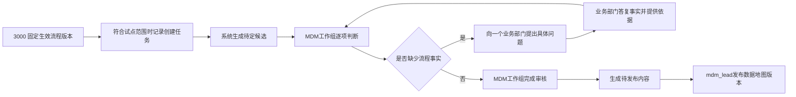

# MDM 数据流与生命周期治理开发计划

> 日期：2026-08-09
> 状态：默认关闭的候选实现已形成；正式迁移、试点启用和完整发布范围仍等待前置门槛
> 主责资产：`apps/mdm-platform/`
> 适用对象：MDM 工作组、流程归口部门、开发人员、测试人员
> 正式试点启动条件：一个3001 V7文件已经在3000完成受控预览、部门核对、提升、审核和发布，形成经过确认的不可变`process_version_id`；数据库迁移、备份恢复和真实角色验收门槛均已通过

> 关联总方案：[`2026-08-13-ea-bpm-governance-evaluation-design/`](2026-08-13-ea-bpm-governance-evaluation-design/README.md)。本计划作为总方案中的“数据流与生命周期治理工作包”继续执行，并复用总方案定义的评价规则、问题卡、证据、权限、审计和版本基础能力。2026年8月27日用户明确授权实施默认关闭、精确单版本范围的候选能力；该授权不代表G-01至G-06已经通过，也不授权执行正式数据库迁移、启用试点或发布数据地图。

> 关联上游计划：[`2026-08-20-3001-process-governance-v7-data-lifecycle-upgrade-plan.md`](2026-08-20-3001-process-governance-v7-data-lifecycle-upgrade-plan.md)。3001 v7只负责单流程生命周期事实编制和确定性建议；本计划负责3000中的规则、审核、证据、跨流程一致性和发布。两项工作分别实施，任何一项都不授权建立3001与3000的运行依赖。

> 2026年8月27日职责调整：业务部门不再填写完整数据生命周期治理工作包。流程治理结束后，数据对象归类、主数据认定、统一对象匹配、关键字段判定、生命周期规则和跨流程冲突由MDM工作组处理；业务部门只回答MDM定向提出的具体流程事实问题并提供依据。

## 1. 计划目的

本计划用于在 3000 中建设设计态业务数据流与数据生命周期治理能力。该能力以 3000 的固定生效流程版本为输入，管理统一数据对象、流程使用关系、关键字段、生命周期规则、部门确认、跨部门确认、MDM 工作组审核和数据地图版本发布。

本计划的完整发布范围仍等待第2章门槛。当前候选代码和迁移方案必须默认关闭、精确限定一个`process_version_id`，不得执行正式建表、历史回填、功能启用或数据地图发布。只有第2章启动门槛全部通过后，`mdm_lead`才能记录正式试点启动结论。

## 2. 开发启动门槛

### 2.1 门槛判定

下列条件必须同时满足：

| 门槛 | 责任主体 | 必须取得的证据 | 通过标准 |
|---|---|---|---|
| G-01 批量导入输入冻结 | 批量导入负责人 | 输入清单、文件数量、每个文件的结构版本和 SHA-256 摘要 | 输入范围明确；测试期间输入文件未被替换 |
| G-02 批量导入完成 | 批量导入负责人、部门 MDM 审核员 | 实际执行命令或操作记录、逐文件处理结果、审核主体和审核依据 | 每个输入均有“导入成功、重复内容返回既有记录、拒绝并说明原因”之一；没有去向不明的文件 |
| G-03 导入后数据核对通过 | 测试人员、数据质量审计人 | 导入前后数量、结构版本、稳定引用、修订号、内容摘要和承接关系核对记录 | 3000 保存内容统一符合当前结构规则；没有静默丢失、默认猜测、重复写入或断开的稳定引用 |
| G-04 幂等复跑通过 | 测试人员 | 使用同一输入重复执行的记录 | 重复执行不产生重复流程、重复修订或重复审核记录 |
| G-05 第一轮完整测试通过 | 测试人员 | 测试命令、Git 提交、环境说明、通过/失败结果和缺陷清单 | 第 2.3 节全部检查通过；阻断缺陷为零 |
| G-06 启动审核通过 | MDM 工作组、`mdm_lead` | 门槛审核记录 | MDM 工作组确认 G-01 至 G-05 证据完整；`mdm_lead` 记录开发启动结论 |

以下任一情况发生时，启动门槛失效，测试人员必须重新执行受影响检查：

- 批量导入代码、导入规则、流程结构或数据库结构在测试后发生变化；
- 批量导入输入清单或任一文件摘要发生变化；
- 测试使用的提交与计划执行基线不一致；
- 发现导入记录缺失、重复、引用断开、权限绕过或不能恢复的数据问题；
- 测试报告存在尚未关闭的阻断缺陷。

### 2.2 批量导入记录要求

当前仓库没有可直接认定为“3001 JSON 目录批量导入”的固定命令。前置批量导入任务交付时，负责人必须在测试报告中记录实际命令或操作路径，不能由本计划预设不存在的入口。

批量导入必须继续遵守 3000 的受控导入边界：

1. 3000 在服务端重新校验每个输入，不能信任上传内容中的审核状态、审核人或批准人字段。
2. 3000 必须记录真实审核主体和审核依据；`admin` 不得作为业务审核人执行导入。
3. 单个流程的草稿、修订、关系投影、事件和导入审计必须原子写入。失败时不得留下半套数据。
4. 相同流程和相同内容重复导入时，3000 返回既有记录。内容变化时，3000 创建新修订并重新进入审核。
5. v1、v2 输入只按当前兼容规则转换；无法无损转换的内容必须停止并列出具体位置，不能用默认业务事实填补。
6. 批量导入不得修改用户提供的源文件。

G-01输入清单只能包含3000已明确支持并通过服务端校验的结构版本。3001 v7发布不代表3000已经支持v7；输入清单如包含v7，负责人必须先完成3000的独立兼容方案、迁移测试和受控导入验证，再重新冻结G-01至G-06证据。

### 2.3 第一轮完整测试

测试人员在批量导入完成后，至少执行以下当前有效命令：

```powershell
npm --prefix apps/structured-output-service test
npm --prefix apps/mdm-platform run test:process-governance-v3-migration
npm --prefix apps/mdm-platform run test:process-design
npm --prefix apps/mdm-platform run test:process-governance-unified
npm --prefix apps/mdm-platform run test:process-governance
npm --prefix apps/mdm-platform run test:role-workbench
npm --prefix apps/mdm-platform run test:frontend
npm --prefix apps/mdm-platform run test:project-roles
npm --prefix apps/mdm-platform run test:mainline
npm --prefix apps/mdm-platform run migrate:process-governance-v3:dry-run
npm --prefix apps/mdm-platform run migrate:process-governance-unified:dry-run
npm run start:infomat-services
npm run smoke:infomat-services
```

除自动化测试外，测试人员还必须核对真实导入结果：

- 输入清单中的每个文件均能对应到处理结果；
- 导入成功数量、拒绝数量、重复数量和总输入数量一致；
- 3000 中的流程稳定标识、修订号、当前标记和内容摘要一致；
- 兼容输入已经按当前规则保存，原有字段、顺序和稳定引用未被改写；
- 重复执行不增加数据数量；
- 代表性部门角色可以读取本人范围，不能越权读取或处理其他部门事项；
- `admin` 对治理业务写入继续返回 403；
- 浏览器能够完成预览、受控导入、草稿打开、保存、导出和承接待办检查；
- 测试环境缺少真实身份时，测试人员记录未完成的浏览器链路，不得临时授予越权角色或使用管理员代办。

测试报告建议存放在 `docs/reports/`，并记录测试日期、Git 提交、环境、输入清单、命令结果、数量核对、缺陷和最终结论。

## 3. 已确认的建设边界

### 3.1 本次建设内容

- 完整发布能力要求3000在流程版本生效后自动创建一份数据生命周期治理工作包。当前默认关闭的候选实现只在功能已启用且新版本标识与唯一试点配置完全相等时记录创建任务；既有正式版本必须由`mdm_lead`显式补建。
- 工作包固定绑定创建时的不可变 `process_version_id`，页面实时读取该固定版本。
- 3000 不复制流程事实；工作包只保存生命周期治理内容、确认记录、审核记录和发布关联。
- 统一数据对象身份与流程中的数据对象使用记录分层管理。
- 业务数据对象作为数据流主节点；关键字段按需进入字段级追踪。
- 数据行为和数据流分别记录创建、更新、使用、派生与传递；它们不作为生命周期动作。
- 生命周期动作固定区分生效、停用、重新启用、作废、失效、归档、恢复在用保管、销毁和不可逆匿名化。
- 数据治理状态与业务生命周期动作分别管理。
- MDM工作组负责专业治理判断；业务部门只处理定向事实问题。MDM工作组审核和数据地图发布继续使用固定责任链。
- 正式数据地图采用版本发布，不允许直接编辑已发布内容。
- 页面提供任务优先入口、列表与明细编辑，以及包含待定内容的只读图形预览。

### 3.2 不在本次范围

- 本计划的3000实施不修改或扩展3001。3001 v7按独立上游计划实施，并继续保持无状态。
- 工作包不读取、不引用、不依赖原始 3001 JSON、文件名、文件路径或上传摘要。
- 不保存订单、人员、金额、检验结果等实际业务数据值。
- 不跟踪每一条业务记录的运行过程。
- 不建设接口、数据库表、字段任务或运行日志形成的技术血缘。
- 不由 3000 调用生产系统执行归档、作废或销毁。
- 不要求每个数据对象必须绑定应用系统；没有确认事实时保持“待定”。
- 不引入图数据库、消息平台或独立血缘产品。
- 不提供图上拖拽、连线或直接编辑正式关系。

### 3.3 用户用语

新功能面向用户的页面、提示和说明统一使用“待定数据对象、待定关系、待定关键字段、待定匹配建议”。现有接口或数据库中的稳定字段如果仍含历史名称，开发人员不得仅为文案替换直接改名；接口说明必须先给出兼容和迁移方案，页面再映射为“待定”。

## 4. 总体业务流程



流程版本撤销或作废时，3000 停止对应工作包。未完成工作包转为只读，已发布关系结束有效期，历史填写、确认、审核和发布记录继续保留。新流程版本生效后，3000 比较两个生效版本，并为新增、变化和受影响内容创建差异任务。

## 5. 核心模型

### 5.1 逻辑对象

下表定义逻辑对象。最终表名、字段名和索引由数据库结构说明确定。

| 逻辑对象 | 作用 | 真源边界 |
|---|---|---|
| 生效流程版本 | 提供流程、业务行为、数据对象使用记录和关系 | 继续由 3000 流程治理版本保存；工作包不得复制或反向修改 |
| 生命周期治理工作包 | 记录来源版本、风险等级、时限和整体办理状态 | 每个 `process_version_id` 最多一个当前工作包；重复创建返回既有对象 |
| 工作包明细 | 记录统一对象关联、关键字段、生命周期规则和办理状态 | 引用固定流程版本中的稳定对象，不复制流程正文 |
| 统一数据对象身份 | 说明数据是什么、责任部门和关键识别字段 | 不按名称自动合并；匹配建议统一显示为“待定” |
| 生命周期规则 | 记录动作、触发条件、责任部门、结果状态、依据和异常处理 | 只管理数据类别的设计规则，不代表某条业务记录已经执行 |
| 确认与审核记录 | 保存部门确认、跨部门确认和 MDM 工作组审核 | 只追加；替代旧记录时保留关联 |
| 分歧与升级记录 | 保存分歧、处理方案、双方意见和项目决策 | `mdm_lead` 组织处理；仍有异议时升级 `decision_group` |
| 数据地图发布版本 | 保存一次发布范围、有效期和纠正关系 | 已发布版本只读；错误通过新纠正版本恢复 |

实现如需读取完整流程内容，后端必须通过 3000 的固定流程版本读取能力取得内容。即使流程版本内部以 `process_content_json` 保存，工作包也只能使用 3000 的内部版本标识和稳定引用，不能重新接收原始上传文件。

完整发布能力要求流程版本生效时，3000在同一事务中记录“必须创建工作包”的任务。当前候选实现已经提供唯一任务、失败状态、下次重试时间和人工补建接口，但尚未实现后台自动重试或外部通知；这两项仍属于正式试点前的待完成内容。人工补偿继续使用同一`process_version_id`，不得生成第二个工作包。工作包创建成功前，该流程的数据流不能进入正式数据地图。

### 5.2 数据对象和关键字段

- 数据对象是流程中被创建、更新、使用、传递或保管的完整业务信息单位；主数据是经有权主体认定，需要跨业务环节保持稳定身份和统一治理的部分数据对象。所有主数据都是数据对象，但不是所有数据对象都是主数据。
- 跨部门流转、业务重要、具有唯一编号或出现在多个系统，只能作为主数据识别线索，不能单独形成主数据认定结论。
- 公司级统一数据对象记录“它是什么、谁负责、关键识别字段是什么”。
- 流程使用记录说明“该对象在哪个流程版本、业务行为和部门中被怎样使用”。
- 系统可以根据统一编码、表单编号、名称、受控同义词、业务定义、责任部门、关键字段和使用场景生成可解释的待定匹配建议。
- 系统必须显示匹配依据和不一致内容。任何匹配分数都不能替代人员确认。
- 满足下列任一条件的字段进入关键字段待定清单：唯一识别对象；决定审批、判断、计算或状态流转；跨部门或跨流程传递；属于主数据或参考数据；包含敏感或个人信息；需要质量检查；制度或审计明确要求保留。
- 普通字段继续保留在流程版本的表单结构中，不单独成为数据流节点。

### 5.3 生命周期规则

每条生命周期规则至少记录：

- 数据对象；
- 生命周期动作；
- 触发条件；
- 责任部门；
- 所在流程和业务行为；
- 动作完成后的业务效力、保管状态和可识别性结果；
- 作用范围；
- 来源依据；
- 异常或例外处理。

业务效力固定区分未生效、有效、停用、作废和失效；保管状态固定区分在用保管、归档和销毁；可识别性固定区分可识别和不可逆匿名化，并只在适用对象上启用。归档、恢复在用保管和销毁规则还要区分纸质原件、电子原件、业务副本、两者或待定；销毁、不可逆匿名化、全部记录处置、备份或副本处置及仅由条件触发的不可逆动作必须进入高风险人工审核。

传递规则属于数据流，还要记录接收部门、接收行为和使用目的；派生关系还要记录输入对象和生成对象。无法确认的内容统一标记“待定”，不得以空值或默认值伪装为已完成。3000可以读取3001 v7的单流程事实和建议，但必须在固定流程版本、来源依据和责任确认基础上形成正式规则，不能把3001自动建议直接认定为审核结论。

### 5.4 最小依据包

每条正式数据流关系至少保留：

- 来源流程和固定生效版本；
- 数据对象、提供行为、接收行为及其稳定引用；
- 生命周期动作及填写依据；
- 责任部门确认人、确认时间和确认意见；
- 跨部门关系双方的确认记录；
- MDM 工作组审核人、审核时间和审核结果；
- 存在分歧时的处理记录或项目决策组决定。

制度、表单或其他源文件能够定位时，责任部门补充文件名及页码、条款或表格位置。暂时没有附件时，责任部门不得编造来源，也不能只写“已确认”。

## 6. 状态、时限和卡口

### 6.1 工作包状态

候选实现的工作包状态依次为：

`MDM准备 → MDM治理中 ↔ 等待业务事实 → 已完成`

“等待业务事实”只在至少存在一个尚未答复的定向问题时使用。业务部门答复后，事项回到MDM工作组；系统不能把业务答复自动写成治理结论。

来源流程版本撤销时，工作包进入“来源流程版本已撤销”。来源版本被新版本替代但仍需保留办理结果时，工作包保留原状态和历史，新版本另建差异任务。

### 6.2 明细状态

数据对象、关键字段和关系分别记录：`待定、已确认、存在分歧、已退回、已升级、已终止、不适用`。

“不适用”必须填写理由。“已升级”只有在项目决策组记录决定并落实结果后才算处理完成。

### 6.3 风险与时限

- 高风险工作包默认 10 个工作日完成。
- 普通工作包默认 20 个工作日完成。
- 敏感数据、主数据、跨部门传递、关键判断以及法定保留或销毁要求按高风险处理。
- 时限从工作包创建成功的下一个工作日起计算。
- 等待项目决策组处理期间暂停计时；部门内部协调和普通退回不暂停计时。
- 责任部门申请延期时必须填写原因和新日期，`mdm_lead` 记录确认结果。

### 6.4 校验分级

| 级别 | 示例 | 系统处理 |
|---|---|---|
| 结构错误 | 引用不存在、稳定标识重复、关系缺少起点或终点 | 禁止保存 |
| 业务待定 | 生命周期动作、关键字段或来源依据未确认 | 允许保存，不允许提交审核 |
| 治理冲突 | 跨部门意见不一致、统一对象身份冲突、销毁后仍继续使用 | 允许保存处理记录，不允许部门确认通过 |
| 发布卡口 | 存在待定、退回、分歧或升级未决内容 | MDM 工作组不得审核通过，数据流不得进入正式数据地图 |

### 6.5 工作包关闭条件

工作包只有同时满足以下条件才能关闭：

- 所有数据对象身份均已确认；
- 所有关键字段均为“已确认”“不适用”或“已终止”；
- 所有生命周期关系均有明确动作和依据；
- 所有跨部门关系均已取得双方确认；
- “待定、存在分歧、已退回、已升级未决”明细数量均为零；
- MDM 工作组审核通过，`mdm_lead` 已记录审核结果。

任何角色都不能强制跳过未完成明细。工作包未完成不反向撤销已经生效的流程，但对应数据流不能进入正式数据地图。

## 7. 权限与责任

| 角色 | 可以执行 | 不得执行 |
|---|---|---|
| `department_contact` | 答复发给本部门的具体流程事实问题，提供制度、表单或台账依据 | 填写完整工作包、认定主数据、决定关键字段或生命周期规则、部门确认、MDM审核、发布 |
| `department_mdm_reviewer` | 答复发给本部门的具体流程事实问题；继续承担既有流程材料审核和部门决定记录 | 代替其他部门确认、代替MDM专业治理、全局发布 |
| `data_conflict_handler` | 整理被分派分歧、依据和处理方案 | 单方面合并统一对象、处理未分派事项 |
| `data_quality_auditor` | 全局检查完整性、一致性、来源和生命周期矛盾 | 修改部门填写内容、替部门确认、发布 |
| `mdm_lead` | 认定数据对象和主数据、核对统一对象匹配、决定关键字段和生命周期规则、组织跨流程处理、记录MDM工作组审核结果、发布数据地图版本 | 把候选或业务答复自动当作结论、单方面裁决仍有异议的业务事实、绕过必要责任证据 |
| `decision_group` | 决定已升级的重大分歧 | 日常填写、部门确认、MDM 审核、发布 |
| `admin` | 管理账号和角色授权；全局只读治理材料 | 填写、确认、审核、处理分歧或发布 |

部门角色只能读取本部门内容和本部门参与的跨部门关系。全局治理角色按固定职责读取。敏感关键字段的详细定义只向责任部门、关系参与部门和授权的全局治理角色开放。导出必须单独授权，并记录导出人、时间、范围和原因。

## 8. 数据地图发布与版本

1. MDM 工作组审核通过后，系统生成只读的待发布内容，不直接修改正式数据地图。
2. 一个发布版本可以包含一个或多个已审核工作包。高风险内容可以单独发布，普通内容可以合并发布。
3. `mdm_lead` 发布前检查工作包、部门确认、跨部门确认、分歧处理、结构检查和版本一致性。
4. 发布过程必须原子生效。失败时不得出现部分对象或关系已经进入正式数据地图。
5. 数据地图版本状态为“待发布、已生效、已替代、已撤销”。系统记录生效时间和结束时间。
6. 用户可以按日期查看当时有效的数据对象和关系，并比较两个版本的新增、修改和终止内容。
7. 已发布版本不得修改或删除。发布错误时，负责人创建纠正版本；纠正版本引用错误版本和恢复依据。
8. 同一个工作包不得在多个有效发布版本中重复生效。

## 9. 前端交互计划

### 9.1 默认入口

数据流管理入口采用待办优先。“待办优先”只显示“我现在该做什么”及1至3个下一步动作；职责图、角色说明和活动信息只在“全量职责”显示。

- `department_contact`和`department_mdm_reviewer`只看到发给本部门的具体事实问题，不看到工作包全量治理明细；
- `data_quality_auditor`首先看到待检查和存在矛盾的事项；
- `mdm_lead`首先看到待生成候选、待治理、待核对业务答复和待完成审核的工作包。

### 9.2 编辑方式

- 工作包和业务事实问题使用占满浏览器视口的蒙版弹窗。弹窗左侧列出数据对象、关键字段和关系，主要区域编辑当前选中内容；页面本身不保留右侧编辑区。
- 排序只调整展示顺序，不改变稳定引用。
- 切换对象、排序和保存时不得丢失尚未提交的输入。
- 第一版不提供图上拖拽、连线或编辑。

### 9.3 双视角和只读预览

- 流程视角回答“每个业务行为使用和产生什么数据”。
- 数据对象视角分别回答“某个数据对象在哪些流程和部门中被创建、更新、使用、派生或传递”和“该对象何时生效、停用、重新启用、作废、失效、归档、恢复在用保管、销毁或不可逆匿名化”。
- 两个视角读取同一组治理关系，不能分别维护两套数据。
- 默认图形层级为“业务行为 → 数据对象 → 后续业务行为”，关键字段按需展开，普通字段只在明细中查看。
- 待定内容可以进入实时只读预览。预览固定显示“编制预览，包含待定内容，不代表正式生效”。
- 待定关系使用虚线、文字标签和图标；正式关系使用实线并显示生效版本。图形不能只靠颜色区分状态。
- 截图、打印或导出预览时继续保留待定水印。

### 9.4 质量状态展示

页面和管理视图显示可核对的事实指标，不默认生成综合得分。至少包括：生效流程数、已创建工作包数、待定/已确认/存在分歧/逾期明细数量、已完成工作包数、已进入正式数据地图的对象和关系数量、缺少依据的关系数量、未完成双方确认的跨部门关系数量，以及生命周期矛盾数量。每个数量都必须能够进入具体对象、责任部门和处理入口。

## 10. 开发工作包

下列工作量是启动门槛通过后的参考人日，不是日历承诺。开发负责人应根据前置批量导入的实际数据量和缺陷情况重新确认。

| 编号 | 工作内容 | 主要产出 | 依赖 | 参考人日 |
|---|---|---|---|---:|
| WP-00 | 复核启动门槛和代码基线 | 启动审核记录、基线提交、风险清单 | G-01 至 G-06 | 1–2 |
| WP-01 | 收口产品、技术、接口、数据库、权限和测试说明 | 更新后的 PRD、Tech-Spec、接口约定、数据库结构、权限矩阵、迁移与测试说明 | WP-00 | 3–4 |
| WP-02 | 建立 MySQL 结构、索引、约束和迁移 | dry-run、备份、apply、rollback/compensate 和迁移测试 | WP-01 | 5–6 |
| WP-03 | 建立工作包、状态机、时限、事件和版本绑定 | 后端服务、接口、幂等和并发测试 | WP-02 | 6–8 |
| WP-04 | 建立统一对象关联、关键字段、分歧和审核 | 匹配建议、确认、审核、升级和负向权限测试 | WP-03 | 5–6 |
| WP-05 | 建立数据地图待发布内容、版本发布和纠正版本 | 原子发布、历史查询、版本比较和恢复测试 | WP-03、WP-04 | 4–5 |
| WP-06 | 建立任务优先页面、列表与明细、双视角预览 | 前端页面、状态提示、窄屏与可访问性验证 | WP-03、WP-04、WP-05 | 7–9 |
| WP-07 | 完成迁移演练、全量回归、真实浏览器和性能检查 | 测试报告、迁移核对、烟测和缺陷关闭证据 | WP-02 至 WP-06 | 6–8 |
| WP-08 | 同步使用手册、运行说明、变更记录和发布证据 | 文档、发布记录和维护交接 | WP-07 | 2–3 |

参考总量为 39–51 人日。生命周期动作、部门确认、MDM 工作组审核、数据地图版本和待定预览均属于同一次功能交付，不拆成缺少业务链路的半成品版本。

## 11. 数据迁移与旧数据处理

### 11.1 开发前盘点

迁移 dry-run 必须盘点：

- 当前有效和历史流程版本数量；
- 固定生效流程版本是否不可变，稳定引用是否完整；
- 已有数据地图对象、字段身份、系统关联和版本记录；
- 同名对象、重复编码、孤立引用和无责任部门对象；
- 已撤销、已替代或尚未生效的流程版本；
- 已有角色和部门范围能否覆盖新责任链。

固定生效流程版本如果仍可被原地修改，开发必须停止。负责人先修复版本不可变边界，再继续建设工作包。

### 11.2 回填规则

- 结构迁移不自动回填历史版本。只有MDM工作组明确选择且与唯一试点配置完全相同的`process_version_id`，才补建一个工作包。
- 工作包绑定固定 `process_version_id`，不复制流程事实。
- 生命周期规则、统一对象关联和关键字段结论初始为“待定”，不得根据输入输出名称自动确认。
- 已撤销或已替代的历史流程版本不创建当前工作包，只保留查询能力。
- 现有数据地图对象可以形成待定匹配建议；没有人工确认时不得自动合并或覆盖。
- 迁移不读取或修改 3001 文件。

### 11.3 迁移安全

- apply 前必须备份受影响表和待回填对象清单。
- dry-run 必须输出预计新增、跳过、冲突和需人工处理数量。
- 重复执行同一迁移批次不得重复创建工作包或发布内容。
- 任一对象不能安全处理时，迁移必须在写入前停止并列出对象标识和原因。
- 尚未发生迁移后业务写入时可以按批次回滚；已经发生业务写入时使用补偿状态，不删除确认和审核历史。
- 迁移后核对工作包数量、来源版本、稳定引用、状态、责任部门和事件数量。

## 12. 验证计划

### 12.1 自动化测试

至少新增或扩展以下测试组：

- 工作包创建幂等、失败重试和人工补偿；
- 固定流程版本读取和来源版本撤销；
- `expected_revision` 并发冲突；
- 工作包和明细状态机；
- 高风险/普通时限、暂停和延期；
- 统一对象待定匹配建议与人工确认；
- 关键字段判定和不适用理由；
- 九类生命周期动作、三个状态维度、作用范围、载体范围及条件字段；
- 跨部门双方确认、分歧处理和项目决策；
- MDM 工作组审核卡口；
- 待发布内容、批次发布、版本有效期、版本比较和纠正版本；
- `admin` 业务写入 403、部门越权、未分派冲突处理、项目决策组日常写入；
- 迁移 dry-run、重复执行、失败停止、回滚和补偿；
- 3001现有测试全部通过，且本计划的3000实施没有修改3001代码。

### 12.2 浏览器验收

浏览器至少覆盖：

1. 不同角色从“我现在该做什么”进入对应工作包。
2. MDM工作组在全屏蒙版弹窗中生成并核对待定候选，记录结论和依据。
3. MDM工作组一次向一个业务部门提出一个具体事实问题；目标部门可以答复，其他部门不能读取或答复。
4. 业务答复不会自动形成治理结论；MDM工作组记录采用情况、关闭问题并继续判断。
5. 数据质量审计人查看矛盾和依据，但不能改写业务事实。
6. MDM工作组完成审核前，系统列出仍待定的明细和未关闭的事实问题。
7. 待定预览显示固定提示、虚线、文字标签、图标和水印。
8. MDM 工作组审核通过后生成待发布内容，`mdm_lead` 发布数据地图版本。
9. 历史版本只读，按日期查询和版本比较结果正确。
10. `admin` 能读取但不能填写、确认、审核或发布。

### 12.3 完成标准

只有同时满足以下条件，开发才能宣布完成：

- 第 3 章范围全部交付，没有把生命周期功能拆成仅展示概念的半成品；
- 工作包只绑定 3000 固定生效流程版本，与原始 3001 JSON 无运行依赖；
- 3000 不保存真实业务数据值，也不执行生产数据操作；
- 数据库迁移具备 dry-run、备份、幂等、回滚或补偿和迁移后核对；
- 权限正常路径和越权路径均通过；
- 工作包、部门确认、跨部门确认、MDM 工作组审核和发布链路通过；
- 待定、退回、分歧或升级未决内容不能进入正式数据地图；
- 版本发布原子完成，历史版本和纠正版本可追溯；
- 自动化测试、根服务烟测和真实浏览器验收通过；
- README、角色使用手册、接口约定、数据库结构、权限说明、迁移手册、测试说明和术语表已按影响同步。

## 13. 暂停与恢复条件

开发过程中出现以下任一情况时，负责人必须暂停受影响工作：

- 启动门槛证据不完整或批量导入数据发生变化；
- 固定生效流程版本不能保证不可变；
- 稳定引用不能跨读取和版本比较保持一致；
- 迁移 dry-run 出现不能自动处理的对象；
- 新权限设计要求修改七个固定角色或允许管理员业务写入；
- 3000方案要求直接修改3001、要求3001保存状态或建立3001与3000的运行依赖；
- 3001 v7结构规则在3000输入基线冻结后变化，或3000不能无损承接计划使用的v7事实；
- 方案需要保存实际业务数据值或调用生产系统执行销毁；
- 测试发现数据丢失、重复发布、越权、历史被覆盖或无法恢复。

阻塞原因消除后，负责人从最近一个已验证工作包继续执行，并重新运行所有受影响检查。

## 14. 执行清单

- [ ] 3001 JSON 批量导入输入已经冻结并形成清单。
- [ ] 批量导入已完成，逐文件处理结果和审核依据可追溯。
- [ ] 导入后数量、结构版本、稳定引用和内容摘要核对通过。
- [ ] 幂等复跑通过。
- [ ] 第一轮完整测试通过，阻断缺陷为零。
- [ ] MDM 工作组审核启动门槛，`mdm_lead` 记录启动结论。
- [ ] WP-01 规格文档完成并通过评审。
- [x] 默认关闭、精确单版本范围的候选代码和规格已经形成；这不代表WP-01评审、数据库迁移或正式试点完成。
- [ ] WP-02 至 WP-06 实现完成。
- [ ] 数据迁移 dry-run、备份、apply、核对和恢复演练通过。
- [ ] 权限、并发、版本、发布、纠正和异常路径测试通过。
- [ ] 真实浏览器验收和根服务烟测通过。
- [ ] 文档同步和发布记录完成。
