# Infomat 系统性评审摘要

> 日期：2026-06-10
> 目的：把本轮对话中的仓库目标、真源、功能、工作流和治理对象沉淀为一份评审入口文档。
> 方法：不只按说明文档归纳，优先以实际代码、脚本、数据快照、页面内嵌数据和测试入口交叉确认。
> 适用范围：本文件是评审报告，不是流程真源、PMO 真源或 MDM 平台配置真源。

## 1. 一句话定位

Infomat 是昌兴复材信息化治理工作仓库，不是单一源码库。

当前主线不是 MDM 平台开发本身，而是流程地图与数据地图的梳理、沉淀、展示和后续平台承接。分析对象是业务流程、业务行为、字段、跨部门衔接和治理闭环，应用系统只是流程建议落位或支撑入口，不是评价对象。

## 2. 当前实际组成

排除 `.git`、`node_modules`、`.playwright-cli` 后，当前仓库约 1812 个文件：

| 区域 | 实际角色 | 数量级 |
|---|---|---:|
| `docs/` | 资料、制度、组织、流程映射、集成方案、报告、历史方案 | 约 1366 文件 |
| `pmo/` | 流程驾驶舱、项目甘特图、PMO 看板、交付物工作台 | 约 132 文件 |
| `apps/` | 可运行 MDM 平台 | 约 96 文件 |
| `scripts/` | 仓库级解析、检查、生成脚本 | 9 文件 |
| `ai_materials/`、`snapshots/`、`output/`、`.superpowers/` | 历史输入、快照、生成物或 AI 工作材料 | 需评审边界 |

评审时不要把运行态数据库、截图、临时输出、历史快照误判为当前真源。

## 3. 核心真源链

### 3.1 流程治理真源链

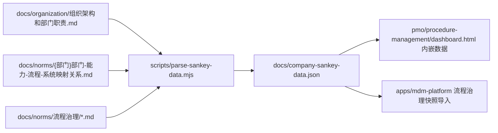

已核实事实：

| 项目 | 当前值 |
|---|---:|
| `docs/company-sankey-data.json` 节点数 | 788 |
| 连接数 | 1420 |
| 流程映射数 | 252 |
| A1 行为数 | 425 |
| 已有数据部门 | 8 |
| 空/占位部门 | 1 |
| 应用系统集合 | ERP / MES / OA / PLM |
| PMO 驾驶舱内嵌 `#sankey-data` | 与 JSON 完全一致 |
| `node scripts/check-dashboard-data.mjs` | 已通过 |

### 3.2 PMO 项目计划真源链

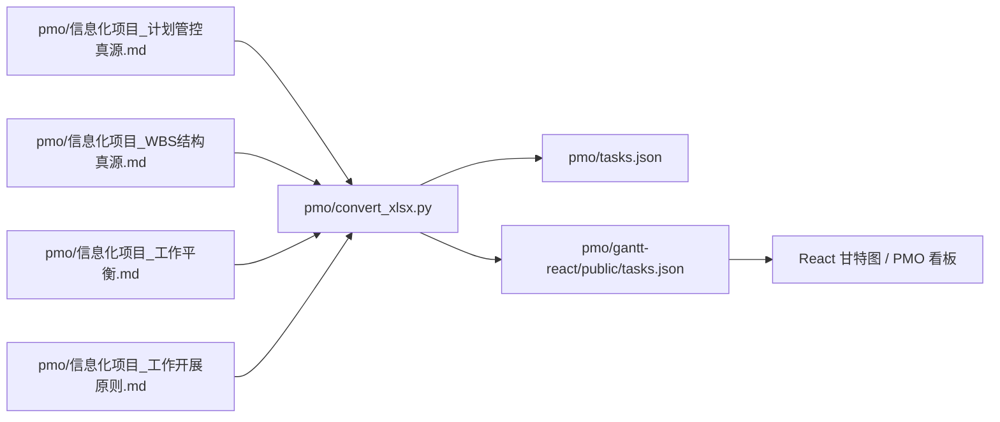

已核实事实：

| 项目 | 当前值 |
|---|---:|
| PMO 任务数 | 434 |
| 周期 | 2026-06-01 至 2028-01-31 |
| `type=里程碑` 任务 | 46 |
| H5 重点展示任务 | 214 |
| 关键路径控制任务 | 75 |
| `pmo/tasks.json` 与 React 消费数据 | 完全一致 |
| 实际 JSON 字段数 | 28 |

注意：`pmo-source-manifest.json` 中记录字段数为 45，但实际 `tasks.json` 的字段合集为 28。评审时应确认这是历史口径、生成逻辑遗漏，还是文档未同步。

### 3.3 MDM 平台主线

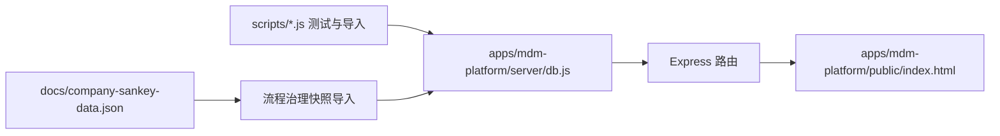

已核实事实：

| 项目 | 当前值 |
|---|---:|
| SQLite schema 表数量 | 54 |
| MDM npm scripts | 35 个 |
| 路由文件 | 约 29 个 |
| API 方法数量 | 约 183 个 |
| 当前本地运行态数据库 | 存在 `apps/mdm-platform/data/platform.db`，不应作为仓库真源 |

## 4. 实际功能面

### 4.1 流程地图和数据地图

功能目标：

- 从部门制度、表单、流程说明、流程图和业务资料中沉淀流程地图。
- 形成部门、能力域、业务能力、业务流程、业务行为、应用系统之间的可追溯关系。
- 支撑公司级流程驾驶舱、部门级桑基图和 MDM 后续承接。

实际资产：

- 部门映射 Markdown：`docs/norms/*部门-能力-流程-系统映射关系.md`
- 部门 MDM 要求：`docs/norms/*能力层与MDM建设要求.md`
- 部门桑基图：`docs/norms/*部门能力流程系统桑基图.html`
- 公司快照：`docs/company-sankey-data.json`
- 解析脚本：`scripts/parse-sankey-data.mjs`
- 质检脚本：`scripts/check-dcm-bbm.mjs`

### 4.2 PMO 流程驾驶舱

功能目标：

- 展示全公司或单域流程地图统计。
- 展示部门覆盖、映射关系、应用系统建议落位、跨部门风险和关键发现。
- 管理层查看为主，不强调 CSV 导出。

已核实：

- 页面使用内嵌 JSON，支持双击打开。
- `#sankey-data` 和 `#cross-dept-data` 均存在。
- PMO 驾驶舱数据与 `docs/company-sankey-data.json` 一致。

### 4.3 MDM 平台

实际模块包括：

- 登录与会话
- 角色工作台
- 统计看板
- 报送管理
- 能力与流程申报
- 业务地图
- 流程治理
- 待办
- 评审记录
- 术语词典
- 冲突管理
- 组织架构
- 人员管理
- 产品主数据
- 数据质量
- 角色权限
- 外部系统集成接口

角色定义已在代码中落地：

| 分组 | 角色 |
|---|---|
| 项目工作角色 | `it_lead`、`project_lead`、`business_contact`、`data_quality`、`decision_group` |
| 基础权限角色 | `submitter`、`owner`、`reviewer`、`admin` |

权限体系不是单一 `users.role`，实际已支持：

- 角色表
- 权限表
- 角色权限表
- 用户角色表
- 角色继承
- deny 覆盖 allow
- 字段约束
- 旧 `users.role` 兼容

### 4.4 PMO 甘特图和交付物工作台

React 甘特图实际支持：

- 任务树
- 甘特图
- 筛选
- 任务详情
- 阶段门视图
- 周视图
- 交付物台账
- 交付物状态流转
- 凭证上传
- 历史快照

交付物文件接口通过 Vite 插件挂载，仅在开发服务中运行：

- `GET /api/pmo/deliverables`
- `GET /api/pmo/deliverables/{DLV-id}`
- `GET /api/pmo/deliverables/{DLV-id}/raw`
- `PUT /api/pmo/deliverables/{DLV-id}`
- `POST /api/pmo/deliverables/{DLV-id}/transition`
- `POST /api/pmo/deliverables/{DLV-id}/upload`

## 5. 关键工作流

### 5.1 流程证据链工作流

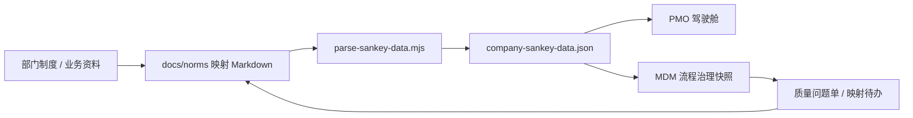

关键原则：

- MDM 记录问题、责任、状态和整改说明。
- 真正整改必须回到 `docs/norms`。
- 改完后重新运行 parser、质检和导入。
- 平台不反向覆盖流程真源。

### 5.2 DCM / BBM 质检工作流

当前质量状态：

| 等级 | 数量级 |
|---|---:|
| BLOCK | 约 208 |
| WARN | 约 1870 |
| INFO | 约 1 |

主要问题集中在：

- BBM 表缺少核心列
- 证据类型枚举不合规
- 跨部门标记不足
- A1 核验提醒和部门确认字段未完全标准化
- 个别公司级数据存在质量提示

结论：当前数据已可展示、可导入，但不能视为流程证据链已完全验收。

### 5.3 MDM 流程映射审批流

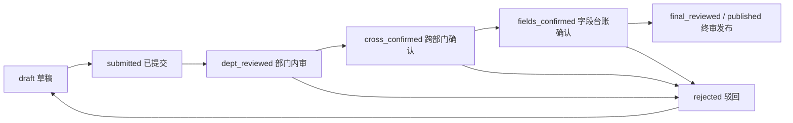

实际步骤：

| Step | 名称 | 说明 |
|---:|---|---|
| 1 | 草稿 | 创建人或管理员可修改、删除 |
| 2 | 部门内审 | 部门内审核任务 |
| 3 | 跨部门确认 | 无相关部门时自动通过 |
| 4 | 字段台账确认 | 无字段确认人时自动通过 |
| 5 | 信息化项目组终审 | 最终发布 |

关键控制：

- 映射提交时会检查未知术语。
- 字段级 error 冲突会阻塞审批。
- 驳回会回到草稿。
- 版本日志和变更记录会写入 `change_set`、`version_log`。

### 5.4 术语治理工作流

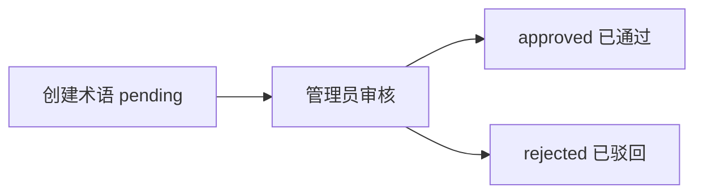

联动规则：

- 流程映射提交时会检查字段中文名是否已被术语覆盖。
- 若出现未知术语，会拦截提交并创建术语补充待办。
- 创建人只能修改自己创建且仍处于待审状态的术语；管理员可维护。

### 5.5 字段台账 / 黄金源工作流

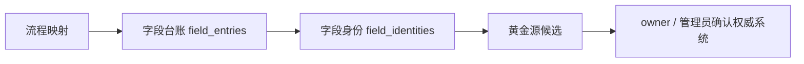

关键原则：

- 字段必须关联流程语境。
- 字段可关联流程治理 L3/A1。
- 黄金源必须按字段确认。
- 不因为流程建议落位到某类应用就直接认定黄金源。

### 5.6 冲突协调工作流

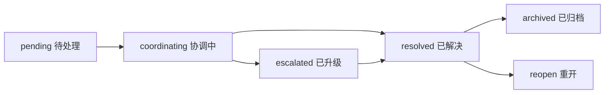

实际机制：

- 首次指定责任人：`pending -> coordinating`
- 协调中可改派
- 当前责任人提交协调结果
- 超过 3 个工作日未闭环会自动升级
- 可手动升级到项目决策组
- 升级后只能由具备终裁权限的角色处理
- 已解决后可归档，也可重开
- 字段冲突解决后会尝试恢复被阻塞的审批任务

### 5.7 流程治理质量问题工作流

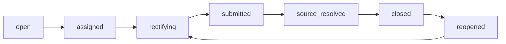

关闭条件很关键：

- 用户不能随意把问题关闭。
- 只有重新质检后问题不再出现，才能进入 `source_resolved`。
- 进入 `source_resolved` 后，具备关闭权限的角色才能关闭。

这保证了“问题关闭”不是口头关闭，而是由源文件整改和重新检查证明。

### 5.8 流程映射待办工作流

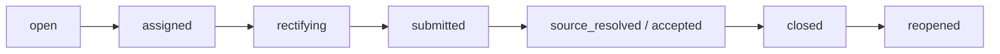

待办类型：

- `dept_confirm`：部门确认
- `verification`：核验
- `adjustment`：调整
- `cross_dept`：跨部门衔接
- `evidence`：证据补充

映射待办来自 norms 映射关系、A1 核验提醒和跨部门衔接风险。处理过程记录在 MDM，整改仍必须回到源文件。

### 5.9 PMO 计划工作流

评审重点：

- 真源 Markdown 与生成 JSON 是否一致。
- WBS 层级、前置任务、关键路径、阶段门是否可解释。
- 任务数、字段数、里程碑数与 manifest 是否一致。

### 5.10 PMO 交付物工作流

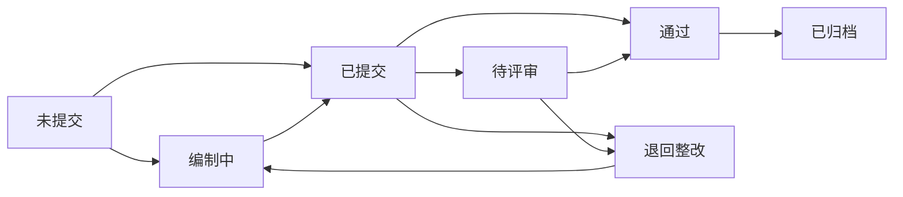

关键控制：

- 进入评审、审核通过、归档前需要凭证。
- 上传支持 docx、xlsx、md，插件会转成 Markdown。
- `If-Match` 防止并发覆盖。
- 通过和归档会写历史快照。
- 该接口是 Vite 开发服务插件，不是生产后端。

## 6. 治理对象

本仓库的治理对象不等于文件清单，也不等于应用系统。治理对象是需要被识别、建模、确认、流转、质检、发布或闭环的业务与管理实体。

### 6.1 总览

| 治理对象类 | 对象 | 当前载体 | 关键状态/动作 |
|---|---|---|---|
| 组织治理 | 公司、部门、办公室、岗位、人员 | `docs/organization`、MDM org/person/position 表 | 同步、激活、任岗、权限绑定 |
| 角色治理 | 项目工作角色、基础权限角色、权限 | MDM roles/permissions/user_roles | 分配、继承、授权、字段约束 |
| 流程治理 | D1/L1/L2/L3/A1/S1/S2 | `docs/norms`、company JSON、MDM 快照 | 抽取、解析、质检、导入、整改 |
| 证据治理 | 制度、表单、台账、流程图、流程说明 | `docs/norms/*业务资料` | 纳入、排除、待复核、引用 |
| 字段治理 | 字段台账、字段身份、黄金源候选 | MDM `field_entries`、`field_identities` | 录入、确认、冲突、发布 |
| 术语治理 | 术语、术语类型、禁用表述 | MDM terms/term_types | 申报、审核、驳回、通过 |
| 冲突治理 | 字段冲突、术语冲突 | MDM conflict 表 | 指派、协调、升级、终裁、归档 |
| 质量治理 | DCM/BBM 发现项、质量问题单 | `_quality-report.md`、MDM quality cases | 分派、整改、提交、复检、关闭 |
| 跨部门治理 | 输入输出部门、交互链、风险 | `docs/norms/流程治理`、MDM cross-dept | 确认、待确认、高风险、闭环 |
| PMO 治理 | WBS、任务、阶段门、交付物 | `pmo` Markdown/JSON/React | 转换、展示、评审、归档 |
| 集成治理 | 外部系统、外部身份、接口凭据、同步日志 | MDM external/integration 表 | 登记、授权、同步、回调 |

### 6.2 组织治理对象

组织治理对象包括：

- 公司：沈阳昌兴复材航空科技有限责任公司
- 部门：工程技术部、质量管理部、财务部、行政人事部、经营发展部、物资保障部、项目管理部、复材车间、运维安环部
- 办公室：总经理办公室、经营副总办公室、生产副总办公室
- 岗位：总经理、经营副总、生产副总及后续部门岗位
- 人员：员工工号、姓名、任职状态、岗位分配

真源与承接：

| 层次 | 真源/载体 |
|---|---|
| 组织口径 | `docs/organization/组织架构和部门职责.md` |
| MDM 同步脚本 | `apps/mdm-platform/scripts/sync-organization-structure.js` |
| MDM 数据表 | `org_unit`、`position`、`person`、`person_position_assignment` |

评审问题：

- 组织架构真源是否覆盖全部部门和领导办公室？
- 脚本中的硬编码组织是否与真源一致？
- 部门到域映射是否仍使用“总经理直辖域/经营域/生产域”三域？
- 人员任岗是否校验岗位所属组织？

### 6.3 角色和权限治理对象

角色治理对象包括：

| 分组 | 对象 |
|---|---|
| 项目工作角色 | 信息化负责人、项目组长、业务对接人、数据质量员、项目决策组 |
| 基础权限角色 | 报送人、业务负责人、审核员、管理员 |
| 权限对象 | dashboard、mapping、review、conflict、todos、data、quality、admin 等权限 |
| 用户授权 | 用户与角色关系、继承权限、字段约束 |

实际承接：

- 角色定义：`apps/mdm-platform/server/roleDefinitions.js`
- 权限引擎：`apps/mdm-platform/server/auth.js`
- 可见性控制：`apps/mdm-platform/server/access.js`
- 数据表：`roles`、`permissions`、`role_permissions`、`user_roles`

评审问题：

- 多角色用户是否能看到“我的工作台”式合并视图？
- `users.role` 旧字段与新 RBAC 是否会冲突？
- deny 覆盖 allow 是否有测试覆盖？
- 字段约束是否在所有敏感资源上生效？

### 6.4 流程治理对象

核心术语：

| 编码 | 治理对象 |
|---|---|
| D1 | 部门 |
| D2 | 办公室 |
| L1 | 能力域 |
| L2 | 业务能力 |
| L3 | 业务流程 |
| A1 | 业务行为 |
| A2 | 业务行为细分 |
| S1 | 应用系统 |
| S2 | 应用模块 |

当前流转：

评审重点：

- 每个 L3 是否有制度依据。
- 每个 A1 是否挂接到已有 L3。
- A1 是否有执行角色、触发情景、前置条件、审批类型、证据类型、验收标准。
- 应用系统 S1 是否仅使用 OA/MES/PLM/ERP 或留空。
- 留空 S1 是否有 no-fit 说明。
- MDM 是否被错误放入 S1。

### 6.5 证据治理对象

证据对象包括：

- 制度正文
- 程序文件
- 管理规定
- 表单模板
- 台账
- 流程图
- 流程说明 Excel
- VSD/VSDX 流程模型
- 图片模板
- 更改单

证据状态建议使用：

| 状态 | 含义 |
|---|---|
| 纳入 | 已作为流程、A1、字段或 MDM 要求依据 |
| 排除 | 已确认不参与本轮流程映射，并记录原因 |
| 待复核 | 文件存在但尚无法确认处理口径 |

当前风险：

- `docs/norms` 下业务资料规模较大，包含 docx、doc、xlsx、xls、vsd、pdf、jpg、txt、md 等。
- 若未建立完整 source manifest，容易出现“源文件未覆盖但映射已完成”的假象。
- 表单和流程图不能只因其父制度被引用就视为已覆盖。

### 6.6 字段和主数据治理对象

字段治理对象：

- 字段条目
- 数据对象
- 字段中文名/英文名
- 字段类型
- 消费系统
- 同步方式
- 对应流程 L3
- 对应业务行为 A1
- 维护部门
- owner
- 黄金源候选
- 权威系统
- 确认状态

主数据候选对象：

- 组织
- 人员
- 岗位
- 产品
- 物料
- 供应商
- 工装
- 设备
- 代码分类
- 属性模板
- 外部身份

评审重点：

- `data_object` 是主数据对象候选，不等于已经完成主数据建模。
- 黄金源确认必须按字段进行。
- 主数据对象沉淀前必须确认维护部门、审批部门、消费系统和权限边界。

### 6.7 术语治理对象

术语对象包括：

- 术语类型
- 术语
- 定义
- 适用范围
- 禁用表述
- 所属业务流程
- 审核状态

流转状态：

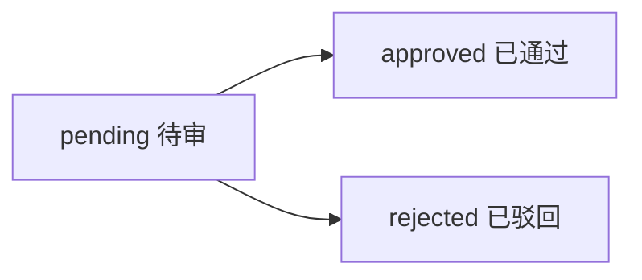

评审重点：

- 术语是否绑定本部门映射关系线上的业务流程。
- 流程映射提交拦截是否会产生过多误报。
- 术语冲突是否能进入冲突协调工作流。

### 6.8 冲突治理对象

冲突对象包括：

- 字段冲突
- 术语冲突
- 冲突参与部门
- 冲突字段或术语
- 双方取值或定义
- 严重级别
- 协调责任人
- 协调历史
- 升级状态
- 终裁结论
- 归档状态

评审重点：

- error 级字段冲突是否能阻塞映射审批。
- 冲突解决后是否能恢复被阻塞的审批任务。
- 自动升级的 3 个工作日规则是否符合管理要求。
- 项目决策组终裁记录是否可追溯。

### 6.9 质量治理对象

质量治理对象包括：

- 质检发现项
- BLOCK/WARN/INFO
- 问题单
- 问题单事件
- 责任部门
- 责任人
- 优先级
- 整改说明
- 复检结果
- 关闭说明

当前实际质量状态显示：流程治理已进入工具化质检阶段，但质量问题仍多，尤其 BBM 区域。

评审重点：

- BLOCK 是否被逐条分派并回源整改。
- WARN 是否区分历史口径、待部门确认和真实缺陷。
- 问题关闭是否严格依赖重新质检。

### 6.10 跨部门治理对象

跨部门对象包括：

- 输入来源部门
- 输出目标部门
- 跨部门 A1
- 交互链
- 链路断点
- 风险等级
- 确认状态

当前快照事实：

| 项目 | 当前值 |
|---|---:|
| 检查项 | 168 |
| 已确认 | 158 |
| 待确认 | 6 |
| 高风险 | 1 |

当前高风险关注点：

- 指向工程技术部的若干 A1 在目标侧缺少对应流程承接。
- 影响客户订单到交付链、成本管控链等交互链完整性。

注意表述：评审时应避免评价某个应用或部门“最忙/承载最多”，只描述流程数、关系数、待补全部门和断点。

### 6.11 PMO 治理对象

PMO 对象包括：

- WBS
- 任务
- 前置任务
- 责任部门
- 供应商
- 审核人/审批组
- 风险等级
- 里程碑
- 阶段门
- 交付物
- 凭证
- 历史快照
- 工作平衡和推进原则

评审重点：

- 任务排期是否与 WBS 层级一致。
- 阶段门阻断规则是否清晰。
- 高风险任务与 A/B 级交付物是否能被管理层看见。
- 交付物状态流转是否要求凭证。
- dev-only 文件接口是否被误当成生产后端。

### 6.12 集成治理对象

集成对象包括：

- 外部系统
- 外部身份
- 集成凭据
- 同步日志
- 回调记录
- 权限范围

实际表包括：

- `external_system`
- `external_identity`
- `integration_credentials`
- `integration_sync_log`

评审重点：

- API key 权限是否按 read/write 控制。
- 外部身份是否与内部主数据对象建立可追溯关系。
- 凭据生成和查看是否受管理员权限保护。

## 7. 当前已知风险和评审关注点

| 风险 | 说明 | 建议 |
|---|---|---|
| 质量问题仍多 | `_quality-report.md` 中 BLOCK/WARN 数量较大 | 先清 BLOCK，再分层处理 WARN |
| PMO 字段口径不一致 | manifest 写 45 字段，实际 JSON 为 28 字段 | 查 `convert_xlsx.py` 与 MD 源块 |
| 工程技术部映射缺口 | 跨部门链路中存在高风险断点 | 建立工程技术部映射补全专项 |
| 本地运行态数据库存在 | `apps/mdm-platform/data/platform.db` 存在 | 不作为评审真源，不提交 |
| 工作区有未提交修改 | MDM 前端、db、术语路由、流程治理前端测试有改动 | 评审前确认是否纳入基线 |
| 根目录仍有临时/待归类资产 | 如 `temp_survey.txt` 等 | 走资产审计，不直接迁移 |
| MDM 初始密码策略 | 新增账号默认 `init1234`，需要首登改密配套检查 | 安全评审专项 |
| dev-only PMO 文件接口 | Vite 插件提供文件写接口 | 明确只用于开发态/本机 PMO 工作台 |

## 8. 建议评审顺序

1. 确认评审基线：先冻结当前未提交修改范围。
2. 跑流程数据链：`node scripts/parse-sankey-data.mjs`、`node scripts/check-dashboard-data.mjs`。
3. 跑 DCM/BBM 质检：`node scripts/check-dcm-bbm.mjs --no-fail`。
4. 先看 BLOCK：按部门、问题类型、来源文件建立整改优先级。
5. 查跨部门链路：尤其工程技术部目标侧断点。
6. 查 MDM 主线：`npm run test:mainline`、`npm run test:process-governance`、`npm run test:role-workbench`。
7. 查 PMO 主线：`python convert_xlsx.py` 后确认 `tasks.json`、manifest 和 React 消费数据。
8. 查权限和安全：RBAC、字段约束、默认密码、session secret、集成凭据。
9. 查生成物边界：数据库、日志、截图、历史输出是否被误纳入真源。

## 9. 评审时的核心判断句

评审这个库时，不要只问“有没有页面”。

应该追问：

- 这个对象的真源在哪里？
- 谁能创建、修改、提交、审核、关闭？
- 状态从哪里来？
- 失败或驳回后回到哪里？
- 关闭条件由什么证明？
- 平台记录是否会反向污染源文件？
- 展示副本是否与生成快照一致？
- 生成快照是否能从源文件重新生成？

只要这几个问题能回答清楚，Infomat 的治理链路就能被系统性评审，而不是被一堆页面和文档淹没。
