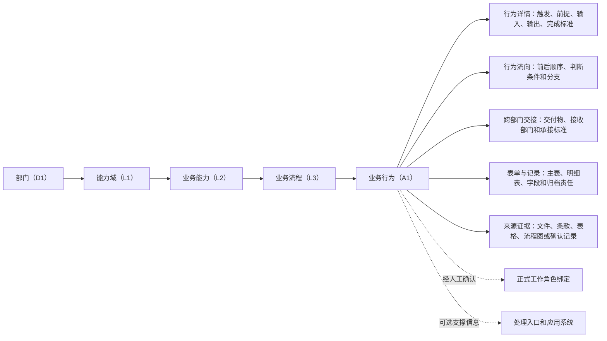

# 业务能力—流程—业务行为数据模型与部门完善指南

> 状态：流程治理说明稿
> 日期：2026-07-20
> 适用对象：各业务部门的业务经办人、流程负责人、部门审核人，以及流程治理人员
> 目的：用业务人员能直接理解的方式说明“部门—能力—流程—行为”的关系，重点给出完整的业务行为模型和部门补数方法。
> 边界：本文是说明和填报指南，不替代组织真源、部门流程输入基线、制度或表单原文，也不直接修改任何已确认映射。

## 1. 先说结论

各部门不应从“我要填一个 L1、L2、L3、A1”开始，也不应先考虑使用哪个系统。正确的起点是本部门每天、每周、每月或在特定事件发生时，实际要完成的业务事项。

用最平实的话说：

- **能力**回答“本部门长期要具备什么本事”。
- **流程**回答“一件业务从什么情况开始，经过哪些环节，到什么结果结束”。
- **行为**回答“谁在什么条件下，拿什么，对什么做什么，形成什么结果，怎样才算完成”。

完整的业务行为至少包含：

> 一个主要执行角色，在明确的触发情景和前置条件下，使用可说明的输入，对具体业务对象执行一个动作或判断，形成可检查的输出，并有完成标准和来源证据。

如果这项行为还涉及判断分支、审批、跨部门交接、表单记录或正式工作角色，则继续补充对应的控制关系。只写“处理”“确认”“跟踪”“形成结果”，还不是完整的业务行为。

## 2. 本文依据和真源边界

本文按以下当前口径整理：

- 组织和部门名称以 `docs/organization/组织架构和部门职责.md` 为准。
- 已确认的能力、流程和行为映射以 `docs/norms/{部门}部门-能力-流程-系统映射关系.md` 为准。
- DCM/BBM 现行字段解释以 `docs/norms/流程映射表字段说明.md` 为准。
- 文档结构化输出的机器合同以 `docs/contracts/document-structured-output.schema.json` 为准。
- `docs/norms/README.md` 中的 `l3_catalog`、`a1_catalog` 是发布投影，不是完整业务行为的全部字段。

本文没有从质量报告、页面快照、数据库读模型或 PMO 驾驶舱反推新的业务事实。报告中的例子只演示写法，不进入正式流程输入基线。

## 3. 总体数据模型

### 3.1 主层级

| 层级 | 平实解释 | 主要内容 | 谁提供业务事实 | 谁做最终确认 |
|---|---|---|---|---|
| 部门（D1） | 这是谁的日常业务 | 标准部门名称、部门编码、所属域 | 由人员和组织真源自动带出，不让填报人重复填写 | 组织真源维护人 |
| 能力域（L1） | 这一组工作属于哪一大类本事 | 较稳定的高层业务分类 | 部门说明自己的职责范围和实际业务 | 流程治理审核人会同部门负责人 |
| 业务能力（L2） | 本部门需要持续具备的具体本事 | 对若干相近流程进行归类 | 部门提供真实业务事项、对象和结果 | 流程治理审核人会同部门负责人 |
| 业务流程（L3） | 一件业务从开始到结束的完整路径 | 流程边界、负责人、输入、主要结果、行为链、证据 | 流程负责人和实际经办人 | 部门负责人或授权审核人 |
| 业务行为（A1） | 流程中一个角色完成的一项独立任务或判断 | 角色、触发、前提、输入、动作、输出、标准和证据 | 实际经办人和流程负责人 | 部门审核人；跨部门部分还需接收部门确认 |

### 3.2 关系图

### 3.3 关系约束

1. 一个部门可以有多个能力域。
2. 一个能力域可以包含多个业务能力。
3. 一个业务能力可以由多个业务流程实现。
4. 一个业务流程至少应有一个业务行为；通常由多个行为组成。
5. 一个业务行为只能归属于一个 L3 流程，不能同时挂在两个流程下。
6. 一个业务行为可以关联多个证据、多个表单、多个参与角色和多个跨部门交接关系。
7. 应用系统只是行为的处理载体或入口，不是能力、流程或行为的上级。
8. 表单、制度和台账是业务对象或证据，不应直接当成业务能力名称。

## 4. 怎么区分能力、流程和行为

| 判断问题 | 如果答案是“是” | 更可能属于 | 典型命名方式 |
|---|---|---|---|
| 这是一类长期稳定、可以由多条流程共同支撑的本事吗？ | 是 | L1/L2 能力 | 名词或能力式名称，如“培训管理”“供应商质量管理” |
| 这件事有明确开始、结束和主要业务结果吗？ | 是 | L3 流程 | 对象加闭环事项，如“年度培训计划编制与发布” |
| 这是一个主要角色可以独立完成并留下结果的一项任务吗？ | 是 | A1 行为 | 动词加具体对象，如“汇总培训需求并形成需求清单” |
| 这是根据条件作出判断并决定下一步吗？ | 是 | 判断型 A1 | “判断……是否……”“审核……并作出通过或退回决定” |
| 这只是一次点击、打开页面或复制粘贴吗？ | 是 | 通常不是业务行为 | 作为操作说明，不单独建 A1 |
| 这只是“负责、管理、处理、跟踪”等职责口号吗？ | 是 | 还没有落到流程或行为 | 继续追问对象、动作、结果和完成标准 |

### 4.1 L1/L2 不让一线填报人硬想

L1/L2 需要跨流程归类和抽象总结。部门填报人的首要任务是把真实业务事实说清，不要求一开始就创造能力分类或编号。

流程治理审核人应在部门事实已经完整后：

1. 优先选择本部门已有 L1/L2。
2. 确实无法归入时，再提出新增或调整建议。
3. 由人工确认分类，不让模型或抽取脚本直接定义标准。

### 4.2 L3 是一件业务的完整边界

一个 L3 至少应能回答：

- 什么情况使流程开始？
- 流程为谁或为什么服务？
- 主要业务对象是什么？
- 最终形成什么结果或状态？
- 谁对整条流程负责？
- 哪些 A1 共同完成它？
- 可以回到哪里核验？

如果一条所谓“流程”只有一个动作，没有独立起止和业务结果，它更可能是 A1。如果一条“流程”同时混入多个互不相关的开始和结果，它可能需要拆成多个 L3。

## 5. L3 业务流程模型

### 5.1 业务字段

| 字段 | 业务人员看到的问题 | 当前合同对应 | 完善要求 |
|---|---|---|---|
| 所属部门 | 这是谁的流程？ | `department` / `dept_name` | 从当前人员和组织真源带出，不手工猜部门。 |
| 能力域（L1） | 这属于哪一大类业务能力？ | `l1_name` / `l1` | 由审核人优先从已有分类选择。 |
| 业务能力（L2） | 这条流程支撑哪项稳定能力？ | `l2_name` / `l2` | 由审核人会同部门确认。 |
| L3 稳定编号 | 后续怎样稳定引用这条流程？ | `l3_key` | 由流程治理人员按现有编号口径分配或确认，部门不临时造号。 |
| 流程名称 | 这件完整业务叫什么？ | `l3_name` | 使用业务名称，不写系统菜单、文件名或部门职责口号。 |
| 流程类型 | 这是新建、继承、承接还是调整？ | `process_type` | 按真实来源选择，不因名称相似自动认定。 |
| 流程说明 | 从哪里开始，到哪里结束？ | `description` | 写清起点、终点、主要对象和结果。 |
| 流程负责人 | 谁对整条流程持续负责？ | `owner` | 写责任角色，不等于每个 A1 的执行人。 |
| 建议处理系统 | 当前建议在哪个系统处理？ | `system` | 可为空；只描述流程落位，不评价哪个系统更重要。 |
| 来源证据 | 流程边界和归属依据在哪里？ | `evidence_refs` | 至少能回到真实文件、条款、流程图、表单、台账或经确认的业务事实。 |

### 5.2 L3 达到可发布状态的条件

- 已归入一个经过确认的 L1/L2。
- 名称、起点、终点和主要结果清楚。
- 已指定流程负责人。
- 至少有一个 A1，且 A1 共同构成连续业务链。
- 判断分支、审批和跨部门交接没有被藏在一段笼统描述里。
- 证据可追溯，待确认问题已经处理或明确保留为未发布项。

## 6. 完整的 A1 业务行为模型

### 6.1 为什么不能只看 `a1_catalog`

当前 `a1_catalog` 只保存发布投影需要的摘要：A1 编号、所属 L3、行为名称、角色、入口、系统和证据引用。它足以画出“L3 → A1”的骨架，但不足以说明一项行为怎样真正执行。

完整行为模型分散在以下相互关联的对象中：

| 对象 | 负责说明什么 | 当前合同对象 |
|---|---|---|
| 行为基本记录 | 属于哪个流程、是动作还是判断、谁做、何时做、输入输出是什么 | `steps[]` |
| 行为详情 | 触发情景、前置条件、完成标准、交付物、审批和跨部门标记 | `behavior_details[]` |
| 行为流向 | 判断条件满足后走向哪个下一行为 | `step_transitions[]` |
| 跨部门交接 | 交给哪个部门、交什么、对方按什么标准承接 | `cross_dept_handoffs[]` |
| 表单和记录 | 行为使用、形成或维护哪些表单、表格和字段，怎样归档 | `forms[]`、`form_tables[]`、`form_table_fields[]`、`form_fields[]` |
| 正式工作角色绑定 | 原文角色在人工确认后对应哪个正式工作角色、以什么身份参与 | `work_role_bindings[]` |
| 来源证据 | 每项事实来自哪里、如何定位、是否已经核验 | `evidence_catalog[]` |

所以，一条 A1 不是一行“行为名称”，而是以行为为中心的一组可追溯关系。

### 6.2 每项 A1 的核心字段

下面这些字段是部门真正要说清的业务事实。机器合同允许先保存不完整草稿，但进入正式审核或发布前，应按本表补齐。

| 字段 | 要回答的业务问题 | 当前字段 | 谁提供 | 填写口径 |
|---|---|---|---|---|
| 所属 L3 | 这项行为在完成哪条流程？ | `process_ref`、`l3_key` | 流程负责人 | 只能挂在一个已确认或正在审核的 L3 下。 |
| A1 稳定编号 | 后续怎样稳定引用这项行为？ | `a1_code` | 流程治理人员 | 编号应能回到所属 L3，不让部门临时自造。 |
| 行为类型 | 这是执行动作，还是作出条件判断？ | `step_type` | 经办人提出，审核人确认 | 只用“动作”或“判断”；判断必须补分支。 |
| 行为名称 | 具体做什么？ | `step_name` / `behavior` | 实际经办人 | 使用“动词 + 具体对象 + 必要结果”，不要只写抽象动词。 |
| 原文执行角色 | 谁实际完成这项工作？ | `actor_role` / `role` | 实际经办人和制度维护人 | 先保留制度、表单或实际业务中的原称谓，不自动改成标准角色。 |
| 触发情景 | 什么事情发生后，这项行为才启动？ | `trigger_scene` | 实际经办人 | 写业务事件，如“收到经批准的申请”，不要只写日期。 |
| 时间要求 | 什么时候做、多久做完、周期是什么？ | `timing` | 实际经办人 | 写频次、截止点或时限；没有明确时限可说明“无固定时限，随事件触发”。 |
| 前置条件 | 开始前必须已经满足什么？ | `precondition` | 实际经办人 | 写状态、资格、资料齐备或上一行为结果，不与触发事件混写。 |
| 输入材料 | 执行时拿到什么？ | `input_materials` | 实际经办人 | 写具体表单、计划、数据、实物、通知或上一步结果。 |
| 输出结果 | 做完以后留下什么？ | `output_result` | 实际经办人 | 可以是文件、记录、数据、决定、状态或实物标识，但必须可检查。 |
| 执行/完成标准 | 怎样判断已经做到且结果合格？ | `execution_standard`；旧 BBM 表中的“验收标准” | 实际经办人和流程负责人 | 写可观察条件、必备字段、时限、准确性或一致性要求，不能只写“完成”。 |
| 来源证据 | 上述事实在哪里能找到？ | `evidence_refs` | 经办人提供，审核人核验 | 指向真实来源和具体位置；OCR、推断或分析拆分不能冒充已核验证据。 |

### 6.3 条件成立时必须补的控制字段

| 情况 | 必须补什么 | 当前字段或对象 | 完成标准 |
|---|---|---|---|
| 行为结果需要审批 | 是否审批、审批角色、顺序、通过/退回结果和依据 | `requires_approval`、`approval_note`；旧 BBM 的“审批类型” | 审批链有原文、流程图、表单签批栏或审批记录支撑。 |
| 行为本身是判断 | 每个判断条件和下一行为 | `step_transitions[]` | 每个可发生的结果都有清楚条件；目标行为明确，未明确时保留待确认而非猜测。 |
| 结果要交给其他部门 | 具体交付物、接收部门、承接标准、接收方流程/行为和确认状态 | `delivery_object`、`cross_dept_handoffs[]` | 接收部门确认“收到什么、怎样算可接、接到哪里继续处理”。 |
| 行为使用或形成表单 | 表单名称、编号、主表/明细表、字段、归档位置、期限和责任 | `forms[]` 及表单结构对象 | 表单作为可维护业务对象，而不是只留下一个附件名称。 |
| 需要映射正式工作角色 | 参与部门、原文称谓、参与类型、正式角色、证据和确认依据 | `work_role_bindings[]` | 行政人事和流程责任部门均完成确认；候选关系不能进入正式投影。 |
| 需要指定系统入口 | 应用系统和具体处理入口 | `system`、`entry` | 系统可以留空；只记录处理位置，不用系统名称替代业务动作。 |
| 行为不再生效 | 作废状态和原因追溯 | `status` | 保留历史，不物理删除；作废行为不进入发布投影。 |

### 6.4 行为名称怎样写才算完整

推荐句式：

> 动词 + 具体业务对象 + 必要的处理结果或判断结论

| 不完整写法 | 问题 | 改写方向 |
|---|---|---|
| 处理 | 不知道处理什么，也不知道结果 | 写清对象和结果，如“核对报销单据并形成审核意见” |
| 确认 | 不知道确认哪项事实、按什么判断 | 写成“确认设备状态满足启用条件” |
| 跟踪 | 不知道跟踪对象、频率和闭环结果 | 写成“跟踪整改项进度并更新整改台账” |
| 汇总核算 | 对象和产出不清 | 写成“汇总各项目成本数据并形成月度成本分析表” |
| 形成结果 | 没有说明动作和结果是什么 | 写清“依据检验记录判定产品是否符合放行条件” |
| 系统提交 | 把界面操作当成业务行为 | 先写业务动作，如“提交经复核的付款申请”，系统仅作为入口 |

抽象名称来自分析拆分时，必须同时保留它从哪段原文、哪个具体对象、哪个流程图节点或哪个表单动作抽象而来。

### 6.5 什么时候拆成两个 A1

出现下列任一情况，通常应拆分：

1. 主要执行角色发生变化。
2. 从执行动作进入审核、批准或条件判断。
3. 产生了一个可以独立检查、独立退回或独立交接的中间结果。
4. 业务对象发生变化，例如从“申请单”转为“合同”或“付款记录”。
5. 结果被受控交给另一个部门。
6. 不同结果会进入不同下一步。
7. 两段工作有不同完成标准或不同证据。

下列情况通常不必拆分：

- 同一角色对同一对象连续完成的机械小动作，没有独立结果或控制点。
- 只是在系统中点击、选择、保存或关闭页面。
- 为了凑数量，把一句完整业务动作拆成几个没有独立意义的动词。

一个实用判断是：如果前半段失败、退回或交给别人时需要单独记录，它通常值得成为独立 A1。

## 7. 判断、审批和跨部门交接的特别规则

### 7.1 判断节点

判断型 A1 仍要填写角色、触发、前提、输入、输出和完成标准，不能只写一个菱形名称。

判断分支至少包含：

| 字段 | 说明 |
|---|---|
| 从哪个判断行为出发 | 必须引用当前流程中的判断型 A1。 |
| 判断条件 | 使用业务可验证的条件，如“资料完整且金额一致”。 |
| 下一行为 | 条件成立后进入哪个 A1；确实未明确时保留待确认。 |
| 分支证据 | 指向制度条款、流程图连线、表单选项或经确认的业务规则。 |

“通过”和“退回”不能只写结果词，还要说明各自的判断条件和去向。

### 7.2 审批

审批不是看到“负责人”“领导”或“审核”字样就自动成立。至少要有以下一种依据：

- 制度正文明确了提交、审核、批准的顺序。
- 流程图明确了审批节点和流向。
- 表单存在可辨识的审核、批准或会签栏。
- 现行审批记录能够证明角色、顺序和结果。

如果审批由另一个角色作出，而且通过或退回会改变流程走向，应把审批建成单独的判断型 A1。前一行为上的“需要审批”只说明其结果需要进入审批，不能代替审批人的实际行为。

旧 BBM 表中的审批类型只使用“无审批、单人审批、多级审批、会签”。文档结构化输出当前采用“是否需要审批 + 审批说明”。两种表达必须来自同一条审批证据，不能为了填满字段默认写“无审批”。

### 7.3 跨部门交接

只有同时说清下列事实，才建立跨部门交接：

1. 从哪个 A1 发出。
2. 交付的具体对象是什么。
3. 交给哪个标准部门。
4. 用什么动作完成交接，例如提交、发送、移交、反馈、签收或回写。
5. 接收方怎样判断可以承接。
6. 接收方在哪条流程或哪个行为继续处理；暂时不清时由接收部门回写。
7. 在哪里能看到交接证据。

下列事实本身不能证明跨部门交接：

- 某部门参加会议、协同讨论或被抄送。
- 某部门承担审核、批准或归档责任。
- 制度的附件清单里出现另一个部门。
- 根据常识推断“这项工作应该交给某部门”。
- 外部客户、供应商、银行等参与方被直接当成公司内部部门。

跨部门关系必须由交付对象串起来。接收部门未确认前，承接流程和承接行为保持待确认，不由发起部门代填结论。

## 8. 表单、工作角色和证据怎样挂在行为上

### 8.1 表单和记录

输入材料和输出结果先用业务语言概括。如果某张表单需要长期维护字段、版本、归档或责任，应进一步建成独立表单对象，并挂到实际使用或形成它的 A1。

一个可治理的表单至少应说明：

- 表单名称和编号。
- 它属于哪个 A1。
- 主表名称；需要时再增加明细表。
- 字段名称、类型、是否必填和业务含义。
- 归档位置、留存周期、归档责任部门和责任角色。
- 表单或字段的来源证据。

表单是业务运行对象，不应以“一张 A4 纸长什么样”作为第一设计目标。打印版可以后续生成，流程中的数据结构和责任关系应先说清。

### 8.2 原文角色和正式工作角色

业务行为中的 `actor_role` 先保留原文角色称谓，例如制度里的岗位、身份或组织称谓。它回答“原文或实际业务是怎么说的”。

正式工作角色绑定回答另一件事：“这个原文称谓经过确认后，对应公司哪一类稳定业务责任”。两者不能直接画等号。

- 部门提供原文称谓和实际参与方式。
- 行政人事部确认正式工作角色和岗位映射。
- 流程责任部门确认该角色在具体 L3/A1 中的参与类型。
- 只有 `confirmed` 关系才能进入正式投影。
- 自动抽取、岗位同名或模型建议只能形成候选，不能生成正式关系。

### 8.3 证据

每条关键事实都应能回到具体来源。证据至少包含：

| 内容 | 平实说明 |
|---|---|
| 证据类型 | 制度条款、表单样例、流程图、台账记录、访谈记录、会议纪要或暂无证据。 |
| 来源名称 | 哪份制度、表单、台账、流程图或确认记录。 |
| 源文件编号 | 文件已有编号时记录；没有编号时明确“待分配编号”。 |
| 具体位置 | 条款、页码、表格、字段、流程节点或可定位摘录。 |
| 原文摘录 | 保留原文，不把规范化后的改写冒充原文。 |
| 定位方式 | 人工核验、文本定位、表格定位、OCR 等。 |
| 核验状态 | 已核验、待复核、来源缺失、OCR 待确认或仅供审核参考。 |
| 确认人和时间 | 谁在什么时候完成了人工确认。 |
| 证据成熟度 | 只能保存草稿、发布前需补、可提交审核或可支撑发布。 |

证据状态的业务含义：

- `verified`：已经回到真实来源核验，可以支撑正式结论。
- `pending_review`：已找到来源，但仍需人工核对。
- `source_missing`：当前没有可用来源，应说明缺什么、由谁补、计划何时补。
- `ocr_extracted_not_confirmed`：来自 OCR，尚未和原 PDF/图片逐项核对。
- `review_only`：可帮助审核理解，但不能直接作为正式入库依据。

分析拆分或上下文推断可以帮助提出待确认项，但不能据此填实输出对象、审批类型、执行角色或目标部门。正式发布前必须回到具体对象、动作、流程节点或表单位置核验。

## 9. 各部门按自身业务完善数据的步骤

### 第一步：选一件真实、重复发生的业务事项

从本部门实际工作中选择一件会重复发生、有人负责、会留下结果的业务，例如周期性计划、申请审批、检验放行、合同评审、设备维护、问题整改或报表编制。

先不要选系统，也不要先想 L1/L2 名称。

本步输出：业务事项名称、主要对象、实际经办人、现有制度/表单/台账清单。

### 第二步：画出这件事的起点和终点

请用两句话说明：

1. “当什么事情发生时，这件业务开始。”
2. “形成什么结果并达到什么状态时，这件业务结束。”

如果说不清起点和终点，先不要急着命名 L3。

本步输出：L3 候选名称、起点、终点、主要结果和流程负责人。

### 第三步：按实际发生顺序讲一遍

让真正做这项工作的人按时间顺序回答：

- 第一个人拿到什么，做什么，交出什么？
- 下一个人为什么接手，接到什么，怎样处理？
- 在哪里需要判断、审核、批准、退回或重做？
- 哪一步把什么交给了其他部门？
- 最终结果由谁确认？

本步输出：A1 候选清单和前后关系。

### 第四步：每个 A1 填完“九句话”

部门可以直接按下面的句式填写：

1. 这项行为属于“______”流程。
2. 当“______”发生时，这项行为启动。
3. 开始前必须已经“______”。
4. 由“______”角色执行。
5. 执行人拿到“______”。
6. 对“______”执行“______”动作或判断。
7. 完成后形成“______”。
8. 满足“______”时，才算完成。
9. 上述事实可以在“______文件/表单/台账的______位置”找到。

有固定周期或截止时间时，再补一句：“应在______时间内完成。”

本步输出：每个 A1 的核心行为卡。

### 第五步：把特殊控制单独展开

- 有判断：补每个判断条件和下一行为。
- 有审批：补审批角色、顺序、通过/退回结果和依据。
- 有跨部门：补交付物、接收部门、承接标准和接收方确认。
- 有表单：补表单、表格、字段和归档责任。
- 有正式角色映射需求：保留原文角色，提交角色绑定确认，不自行填写正式角色编码。

本步输出：分支表、审批说明、跨部门交接表、表单结构和角色绑定候选。

### 第六步：让接收方和实际执行人核对

- 实际执行人核对“这是不是我真正做的工作”。
- 流程负责人核对“这些行为能不能连成完整流程”。
- 接收部门核对“我是否真的接收这个对象，什么样才接得住”。
- 制度或表单维护人核对“来源位置和原文是否准确”。

本步输出：部门确认意见、跨部门确认意见和证据核验结果。

### 第七步：由审核人完成能力归类和稳定编号

审核人优先复用已有 L1/L2，确认 L3 边界和 A1 粒度，再分配或确认稳定编号。AI 或脚本可以提示重复、缺字段和悬空关系，但不决定新的能力分类、行为拆分或发布结论。

本步输出：确认后的 D1-L1-L2-L3-A1 关系和稳定引用。

### 第八步：按成熟度进入草稿、审核或发布

- 事实还不完整：保存草稿，并逐项写明缺什么、由谁补、什么时候补。
- 核心行为已完整、证据待最终核验：提交审核。
- 分类、行为、分支、交接和证据都已人工确认：进入受控发布。

## 10. 分工建议

| 参与人 | 主要责任 | 不应代替别人决定的事项 |
|---|---|---|
| 实际经办人 | 说明真实动作、输入、输出、时限、完成标准和现有证据 | 不强迫其创造 L1/L2 或稳定编码 |
| 流程负责人 | 确认 L3 起止、行为顺序、异常路径和整体完成结果 | 不替接收部门确认跨部门承接 |
| 部门审核人/负责人 | 确认本部门职责、行为粒度、审批和发布意见 | 不用常识补写缺失证据 |
| 接收部门 | 确认交付物、承接标准、目标流程和目标行为 | 不由发起部门代填 |
| 行政人事部 | 管理正式工作角色目录和岗位映射 | 不改写制度中的原文角色称谓 |
| 流程治理人员 | 维护 L1/L2 口径、稳定编号、关系完整性和发布规则 | 不替业务部门定义实际工作事实 |
| AI/系统 | 抽取、整理、查重、预检查、逐项提示缺口 | 不定标准、不拆 A1、不确认审批链、不替人发布 |

## 11. 填写示例

> 下例只演示写法，不对应现行已确认流程输入基线，也不能作为任何部门的正式证据。

### 11.1 示例层级

| 层级 | 示例 |
|---|---|
| 部门 | 行政人事部 |
| 能力域（L1） | 人力资源管理（示例） |
| 业务能力（L2） | 培训管理（示例） |
| 业务流程（L3） | 年度培训计划编制与发布（示例） |

### 11.2 示例行为链

| 顺序 | 类型 | 行为名称 | 主要角色 | 主要输出 |
|---|---|---|---|---|
| A01 | 动作 | 收集各部门培训需求 | 培训管理人员 | 已登记的部门培训需求 |
| A02 | 动作 | 汇总培训需求并编制年度培训计划草案 | 培训管理人员 | 年度培训计划草案 |
| A03 | 判断 | 审核年度培训计划草案是否满足年度安排 | 授权审核角色 | 通过或退回意见 |
| A04 | 动作 | 发布经批准的年度培训计划 | 培训管理人员 | 已发布的受控版本培训计划 |

判断分支示例：

| 从哪个行为 | 条件 | 下一行为 |
|---|---|---|
| A03 | 计划内容、资源和时间安排符合要求 | A04 |
| A03 | 信息不完整或安排不具备执行条件 | A02 |

### 11.3 A02 完整行为卡示例

- 所属 L3：年度培训计划编制与发布（示例）。
- 行为类型：动作。
- 行为名称：汇总培训需求并编制年度培训计划草案。
- 原文执行角色：培训管理人员（示例称谓，正式角色另行确认）。
- 触发情景：各部门培训需求提交期结束。
- 时间要求：在计划编制约定周期内完成。
- 前置条件：各部门需求已登记；缺报部门已被识别并记录。
- 输入材料：各部门培训需求、年度工作安排和可用资源信息。
- 输出结果：可进入审核的年度培训计划草案。
- 完成标准：每项计划可追溯到需求来源，培训对象、主题、时间安排和责任信息完整，重复需求已经核对。
- 是否需要审批：是；草案需进入 A03 审核。
- 是否跨部门：本行为汇总多部门输入；正式跨部门关系应由实际交付记录和接收方确认支撑。
- 来源证据：正式填报时换成真实制度、需求表、台账或确认记录及具体位置；本例不提供真实证据。

和“汇总培训”相比，这张卡写清了角色、触发、前提、输入、动作、输出、标准和后续审核，每一项都能核对。

## 12. 可直接复制的部门填报模板

### 12.1 L3 流程卡

- 部门：
- 业务事项：
- 建议流程名称：
- 什么情况开始：
- 什么结果表示结束：
- 主要业务对象：
- 流程负责人角色：
- 涉及哪些实际经办角色：
- 是否涉及其他部门：
- 现有制度/表单/流程图/台账：
- 当前已有 L1/L2（不知道可留给审核人）：
- 待确认问题：

### 12.2 A1 行为卡

- 所属 L3：
- 行为类型：动作 / 判断
- 行为名称：
- 原文执行角色：
- 触发情景：
- 时间要求：
- 前置条件：
- 输入材料：
- 对什么对象做什么：
- 输出结果：
- 执行/完成标准：
- 是否需要审批：是 / 否 / 待确认
- 审批角色、顺序和结果：
- 是否涉及跨部门交接：是 / 否 / 待确认
- 具体交付物：
- 接收部门：
- 承接标准：
- 目标流程/行为（由接收部门确认）：
- 使用或形成的表单/台账：
- 当前处理入口/系统（不知道可留空）：
- 来源文件或记录：
- 具体位置或摘录：
- 当前证据状态：
- 还缺什么、由谁补、计划何时补：

### 12.3 判断分支表

| 判断行为 | 判断条件 | 下一行为 | 来源位置 | 待确认事项 |
|---|---|---|---|---|
|  |  |  |  |  |

### 12.4 跨部门交接表

| 发出行为 | 具体交付物 | 接收部门 | 承接标准 | 接收方流程/行为 | 接收方确认状态 | 来源位置 |
|---|---|---|---|---|---|---|
|  |  |  |  |  |  |  |

### 12.5 证据表

| 支撑对象/字段 | 证据类型 | 来源名称和编号 | 条款/页码/表格/节点 | 原文摘录 | 核验状态 | 确认人和时间 |
|---|---|---|---|---|---|---|
|  |  |  |  |  |  |  |

## 13. 三个成熟度关口

### 13.1 可以保存草稿

- 已说明真实业务事项和部门。
- 至少有 L3 候选和一个 A1 候选。
- 缺失项没有被默认为“无”，而是写明缺什么、由谁补、何时补。
- OCR、模型抽取和推断内容都明确标为待复核。

### 13.2 可以提交审核

- L3 的起点、终点、负责人和主要结果清楚。
- 每个 A1 的角色、触发、前提、输入、动作、输出和完成标准完整。
- 行为顺序能够连成完整流程。
- 判断分支、审批和跨部门交接已单独展开。
- 每项关键事实至少有来源或明确的待补责任。

### 13.3 可以受控发布

- L1/L2、L3 边界和 A1 粒度已经人工确认。
- L3/A1 稳定编号有效且没有重复或悬空引用。
- 所有正式结论使用可核验证据；OCR 和仅供审核材料未被冒充正式证据。
- 审批类型和审批链有直接证据。
- 跨部门交付物、接收部门、承接标准和目标流程/行为已由双方确认。
- 正式工作角色绑定已经行政人事和流程责任部门确认。
- 作废行为未进入发布投影，历史仍可追溯。
- 不存在以“旧模板未采集、待补、上下文推断”代替核心业务事实的发布项。

## 14. 发布前检查清单

### 层级关系

- [ ] 部门名称来自组织真源。
- [ ] 每个 L3 只归入一个明确的 L2。
- [ ] 每个 A1 只归属于一个 L3。
- [ ] 没有让 A1 反向改写未经审核的 L1/L2。
- [ ] 系统名称没有被当成能力、流程或行为名称。

### L3 完整性

- [ ] 起点、终点、主要对象和结果清楚。
- [ ] 流程负责人明确。
- [ ] 行为链能够覆盖正常路径和主要异常路径。
- [ ] 流程证据可定位。

### A1 完整性

- [ ] 名称是明确动作或判断，不是抽象口号。
- [ ] 一个 A1 有一个主要执行角色。
- [ ] 触发情景和前置条件没有混写。
- [ ] 输入、输出和完成标准可检查。
- [ ] 判断型 A1 的每个分支有条件和去向。
- [ ] 审批有角色、顺序、结果和证据。
- [ ] 跨部门交接以具体交付物为中心，并由接收方确认。
- [ ] 表单和记录已挂到实际使用或形成它们的 A1。
- [ ] 原文角色称谓与正式工作角色绑定分开管理。

### 证据和确认

- [ ] 证据能拆解为源文件编号、制度或表单名称、具体位置、业务流程和业务行为。
- [ ] 原文摘录没有被规范化改写替代。
- [ ] OCR 内容已经回原图/PDF 核对，或仍保持待确认。
- [ ] 推断和分析拆分显示了具体推断依据。
- [ ] 已记录确认人、确认时间和处理结论。

## 15. 当前合同字段对照

本节供流程治理、产品和技术人员核对。部门业务人员不需要记住这些英文名。

### 15.1 L3

| 业务概念 | 文档结构化输出 v2 | 正式结构块投影 |
|---|---|---|
| 内部引用 | `process_ref` | — |
| 稳定流程编号 | `l3_key` | `l3_key` |
| 流程类型 | `process_type` | — |
| L1/L2/L3 | `l1_name`、`l2_name`、`l3_name` | `l1`、`l2`、`l3_name` |
| 流程说明 | `description` | — |
| 流程负责人 | `owner` | `owner` |
| 建议落位系统 | `system` | `system` |
| 证据 | `evidence_refs` | `evidence_refs` |

### 15.2 A1 基本记录和详情

| 业务概念 | 文档结构化输出 v2 | 正式 `a1_catalog` 投影 |
|---|---|---|
| 内部引用 | `step_ref` | — |
| 所属流程 | `process_ref` | `l3_key` |
| A1 编号 | `a1_code` | `a1_code` |
| 动作/判断 | `step_type` | — |
| 行为名称 | `step_name` | `behavior` |
| 原文执行角色 | `actor_role` | `role` |
| 时间要求 | `timing` | — |
| 触发情景 | `behavior_details.trigger_scene` | — |
| 前置条件 | `behavior_details.precondition` | — |
| 输入材料 | `input_materials` | — |
| 输出结果 | `output_result` | — |
| 完成标准 | `behavior_details.execution_standard` | — |
| 交付对象 | `behavior_details.delivery_object` | — |
| 是否需要审批 | `behavior_details.requires_approval` | — |
| 审批说明 | `behavior_details.approval_note` | — |
| 是否跨部门 | `behavior_details.is_cross_department` | — |
| 处理入口 | `entry` | `entry` |
| 建议落位系统 | `system` | `system` |
| 生效状态 | `status` | — |
| 证据 | `evidence_refs` | `evidence_refs` |

这张表直接说明了为什么 `a1_catalog` 不能单独承担完整行为模型：它只投影骨架和发布摘要，完整执行语义仍在行为基本记录、行为详情和关联对象中。

### 15.3 行为关联对象

| 对象 | 关键字段 | 说明 |
|---|---|---|
| 判断分支 | `from_step_ref`、`condition`、`to_step_ref`、`evidence_refs` | 同一 L3 内的条件流向。 |
| 跨部门交接 | `step_ref`、`target_department`、目标流程/行为、`handoff_standard`、`status` | 接收部门负责回写承接流程和行为。 |
| 表单 | `step_ref`、表单编号/名称、主表、归档位置、留存周期、责任部门/角色、证据 | 表单通过 `step_ref` 挂到 A1。 |
| 工作角色绑定 | 流程/A1、参与部门、原文称谓、正式角色编码、参与类型、状态、证据、确认依据 | 只有人工确认关系进入正式投影。 |
| 证据 | 对象类型/引用、证据类型、来源、位置、摘录、定位方法、成熟度、状态、确认人/时间 | 一份证据可支撑一个或多个对象，但每个引用必须可追溯。 |

### 15.4 当前表达差异

1. 当前 L1/L2 在标准合同中主要以名称表达，没有让部门自行维护稳定编码的入口。
2. 旧 BBM 表用“审批类型”枚举；文档结构化输出 v2 用“是否需要审批 + 审批说明”。审核时必须保证两者来自同一证据。
3. 旧 BBM 表可直接写“输入来源部门/输出目标部门”；新模型把对外输出进一步建成跨部门承接关系。任何部门字段都必须由具体交付证据支撑。
4. 正式结构块只投影已确认的 L3/A1 摘要、证据和确认后的工作角色关系；完整草稿中的触发、前提、分支、表单和承接细节不能因此被忽略。
5. 系统字段只允许当前合同规定的值或留空；MDM 是后续治理承接能力，不作为流程应用系统（S1）。

## 16. 本文的使用方式

建议以“一条真实 L3”为单位组织部门访谈或填报：

1. 先由实际经办人填写 L3 卡和 A1 卡。
2. 再由流程负责人补全行为顺序、审批和异常路径。
3. 涉及跨部门时，将交接表发给接收部门确认。
4. 制度或表单维护人核验证据位置。
5. 最后由流程治理审核人完成 L1/L2 归类、稳定编号、完整性检查和发布判断。

这样分工后，部门只需说清自己的真实业务，不必面对一张充满内部代码的大表。AI、系统和其他部门也不能替它定义业务规则。
