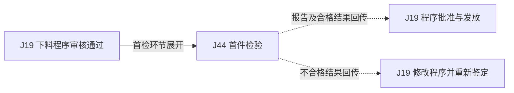

# 第11周流程关联与可拼接列表

状态：流程地图草图依据，未作跨部门业务确认，未合并源JSON，未发布正式流程。

[返回总评](2026-09-10-week11-json-review.md) · [逐文件缺口](2026-09-10-week11-json-review-files.md)

## 判定口径

- A：两端文字存在可以复核的交付、使用或办理承接依据，可先画入草图；仍需按限制栏补键、版本、范围及确认记录。
- B：存在关联线索，但一个会改变连线的业务条件尚未明确，只能画待定虚线。
- O：前段重叠、通用与专项或不同编制稿，不能当成前后两次业务串联。
- “子流程展开”表示用一份文件展开另一份文件中的环节，保留调用点和结果返回；不是将两份文件首尾相接。
- “数据供用”“支撑条件”“事件支撑”不表示时间上连续执行。

本清单共有40条：A类10条、B类24条、O类6组。这里没有已具备端到端对象/版本/接收确认依据的自动拼接关系；这是材料证据边界，不是说不能绘制地图。
## 第三步：7组可先形成的局部地图

| 组别 | 局部地图 | 组合方式 | 依据 | 开始绘图前应标出的限制 |
| --- | --- | --- | --- | --- |
| G1 | 采购执行与到货验收 | J27 → J28 | L01 | 供应商到货通知触发；补订单/行号/批次，修正验收类别分流。 |
| G2 | 合同、订单与结算核对 | J30合同签订阶段 → J31；J31销售订单 ⇢ J25月末核对 | L02、L03 | J31展开J30订单环节；结算是按期间取数，先修J25退回改单后的复核路线。 |
| G3 | 工时定额与报价 | J33 ⇢ J29 | L04 | 以零件/工序/定额版本供用；先补报价实际汇总行为，不能连成材料定额变更。 |
| G4 | 计划执行、生产、无损与制造不合格处理 | J35执行节点展开J26；J26无损环节展开J42；J42拒收 → J37 | L05、L06、L10 | 合格回生产后续工序；先修J26汇合与J37报废误放行，未修前只画问题标注草图。 |
| G5 | 生产故障与维修恢复 | J26故障 → J49；修复结果返回受影响工序 | L07 | 返回边尚未在源JSON登记，草图须标为待补；先修J49正常/未完成维修分支。 |
| G6 | 下料程序鉴定与首件检验 | J19首检环节展开J44，结果返回J19批准判断 | L08 | 保留通知和计划等前置条件；核对首检报告身份与形成位置，避免将模板当完成报告。 |
| G7 | 技术文件发布与规范有效目录 | J08适用规范文件发布 ⇢ J22目录更新 | L09 | 只限目录收录范围；J08标识冲突及J07/J22重复范围先核对。 |
## 第二步：全部40条关联

| 编号 | 判定 | 来源→目标 | 关系 | 交付/使用对象 | 证据定位与限制 |
| --- | --- | --- | --- | --- | --- |
| L01 | A | J27 采购订单执行、跟踪与异常处理流程 → J28 采购到货验收及结算流程 | 交接 | 供应商发货/到货通知 | J27 `/behaviors/12`；J28 `/behaviors/0`。供应商实际到货通知到达才触发验收；补采购订单号、行号、到货批次，不能以发货完成代替到货。 |
| L02 | A | J30 销售合同的签订、执行与管理 → J31 销售订单下发流程 | 子流程展开 | 已签合同及客户技术/交付要求 | J30 `/behaviors/10`；J30 `/behaviors/11`；J31 `/behaviors/10`；J31 `/behaviors/12`。仅用于已签外部合同分支；J30的下订单节点由J31展开，不能在J30全部结束后重新跑一次订单流程。 |
| L03 | A | J31 销售订单下发流程 → J25 成本结算 | 数据供用 | 销售订单 | J31 `/behaviors/12`；J31 `/forms/7`；J25 `/behaviors/8`；J25 `/data_objects/0`。按结算期间选取订单；补订单号、行号、生产编号映射。它是数据供用关系，不表示订单一发出立即开始结账。 |
| L04 | A | J33 制定工时定额 → J29 预算报价 | 数据供用 | 工序标准工时与定额依据 | J33 `/behaviors/6`；J29 `/behaviors/1`。限定工时部分，核对零件、工序、定额版本；材料定额不自动沿用工时定额身份。 |
| L05 | A | J26 生产管控 → J42 复合材料无损管理程序 | 子流程展开 | 待检零件、无损检测及验收/拒收结果 | J26 `/behaviors/8`；J26 `/flow_relations/10`；J42 `/behaviors/4`；J42 `/behaviors/5`；J42 `/behaviors/7`；J42 `/behaviors/8`。替换J26无损环节的内部展开；合格回J26表面准备，拒收单独转不合格处理；补零件号、质量编号、批架次。 |
| L06 | A | J42 复合材料无损管理程序 → J37 不合格品控制管理程序（制造流程） | 异常交接 | 无损拒收结果、检测通知及被隔离零件 | J42 `/behaviors/8`；J42 `/flow_relations/7`；J37 `/behaviors/0`；J37 `/behaviors/1`。确认拒收已判为产品不合格后移交；先修J37报废误回正常使用的路线。 |
| L07 | A | J26 生产管控 → J49 设备报修、维修及恢复使用 | 异常调用 | 设备编号、故障现象、报修与恢复结果 | J26 `/behaviors/2`；J26 `/flow_relations/4`；J49 `/behaviors/0`；J49 `/behaviors/1`；J49 `/behaviors/4`。核对班长上报与操作工报修的责任边界；返回故障所在工序的核验点需要补线，不能报修后直接结束生产。 |
| L08 | A | J19 下料程序的编写、升版及发放管理 → J44 首件检验管理程序 | 子流程展开 | 首件/部分首件任务和检验报告 | J19 `/behaviors/3`；J19 `/data_objects/3`；J44 `/behaviors/2`；J44 `/behaviors/4`；J44 `/behaviors/6`。J19明确引用GLC140802；需保留通知和检验计划前置条件，结果回J19合格判断，再办本流程批准。 |
| L09 | A | J08 技术文件编制、审签、发放、回收、归档 → J22 有效目录的编制、更新及发放归档管理 | 数据供用 | 已发布适用规范文件及其版次 | J08 `/behaviors/8`；J22 `/behaviors/0`。仅当发布对象属于J22收录的规范文件；补文件号、版次、生效范围，勿把所有技术文件或程序目录并成一类。 |
| L10 | A | J35 项目计划与调整管理程序 → J26 生产管控 | 子流程展开 | 已生效三层计划对应的生产作业 | J35 `/behaviors/12`；J26 `/behaviors/1`；J26 `/behaviors/3`。从J35三层计划正式执行进入现场工序；核对J26罐前计划与三层计划映射，避免重复下发计划。 |
| L11 | B | J15 首件检验管理程序 → J44 首件检验管理程序 | 交接 | 批准后的首件检验通知 | J15 `/behaviors/1`；J15 `/forms/0`；J44 `/behaviors/2`；J44 `/forms/0`。先确认FM1408-05A与FM-P5-05-01-A的适用/替代关系，并补通知下发；J44前两步与J15重叠。 |
| L12 | B | J16 数控程序的编写、升版及发放管理 → J44 首件检验管理程序 | 子流程展开 | 数控程序首件/部分首件检验 | J16 `/behaviors/3`；J16 `/data_objects/3`；J44 `/behaviors/2`；J44 `/behaviors/4`；J44 `/behaviors/6`。确认通用首检范围能否覆盖本专项；保留仿真/试切，首检结果返回程序批准环节。 |
| L13 | B | J18 投影程序的编写、升版及发放管理 → J44 首件检验管理程序 | 子流程展开 | 投影首件检验结果 | J18 `/behaviors/3`；J18 `/data_objects/3`；J44 `/behaviors/2`；J44 `/behaviors/4`；J44 `/behaviors/6`。先划开首铺层测量与产品首检范围；通用首检不能替代投影专项首铺层验证。 |
| L14 | B | J14 零件供应状态表 → J02 复材零件工艺规程的编制与管理管理标准 | 交接 | 零件供应状态表 | J14 `/forms/0`；J14 `/behaviors/5`；J02 `/behaviors/0/input_description`。先补状态表正式发布和送达；核对图号、版次、供应状态；J02身份冲突和归档自连先修。 |
| L15 | B | J14 零件供应状态表 → J03 复材零件制造大纲的编制与使用管理标准 | 交接 | 零件供应状态表 | J14 `/forms/0`；J14 `/behaviors/5`；J03 `/behaviors/0/input_description`。先补状态表正式发布和送达；核对图号/版次；J03身份与职责先澄清。 |
| L16 | B | J14 零件供应状态表 → J40 产品检验策划 | 数据供用 | 零件供应状态表 | J14 `/forms/0`；J40 `/behaviors/1/behavior_description`。明确表的有效状态和适用产品/版本，补源表数据对象后再绑定。 |
| L17 | B | J14 零件供应状态表 → J16 数控程序的编写、升版及发放管理 | 数据供用 | 零件供应状态及指令性交接状态 | J14 `/forms/0`；J16 `/behaviors/0/input_description`。核对供应状态表与指令性交接状态表是否两个对象，不能合并两种输入。 |
| L18 | B | J29 预算报价 → J30 销售合同的签订、执行与管理 | 子流程展开 | 报价初稿、成本依据及正式报价 | J29 `/behaviors/6`；J29 `/behaviors/7`；J30 `/behaviors/1`；J30 `/behaviors/3`；J30 `/behaviors/4`。划清内部初稿、领导审价、对外报价、谈判修订的先后；J29与J30已有重叠，禁止整份首尾串联。 |
| L19 | B | J31 销售订单下发流程 → J35 项目计划与调整管理程序 | 待定承接 | 销售订单、生产订单与主进度/分层计划 | J31 `/behaviors/18`；J31 `/behaviors/19`；J35 `/behaviors/0`；J35 `/behaviors/4`。J35入口是年度主进度计划，没有订单接收与插单调整入口；必须先说明订单进入哪一层计划。 |
| L20 | B | J28 采购到货验收及结算流程 → J36 不合格品控制管理（库房接收验证不合格品） | 异常交接 | 经检验确认不合格的到货物料/产品 | J28 `/behaviors/2`；J28 `/behaviors/3`；J28 `/behaviors/4`；J28 `/flow_relations/8`；J36 `/behaviors/0`；J36 `/behaviors/1`。数量差异和资料缺失不等于质量不合格；需先补分类后的异常事实和移交责任。 |
| L21 | B | J37 不合格品控制管理程序（制造流程） → J31 销售订单下发流程 | 条件交接 | 已审签废品卡片/返工单与补制需求 | J37 `/behaviors/11`；J37 `/behaviors/12`；J31 `/behaviors/14`。J37回交质量，J31从项目部接单，中间传递与补制决定未写；必须补是否补制、数量及原订单关联，不能每次报废自动下单。 |
| L22 | B | J36 不合格品控制管理（库房接收验证不合格品） → J31 销售订单下发流程 | 条件交接 | 废品卡片及补制要求 | J36 `/behaviors/9`；J36 `/behaviors/10`；J31 `/behaviors/14`。责任确认、项目部传递和补制决定缺失；不可只因都有废品卡片就直接连接。 |
| L23 | B | J39 测量设备管理程序 → J27 采购订单执行、跟踪与异常处理流程 | 子流程展开 | 测量设备技术条件和采购申请 | J39 `/behaviors/4`；J27 `/behaviors/0`。核对设备采购是否采用此请购流程及固定资产适用分支；采购验收完成返回设备校准管理，先修J39顺序。 |
| L24 | B | J39 测量设备管理程序 → J43 计量管理 | 子流程展开 | 设备、校准技术要求、计量结果 | J39 `/behaviors/7`；J43 `/behaviors/0`；J43 `/behaviors/1`；J43 `/behaviors/3`。确认J43同时覆盖首次校准而非仅周期定检；校准合格后再按J39正文规定入库。 |
| L25 | B | J39 测量设备管理程序 → J38 测量软件管理程序 | 支撑条件 | 配套测量软件合格证明 | J39 `/behaviors/5`；J38 `/behaviors/1`；J38 `/behaviors/2`。确认设备带软件的适用情形及设备验收和软件验证先后；缺共同设备/软件版本标识。 |
| L26 | B | J50 设备状态、巡检与维护计划核对 → J35 项目计划与调整管理程序 | 事件支撑 | 设备可用性、维护窗口与状态变化 | J50 `/behaviors/1`；J50 `/behaviors/3`；J35 `/behaviors/10`；J35 `/behaviors/11`。J50接收者是车间计划员，J35调整由班长/工长办理；补转交角色、受影响任务和调整层级。 |
| L27 | B | J49 设备报修、维修及恢复使用 → J27 采购订单执行、跟踪与异常处理流程 | 异常调用 | 缺备件的紧急采购需求 | J49 `/behaviors/2`；J27 `/behaviors/0`。普通采购审批与紧急采购是否共用路径未确认；不要自动套用普通采购时序。 |
| L28 | B | J47 人员上岗资质办理流程 → J48 风险识别、作业条件核对与隐患处理 | 支撑条件 | 人员资质/授权与有效范围 | J47 `/behaviors/3`；J48 `/behaviors/1`。J47只写内部办理完成及外部申请，尚未证明取得有效证书；特种作业许可与人员资质是不同对象。 |
| L29 | B | J30 销售合同的签订、执行与管理 → J32 对账开票与回款计划管理流程 | 数据供用 | 合同条款、合同号及客户对账单 | J30 `/behaviors/10`；J32 `/behaviors/0`；J32 `/behaviors/1`；J32 `/behaviors/2`。J32限定沈飞民机协同平台；合同签订不是对账触发事件，交付、客户接收、对账形成仍有缺口。 |
| L30 | B | J34 总部沈阳地区工装经营业务 → J32 对账开票与回款计划管理流程 | 待定承接 | 客户验收、挂账与对账 | J34 `/behaviors/12`；J34 `/behaviors/13`；J32 `/behaviors/0`。工装客户/主体和沈飞民机对账单是否适用未证实；缺实际对账单形成交接。 |
| L31 | B | J40 产品检验策划 → J41 产品检验管理程序 | 待定承接 | 检验方案与产品检验规程 | J40 `/behaviors/5`；J40 `/forms/0`；J41 `/behaviors/1`；J41 `/behaviors/4`。J41输入未直接引用J40检验方案，先澄清方案与规程的转换/包含关系及发放。 |
| L32 | B | J04 更改申请 → J23 制造过程设计更改控制管理标准 | 待定承接 | 更改解答与批准的设计更改文件 | J04 `/behaviors/4`；J04 `/behaviors/5`；J23 `/behaviors/0`。J04无更改类型及生效结论，J23依据构改行动项和设计更改文件；不能把一般解答当作获批设计更改。 |
| L33 | B | J13 工装有效目录 → J11 工艺装备申请管理程序 | 待定供用 | 工装有效目录与工艺装备品种表 | J13 `/process/process_name`；J13 `/forms/0`；J11 `/behaviors/0/input_description`。文件名和正文对象不一致；先确认工装有效目录能否承担申请所需品种表的作用。 |
| L34 | B | J26 生产管控 → J32 对账开票与回款计划管理流程 | 待定承接 | 产品交付、客户验收与对账单 | J26 `/behaviors/11`；J32 `/behaviors/0`。缺成品入库、出库发运、客户接收和对账单形成的明确流程对象；只能标出待补段。 |
| L35 | O | J07 规范有效目录的编制、审签、发放、回收、归档 → J22 有效目录的编制、更新及发放归档管理 | 重复范围核对 | 规范文件有效目录 | J07 `/process`；J07 `/behaviors`；J22 `/process`；J22 `/behaviors`。名称、对象及业务范围高度重叠，先核对版本/部门适用边界，不能画成前后两次目录审签。 |
| L36 | O | J11 工艺装备申请管理程序 → J21 样板/数据集申请单 | 子范围重叠 | 样板/数据集申请单 | J11 `/forms/1`；J11 `/behaviors`；J21 `/forms/0`；J21 `/behaviors`。确认主流程与专项展开或者不同编制稿，核对表号和签审责任后只执行一次。 |
| L37 | O | J19 下料程序的编写、升版及发放管理 → J24 自动剪裁下料机鉴定和管理管理标准 | 重复范围核对 | 下料程序编制与鉴定 | J19 `/process`；J19 `/behaviors`；J24 `/process`；J24 `/behaviors`；J24 `/forms/0`。J24设备/程序/表单混杂；先分清设备管理与程序专项，不能重复鉴定。 |
| L38 | O | J08 技术文件编制、审签、发放、回收、归档 → J05 典型工艺规程的编制、审签、发放、回收、归档 | 通用与专项 | 技术文件通用审签和典型工艺规程专项 | J08 `/process/scope`；J05 `/process/scope`。属于规则适用或流程层级关系，不是顺序先后。 |
| L39 | O | J15 首件检验管理程序 → J44 首件检验管理程序 | 前段重叠 | 首件检验通知编制和下发 | J15 `/behaviors/0`；J15 `/behaviors/1`；J44 `/behaviors/0`；J44 `/behaviors/1`。J15可展开J44前段，随后接J44编制检验计划；须先解决通知表号和批准/下发差异。 |
| L40 | O | J17 特种检验目录 → J42 复合材料无损管理程序 | 前段重叠 | 特种检验目录编制审批 | J17 `/behaviors`；J42 `/behaviors/1`；J42 `/behaviors/2`。核对实验室审查与无损III级批准及适用检测类型；不能重复编制、审批同一目录。 |
## 逐条证据摘录

下列摘录均来自本次50份JSON，不表示已核对制度原件、实际台账或业务人员确认。节点全对象过长时只展示前280字符，定位路径及文件摘要用于回查完整证据。

### L01 采购执行跟踪→到货验收（A / 交接）

来源：[J27](2026-09-10-week11-json-review-files.md#j27) 采购订单执行、跟踪与异常处理流程

- `/behaviors/12`：{"behavior_ref":"behavior_178883769013945a088d475619","node_type":"action","behavior_name":"采购员跟踪采购订单发货情况","behavior_description":"采购员跟踪供应商实际发货情况，获取发货日期、数量、物流信息及预计到货时间。","current_actor_role":"经营发展部计划员","actor_assignment_mode":"fixed_department","actor_department_data_ref":null,"a……（仅摘录；完整值见源文件）

接收/关联：[J28](2026-09-10-week11-json-review-files.md#j28) 采购到货验收及结算流程

- `/behaviors/0`：{"behavior_ref":"behavior_17887639490956a127ae26ff8d","node_type":"action","behavior_name":"采购员发起到货验收通知","behavior_description":"采购员接收到供应商的到货通知后，发起到货验收通知。","current_actor_role":"经营发展部规划员","actor_assignment_mode":"fixed_department","actor_department_data_ref":null,"actor_position_……（仅摘录；完整值见源文件）

交付或使用对象：供应商发货/到货通知。

限制：供应商实际到货通知到达才触发验收；补采购订单号、行号、到货批次，不能以发货完成代替到货。

### L02 合同签订→销售订单下发（A / 子流程展开）

来源：[J30](2026-09-10-week11-json-review-files.md#j30) 销售合同的签订、执行与管理

- `/behaviors/10`：{"behavior_ref":"behavior_1788917354333ae1fe47a768a6","node_type":"action","behavior_name":"市场专员进行合同签订","behavior_description":"审批通过后，市场专员安排签署，确保盖章和签署主体资质合法","current_actor_role":"经营发展部市场专员","actor_assignment_mode":"fixed_department","actor_department_data_ref":null,"actor_positi……（仅摘录；完整值见源文件）
- `/behaviors/11`：{"behavior_ref":"behavior_178891803487120031b1c75ccc8","node_type":"action","behavior_name":"规划员在用友系统下达项目任务订单","behavior_description":"合同签署后，规划员在用友系统下达项目任务订单","current_actor_role":"经营发展部规划员","actor_assignment_mode":"fixed_department","actor_department_data_ref":null,"actor_positi……（仅摘录；完整值见源文件）

接收/关联：[J31](2026-09-10-week11-json-review-files.md#j31) 销售订单下发流程

- `/behaviors/10`：{"behavior_ref":"behavior_1788850338221fae93189e32498","node_type":"action","behavior_name":"经营发展部向甲方客户索要有效信息","behavior_description":"经营发展部向甲方客户索要技术要求、加工方式、验收规范、特殊注意事项等有效信息","current_actor_role":"经营发展部市场专员","actor_assignment_mode":"fixed_department","actor_department_data_ref":n……（仅摘录；完整值见源文件）
- `/behaviors/12`：{"behavior_ref":"behavior_178885081404992749d0373f4d","node_type":"action","behavior_name":"经营发展部下发销售订单","behavior_description":"经营发展部应根据不同类型的任务输入判断销售订单类型及在用友系统中进行相关信息的填报，下发销售订单，附件中应附带情况说明、任务来源等有效文件。","current_actor_role":"经营发展部市场专员","actor_assignment_mode":"fixed_department","ac……（仅摘录；完整值见源文件）

交付或使用对象：已签合同及客户技术/交付要求。

限制：仅用于已签外部合同分支；J30的下订单节点由J31展开，不能在J30全部结束后重新跑一次订单流程。

### L03 销售订单→成本结算核对（A / 数据供用）

来源：[J31](2026-09-10-week11-json-review-files.md#j31) 销售订单下发流程

- `/behaviors/12`：{"behavior_ref":"behavior_178885081404992749d0373f4d","node_type":"action","behavior_name":"经营发展部下发销售订单","behavior_description":"经营发展部应根据不同类型的任务输入判断销售订单类型及在用友系统中进行相关信息的填报，下发销售订单，附件中应附带情况说明、任务来源等有效文件。","current_actor_role":"经营发展部市场专员","actor_assignment_mode":"fixed_department","ac……（仅摘录；完整值见源文件）
- `/forms/7`：{"form_ref":"form_1788919640262700daa9702c5f","form_name":"销售订单","form_no":null,"form_design_state":"current_state","behavior_links":[{"link_ref":"form_link_1788919792375df7472e216f1d8","behavior_ref":"behavior_178885081404992749d0373f4d","operations":["create","fill","modify","r……（仅摘录；完整值见源文件）

接收/关联：[J25](2026-09-10-week11-json-review-files.md#j25) 成本结算

- `/behaviors/8`：{"behavior_ref":"behavior_1788838021043e3c89f799adcb8","node_type":"action","behavior_name":"核对销售订单","behavior_description":"核对研制件订单和屁产检的出库类别、研制件是否有项目大类以及RD号","current_actor_role":"财务部会计员","actor_assignment_mode":"fixed_department","actor_department_data_ref":null,"actor_position……（仅摘录；完整值见源文件）
- `/data_objects/0`：{"data_ref":"data_178893158846491bcaffc996b28","data_name":"销售订单","description":"用友系统直接导出","information_type":"file_attachment","fields":[{"field_ref":"data_field_1788931667441d0d227e8c7255","field_name":"订单号","field_type":"文本","definition":"订单号"},{"field_ref":"data_field_1788931……（仅摘录；完整值见源文件）

交付或使用对象：销售订单。

限制：按结算期间选取订单；补订单号、行号、生产编号映射。它是数据供用关系，不表示订单一发出立即开始结账。

### L04 工时定额→预算报价（A / 数据供用）

来源：[J33](2026-09-10-week11-json-review-files.md#j33) 制定工时定额

- `/behaviors/6`：{"behavior_ref":"behavior_1788924990517a8b188801c2d4","node_type":"action","behavior_name":"定额员整理归档支撑复用","behavior_description":"定期梳理积分簿定额条目，分类归档定额资料，为报价核算、生产排产提供标准工时查询与数据复用支撑。","current_actor_role":"经营发展部定额员","actor_assignment_mode":"fixed_department","actor_department_data_ref"……（仅摘录；完整值见源文件）

接收/关联：[J29](2026-09-10-week11-json-review-files.md#j29) 预算报价

- `/behaviors/1`：{"behavior_ref":"behavior_1788917158717c75c0cabc49f","node_type":"action","behavior_name":"定额员核算加工工时与工序成本","behavior_description":"定额员依据工艺路线方案，拆解零件的全流程加工工序，确认每道工序的作业内容与加工设备；\n定额员匹配公司工时定额标准文件，定位对应工序的标准工时定额与计算公式；\n定额员提取零件的尺寸、面积、结构特征等参数，代入结构难度系数、尺寸系数、铺叠速率系数等修正系数，核算单工序标准工时；\n定额员匹配对应工……（仅摘录；完整值见源文件）

交付或使用对象：工序标准工时与定额依据。

限制：限定工时部分，核对零件、工序、定额版本；材料定额不自动沿用工时定额身份。

### L05 生产无损工序→无损检测管理（A / 子流程展开）

来源：[J26](2026-09-10-week11-json-review-files.md#j26) 生产管控

- `/behaviors/8`：{"behavior_ref":"behavior_17889217328866b49c6dfba2c1","node_type":"action","behavior_name":"无损","behavior_description":"无损","current_actor_role":"复材车间设备操作工","actor_assignment_mode":"fixed_department","actor_department_data_ref":null,"actor_position_rule":"","trigger":"铣切完成","prec……（仅摘录；完整值见源文件）
- `/flow_relations/10`：{"relation_ref":"relation_1788921857613de52b42d776f2","relation_type":"condition","from_behavior_ref":"behavior_17889217328866b49c6dfba2c1","to_behavior_ref":"behavior_178892180467172f298b6bd586","condition":"无损合格"}

接收/关联：[J42](2026-09-10-week11-json-review-files.md#j42) 复合材料无损管理程序

- `/behaviors/4`：{"behavior_ref":"behavior_1788938981511097ae679f4a66","node_type":"action","behavior_name":"将待检零件送去对应检测站","behavior_description":"生产厂将待检零件送去对应检测站","current_actor_role":"复材车间","actor_assignment_mode":"fixed_department","actor_department_data_ref":null,"actor_position_rule":"","tri……（仅摘录；完整值见源文件）
- `/behaviors/5`：{"behavior_ref":"behavior_1788940010812911f0d88462e9","node_type":"action","behavior_name":"检测零件并记录","behavior_description":"质量管理部无损Ⅱ级检测工检测零件并记录","current_actor_role":"质量管理部无损检测工","actor_assignment_mode":"fixed_department","actor_department_data_ref":null,"actor_position_rule":""……（仅摘录；完整值见源文件）
- `/behaviors/7`：{"behavior_ref":"behavior_1788941564169752f22f0bf09a","node_type":"action","behavior_name":"验收零件，在制造记录上盖章","behavior_description":"质量管理部无损Ⅱ级检测人员验收零件，在制造记录上盖章","current_actor_role":"质量管理部无损检测工","actor_assignment_mode":"fixed_department","actor_department_data_ref":null,"actor_posi……（仅摘录；完整值见源文件）
- `/behaviors/8`：{"behavior_ref":"behavior_1788941752776a2e5edeb1a8a","node_type":"action","behavior_name":"填写无损检测通知单","behavior_description":"质量管理部无损Ⅱ级检测人员填写无损检测通知单","current_actor_role":"质量管理部无损检测工","actor_assignment_mode":"fixed_department","actor_department_data_ref":null,"actor_position_rule……（仅摘录；完整值见源文件）

交付或使用对象：待检零件、无损检测及验收/拒收结果。

限制：替换J26无损环节的内部展开；合格回J26表面准备，拒收单独转不合格处理；补零件号、质量编号、批架次。

### L06 无损拒收→制造不合格品处理（A / 异常交接）

来源：[J42](2026-09-10-week11-json-review-files.md#j42) 复合材料无损管理程序

- `/behaviors/8`：{"behavior_ref":"behavior_1788941752776a2e5edeb1a8a","node_type":"action","behavior_name":"填写无损检测通知单","behavior_description":"质量管理部无损Ⅱ级检测人员填写无损检测通知单","current_actor_role":"质量管理部无损检测工","actor_assignment_mode":"fixed_department","actor_department_data_ref":null,"actor_position_rule……（仅摘录；完整值见源文件）
- `/flow_relations/7`：{"relation_ref":"relation_17889420155513a6a93b03344b","relation_type":"condition","from_behavior_ref":"behavior_17889412964302f370124f6cc1","to_behavior_ref":"behavior_1788941752776a2e5edeb1a8a","condition":"拒收"}

接收/关联：[J37](2026-09-10-week11-json-review-files.md#j37) 不合格品控制管理程序（制造流程）

- `/behaviors/0`：{"behavior_ref":"behavior_178891465434712618a0a6b595","node_type":"action","behavior_name":"检验工确认产品为不合格","behavior_description":"根据客户规范识别出不合格产品\n","current_actor_role":"质量管理部检验工","actor_assignment_mode":"fixed_department","actor_department_data_ref":null,"actor_position_rule":"",……（仅摘录；完整值见源文件）
- `/behaviors/1`：{"behavior_ref":"behavior_17889148898481ce7feca2b6cb","node_type":"action","behavior_name":"检验工标识并隔离不合格产品并作标记","behavior_description":"检验工发现不合格产品后对产品进行标记（贴不合格签或PI标记）并隔离","current_actor_role":"质量管理部检验工","actor_assignment_mode":"fixed_department","actor_department_data_ref":null,"a……（仅摘录；完整值见源文件）

交付或使用对象：无损拒收结果、检测通知及被隔离零件。

限制：确认拒收已判为产品不合格后移交；先修J37报废误回正常使用的路线。

### L07 生产设备故障→设备维修（A / 异常调用）

来源：[J26](2026-09-10-week11-json-review-files.md#j26) 生产管控

- `/behaviors/2`：{"behavior_ref":"behavior_1788919098594bda71be570722","node_type":"action","behavior_name":"设备故障","behavior_description":"上报运维安环部","current_actor_role":"复材车间班长","actor_assignment_mode":"fixed_department","actor_department_data_ref":null,"actor_position_rule":"","trigger":"班长判断设备故……（仅摘录；完整值见源文件）
- `/flow_relations/4`：{"relation_ref":"relation_17889206277960ef9ed9c4daae8","relation_type":"condition","from_behavior_ref":"behavior_1788920559236bc6a3e83d531c","to_behavior_ref":"behavior_1788919098594bda71be570722","condition":"设备故障"}

接收/关联：[J49](2026-09-10-week11-json-review-files.md#j49) 设备报修、维修及恢复使用

- `/behaviors/0`：{"behavior_ref":"behavior_178900816362576645c950eb678","node_type":"action","behavior_name":"车间报修","behavior_description":"发现故障后停止使用设备，向运维安环部报修，说明设备编号、故障现象和发生时间","current_actor_role":"复材车间设备操作工","actor_assignment_mode":"fixed_department","actor_department_data_ref":null,"actor_po……（仅摘录；完整值见源文件）
- `/behaviors/1`：{"behavior_ref":"behavior_17890082961042328400d76ecd8","node_type":"action","behavior_name":"运维安环部诊断维修","behavior_description":"到达现场诊断故障原因，实施维修，更换所需备件，维修过程中向车间反馈预计回复时间和影响范围。","current_actor_role":"运维安环部设备维护工","actor_assignment_mode":"fixed_department","actor_department_data_ref":……（仅摘录；完整值见源文件）
- `/behaviors/4`：{"behavior_ref":"behavior_1789010806507aefec996e69358","node_type":"action","behavior_name":"恢复核验并交付车间","behavior_description":"维修完成后核验设备运行状态，确认正常后通知车间恢复使用，简要告知故障原因和维修情况","current_actor_role":"运维安环部设备维护工","actor_assignment_mode":"fixed_department","actor_department_data_ref":null……（仅摘录；完整值见源文件）

交付或使用对象：设备编号、故障现象、报修与恢复结果。

限制：核对班长上报与操作工报修的责任边界；返回故障所在工序的核验点需要补线，不能报修后直接结束生产。

### L08 下料程序鉴定→首件检验（A / 子流程展开）

来源：[J19](2026-09-10-week11-json-review-files.md#j19) 下料程序的编写、升版及发放管理

- `/behaviors/3`：{"behavior_ref":"behavior_f74966e1a2964662a7ec5646","node_type":"action","behavior_name":"检验技术员检验首件并确认下料程序结果","behavior_description":"依据GLC140802完成首件或部分首件检验。将报告编号和结果写入FM1406-14，检验人员判定是否合格，不合格情况记入备注，完成检验签字；升版时同时完成FM1406-13检验员签字。本节点不展开首件检验内部流程。","current_actor_role":"质量管理部检验技术员","a……（仅摘录；完整值见源文件）
- `/data_objects/3`：{"data_ref":"data_d6862c1718054bdb9078e34d","data_name":"首件或部分首件检验报告","description":"由质量检验环节形成，提供报告编号、结果及合格判定，作为程序鉴定依据；不展开首件检验内部审批流程。","information_type":"file_attachment","fields":[{"field_ref":"data_field_975021395a6344d19a1c6f2f","field_name":"报告编号","field_type":"文字，字母，数字","de……（仅摘录；完整值见源文件）

接收/关联：[J44](2026-09-10-week11-json-review-files.md#j44) 首件检验管理程序

- `/behaviors/2`：{"behavior_ref":"behavior_17888556229864a744d9dc0979","node_type":"action","behavior_name":"编制首件检验计划","behavior_description":"根据首件检验通知单编制首件检验计划","current_actor_role":"质量管理部检验技术员","actor_assignment_mode":"fixed_department","actor_department_data_ref":null,"actor_position_rule":"",……（仅摘录；完整值见源文件）
- `/behaviors/4`：{"behavior_ref":"behavior_1788856578514a18bbce620524","node_type":"action","behavior_name":"检验产品","behavior_description":"检验工根据首件检验报告和制造大纲中要求完成对零件的检验","current_actor_role":"质量管理部检验工","actor_assignment_mode":"fixed_department","actor_department_data_ref":null,"actor_position_rule"……（仅摘录；完整值见源文件）
- `/behaviors/6`：{"behavior_ref":"behavior_17888570947946023e9c543422","node_type":"action","behavior_name":"维护首检数据库","behavior_description":"建立首件检验数据库并负责跟踪维护。首件检验数据库内容至少应包括：序号、零组件号码、零组件名称、质量编号、首件检验结果、完成日期、首检未完成原因说明等","current_actor_role":"质量管理部检验技术员","actor_assignment_mode":"fixed_department","a……（仅摘录；完整值见源文件）

交付或使用对象：首件/部分首件任务和检验报告。

限制：J19明确引用GLC140802；需保留通知和检验计划前置条件，结果回J19合格判断，再办本流程批准。

### L09 技术文件发布→规范有效目录更新（A / 数据供用）

来源：[J08](2026-09-10-week11-json-review-files.md#j08) 技术文件编制、审签、发放、回收、归档

- `/behaviors/8`：{"behavior_ref":"behavior_178892028927837384cb1638b8","node_type":"action","behavior_name":"发布","behavior_description":"批准完成后，文件生效。\nCPM系统上自动生成文件封面，文件状态变更为“已发布”，成为现行有效版本。旧版本文件自动变更为“有效历史版本”状态，以备查阅。","current_actor_role":"工程技术部工艺技术员","actor_assignment_mode":"fixed_department","acto……（仅摘录；完整值见源文件）

接收/关联：[J22](2026-09-10-week11-json-review-files.md#j22) 有效目录的编制、更新及发放归档管理

- `/behaviors/0`：{"behavior_ref":"behavior_cdfeac80b09343a284dfd544","node_type":"action","behavior_name":"工艺技术员编制或更新有效目录","behavior_description":"依据适用规范文件及其有效版次信息编制或更新有效目录，核对序号、文件号、文件名称、文件版次；设置适用产品型号、目录子类型、发文单位和分发单位等CPM对象属性并提交线上审签。具体收录清单由实际办理时填入，本次仅建立四列明细结构，不预填虚构条目。目录表没有纸面签字栏，编制身份及提交记录由线上流程保留。",……（仅摘录；完整值见源文件）

交付或使用对象：已发布适用规范文件及其版次。

限制：仅当发布对象属于J22收录的规范文件；补文件号、版次、生效范围，勿把所有技术文件或程序目录并成一类。

### L10 计划执行→车间生产作业展开（A / 子流程展开）

来源：[J35](2026-09-10-week11-json-review-files.md#j35) 项目计划与调整管理程序

- `/behaviors/12`：{"behavior_ref":"behavior_17888562396617f36328b282f8","node_type":"action","behavior_name":"三层计划正式执行","behavior_description":"生产班组接收生效三层计划，按照计划开展零件生产作业","current_actor_role":"复材车间班长","actor_assignment_mode":"fixed_department","actor_department_data_ref":null,"actor_position_rule"……（仅摘录；完整值见源文件）

接收/关联：[J26](2026-09-10-week11-json-review-files.md#j26) 生产管控

- `/behaviors/1`：{"behavior_ref":"behavior_17889188911146b19fe773306f8","node_type":"action","behavior_name":"下料","behavior_description":"按计划下料","current_actor_role":"复材车间设备操作工（下料工）、设备操作工（工装准备工）","actor_assignment_mode":"fixed_department","actor_department_data_ref":null,"actor_position_rule":"",……（仅摘录；完整值见源文件）
- `/behaviors/3`：{"behavior_ref":"behavior_17889201242933017a00c307008","node_type":"action","behavior_name":"工装准备","behavior_description":"工装准备","current_actor_role":"复材车间设备操作工（下料工）、设备操作工（工装准备工）","actor_assignment_mode":"fixed_department","actor_department_data_ref":null,"actor_position_rule":""……（仅摘录；完整值见源文件）

交付或使用对象：已生效三层计划对应的生产作业。

限制：从J35三层计划正式执行进入现场工序；核对J26罐前计划与三层计划映射，避免重复下发计划。

### L11 工程首检通知→质量首检计划（B / 交接）

来源：[J15](2026-09-10-week11-json-review-files.md#j15) 首件检验管理程序

- `/behaviors/1`：{"behavior_ref":"behavior_1788941695057df44a7cee857","node_type":"action","behavior_name":"首件检验通知批准","behavior_description":"首件检验通知签字批准并注明日期","current_actor_role":"工程技术部副室主任","actor_assignment_mode":"fixed_department","actor_department_data_ref":null,"actor_position_rule":"","tri……（仅摘录；完整值见源文件）
- `/forms/0`：{"behavior_links":[{"link_ref":"form_link_1788943976823aff9d6aae4e72","behavior_ref":"behavior_1788941124689550ae849e5e1c","operations":["create"],"notes":"由生产单位工艺员填写"}],"areas":[{"area_ref":"area_17889439920101761183114407","area_type":"","area_title":"生产厂","items":[{"item_ref":……（仅摘录；完整值见源文件）

接收/关联：[J44](2026-09-10-week11-json-review-files.md#j44) 首件检验管理程序

- `/behaviors/2`：{"behavior_ref":"behavior_17888556229864a744d9dc0979","node_type":"action","behavior_name":"编制首件检验计划","behavior_description":"根据首件检验通知单编制首件检验计划","current_actor_role":"质量管理部检验技术员","actor_assignment_mode":"fixed_department","actor_department_data_ref":null,"actor_position_rule":"",……（仅摘录；完整值见源文件）
- `/forms/0`：{"behavior_links":[{"link_ref":"form_link_178886162845938835bd66f77e","behavior_ref":"behavior_17888553250662322fd5b932b9","operations":["create"],"notes":""}],"areas":[{"area_ref":"area_178886177503608b21954489a","area_type":"基本信息","area_title":"首件检验通知","items":[{"item_ref":"ite……（仅摘录；完整值见源文件）

交付或使用对象：批准后的首件检验通知。

限制：先确认FM1408-05A与FM-P5-05-01-A的适用/替代关系，并补通知下发；J44前两步与J15重叠。

### L12 数控程序鉴定→首件检验（B / 子流程展开）

来源：[J16](2026-09-10-week11-json-review-files.md#j16) 数控程序的编写、升版及发放管理

- `/behaviors/3`：{"behavior_ref":"behavior_44d38a6de3714e05a42121aa","node_type":"action","behavior_name":"检验技术员检验并确认数控程序首件结果","behavior_description":"按通过验证的数控程序开展首件或部分首件加工鉴定，由质量管理部检验技术员确认结果，完成FM1206-57检验员签字。不合格或存在不合理切削参数时，按标准使用FM1405-104记录缺陷并反馈工艺员，交判断节点决定退回修改。本次不展开缺陷反馈单独审批，也不在没有该表样式时编造字段。","curr……（仅摘录；完整值见源文件）
- `/data_objects/3`：{"data_ref":"data_bdb850bc6541450ca71fb7bd","data_name":"数控程序首件或部分首件检验结果","description":"质量检验环节形成的首件/部分首件鉴定结果，为批准提供依据，不展开检验内部流程。","information_type":"file_attachment","fields":[{"field_ref":"data_e7c7dadee27c4427a1bdb646","field_name":"检验记录或报告编号","field_type":"文字，字母，数字","definiti……（仅摘录；完整值见源文件）

接收/关联：[J44](2026-09-10-week11-json-review-files.md#j44) 首件检验管理程序

- `/behaviors/2`：{"behavior_ref":"behavior_17888556229864a744d9dc0979","node_type":"action","behavior_name":"编制首件检验计划","behavior_description":"根据首件检验通知单编制首件检验计划","current_actor_role":"质量管理部检验技术员","actor_assignment_mode":"fixed_department","actor_department_data_ref":null,"actor_position_rule":"",……（仅摘录；完整值见源文件）
- `/behaviors/4`：{"behavior_ref":"behavior_1788856578514a18bbce620524","node_type":"action","behavior_name":"检验产品","behavior_description":"检验工根据首件检验报告和制造大纲中要求完成对零件的检验","current_actor_role":"质量管理部检验工","actor_assignment_mode":"fixed_department","actor_department_data_ref":null,"actor_position_rule"……（仅摘录；完整值见源文件）
- `/behaviors/6`：{"behavior_ref":"behavior_17888570947946023e9c543422","node_type":"action","behavior_name":"维护首检数据库","behavior_description":"建立首件检验数据库并负责跟踪维护。首件检验数据库内容至少应包括：序号、零组件号码、零组件名称、质量编号、首件检验结果、完成日期、首检未完成原因说明等","current_actor_role":"质量管理部检验技术员","actor_assignment_mode":"fixed_department","a……（仅摘录；完整值见源文件）

交付或使用对象：数控程序首件/部分首件检验。

限制：确认通用首检范围能否覆盖本专项；保留仿真/试切，首检结果返回程序批准环节。

### L13 投影程序鉴定→首件检验（B / 子流程展开）

来源：[J18](2026-09-10-week11-json-review-files.md#j18) 投影程序的编写、升版及发放管理

- `/behaviors/3`：{"behavior_ref":"behavior_d20de0823fa04ad49012421a","node_type":"action","behavior_name":"检验技术员检验并确认投影程序鉴定结果","behavior_description":"由现场设备操作员执行投影操作用于首件制造；质量管理部检验技术员对首铺层进行测量验证，并完成产品首件检验。首铺层按LM参考线（或客户允许的工装余量线）核对投影线中心位置，偏差要求按标准5.5.4为0.030inch（0.762mm）内。新编程序首铺层检验和首件检验均合格后，确认程序检验合格；更……（仅摘录；完整值见源文件）
- `/data_objects/3`：{"data_ref":"data_3bb850ba07ab4a028a427057","data_name":"投影程序首铺层及首件检验结果","description":"质量检验环节形成的适用首铺层测量及产品首件/部分首件检验结果，作为程序鉴定依据；不展开首检内部审批。","information_type":"file_attachment","fields":[{"field_ref":"data_77471af7a3af4a3193b97f62","field_name":"检验记录或报告编号","field_type":"文字，字母，数字"……（仅摘录；完整值见源文件）

接收/关联：[J44](2026-09-10-week11-json-review-files.md#j44) 首件检验管理程序

- `/behaviors/2`：{"behavior_ref":"behavior_17888556229864a744d9dc0979","node_type":"action","behavior_name":"编制首件检验计划","behavior_description":"根据首件检验通知单编制首件检验计划","current_actor_role":"质量管理部检验技术员","actor_assignment_mode":"fixed_department","actor_department_data_ref":null,"actor_position_rule":"",……（仅摘录；完整值见源文件）
- `/behaviors/4`：{"behavior_ref":"behavior_1788856578514a18bbce620524","node_type":"action","behavior_name":"检验产品","behavior_description":"检验工根据首件检验报告和制造大纲中要求完成对零件的检验","current_actor_role":"质量管理部检验工","actor_assignment_mode":"fixed_department","actor_department_data_ref":null,"actor_position_rule"……（仅摘录；完整值见源文件）
- `/behaviors/6`：{"behavior_ref":"behavior_17888570947946023e9c543422","node_type":"action","behavior_name":"维护首检数据库","behavior_description":"建立首件检验数据库并负责跟踪维护。首件检验数据库内容至少应包括：序号、零组件号码、零组件名称、质量编号、首件检验结果、完成日期、首检未完成原因说明等","current_actor_role":"质量管理部检验技术员","actor_assignment_mode":"fixed_department","a……（仅摘录；完整值见源文件）

交付或使用对象：投影首件检验结果。

限制：先划开首铺层测量与产品首检范围；通用首检不能替代投影专项首铺层验证。

### L14 供应状态表→工艺规程编制（B / 交接）

来源：[J14](2026-09-10-week11-json-review-files.md#j14) 零件供应状态表

- `/forms/0`：{"form_ref":"form_17889357153121356119ecf51f","form_name":"零件供应状态表","form_no":null,"form_design_state":"unspecified","behavior_links":[{"link_ref":"form_link_1788935732440a669a92f100728","behavior_ref":"behavior_1788935203920725a36432c5e6","operations":[],"notes":""},{"link_ref":……（仅摘录；完整值见源文件）
- `/behaviors/5`：{"behavior_ref":"behavior_178893558316098cac43cdc634","node_type":"action","behavior_name":"中间单位工艺员审核","behavior_description":"审核","current_actor_role":"全公司","actor_assignment_mode":"company_wide","actor_department_data_ref":null,"actor_position_rule":"","trigger":"样板单位设计员审核签字","……（仅摘录；完整值见源文件）

接收/关联：[J02](2026-09-10-week11-json-review-files.md#j02) 复材零件工艺规程的编制与管理管理标准

- `/behaviors/0/input_description`：工艺规范,工程图样,零件供应状态表

交付或使用对象：零件供应状态表。

限制：先补状态表正式发布和送达；核对图号、版次、供应状态；J02身份冲突和归档自连先修。

### L15 供应状态表→制造大纲编制（B / 交接）

来源：[J14](2026-09-10-week11-json-review-files.md#j14) 零件供应状态表

- `/forms/0`：{"form_ref":"form_17889357153121356119ecf51f","form_name":"零件供应状态表","form_no":null,"form_design_state":"unspecified","behavior_links":[{"link_ref":"form_link_1788935732440a669a92f100728","behavior_ref":"behavior_1788935203920725a36432c5e6","operations":[],"notes":""},{"link_ref":……（仅摘录；完整值见源文件）
- `/behaviors/5`：{"behavior_ref":"behavior_178893558316098cac43cdc634","node_type":"action","behavior_name":"中间单位工艺员审核","behavior_description":"审核","current_actor_role":"全公司","actor_assignment_mode":"company_wide","actor_department_data_ref":null,"actor_position_rule":"","trigger":"样板单位设计员审核签字","……（仅摘录；完整值见源文件）

接收/关联：[J03](2026-09-10-week11-json-review-files.md#j03) 复材零件制造大纲的编制与使用管理标准

- `/behaviors/0/input_description`：工艺规范,工程图样,零件供应状态表

交付或使用对象：零件供应状态表。

限制：先补状态表正式发布和送达；核对图号/版次；J03身份与职责先澄清。

### L16 供应状态表→检验方案编制（B / 数据供用）

来源：[J14](2026-09-10-week11-json-review-files.md#j14) 零件供应状态表

- `/forms/0`：{"form_ref":"form_17889357153121356119ecf51f","form_name":"零件供应状态表","form_no":null,"form_design_state":"unspecified","behavior_links":[{"link_ref":"form_link_1788935732440a669a92f100728","behavior_ref":"behavior_1788935203920725a36432c5e6","operations":[],"notes":""},{"link_ref":……（仅摘录；完整值见源文件）

接收/关联：[J40](2026-09-10-week11-json-review-files.md#j40) 产品检验策划

- `/behaviors/1/behavior_description`：依据合同、订单、工程图纸、3D数模、工艺规范、零件供应状态表等要求并结合工艺过程编制产品检验方案

交付或使用对象：零件供应状态表。

限制：明确表的有效状态和适用产品/版本，补源表数据对象后再绑定。

### L17 供应状态表→数控程序编制（B / 数据供用）

来源：[J14](2026-09-10-week11-json-review-files.md#j14) 零件供应状态表

- `/forms/0`：{"form_ref":"form_17889357153121356119ecf51f","form_name":"零件供应状态表","form_no":null,"form_design_state":"unspecified","behavior_links":[{"link_ref":"form_link_1788935732440a669a92f100728","behavior_ref":"behavior_1788935203920725a36432c5e6","operations":[],"notes":""},{"link_ref":……（仅摘录；完整值见源文件）

接收/关联：[J16](2026-09-10-week11-json-review-files.md#j16) 数控程序的编写、升版及发放管理

- `/behaviors/0/input_description`：工程图纸、工程更改单、数据集、指令性工艺文件、指令性交接状态表、供应状态表；升版时另含原程序和更改需求。

交付或使用对象：零件供应状态及指令性交接状态。

限制：核对供应状态表与指令性交接状态表是否两个对象，不能合并两种输入。

### L18 预算报价↔合同报价阶段（B / 子流程展开）

来源：[J29](2026-09-10-week11-json-review-files.md#j29) 预算报价

- `/behaviors/6`：{"behavior_ref":"behavior_1788918908597c785fe9e05d11","node_type":"action","behavior_name":"定额员编制与审核报价文件","behavior_description":"定额员按照公司统一的报价模板，整理形成报价明细清单，逐项列示各成本构成项的金额与测算依据；\n定额员配套整理工时定额依据、工艺路线、材料价格标准、系数取值依据等支撑材料；\n定额员完成报价文件的内部自检，确保逻辑一致、数据准确、格式规范；\n定额员根据审核意见调整报价数据、优化成本方案，更新正式报价……（仅摘录；完整值见源文件）
- `/behaviors/7`：{"behavior_ref":"behavior_1788919084808baf745c508c328","node_type":"action","behavior_name":"定额员解答报价并支持谈判","behavior_description":"定额员接收客户或内部需求方对报价的问询；\n定额员针对疑点梳理对应的定额标准、测算逻辑、成本构成明细材料；\n定额员配合商务谈判场景，按需提供成本拆分说明，提出报价优化方案建议；\n定额员根据谈判最终结论调整报价方案，更新正式报价文件并归档。\n","current_actor_role":"经营……（仅摘录；完整值见源文件）

接收/关联：[J30](2026-09-10-week11-json-review-files.md#j30) 销售合同的签订、执行与管理

- `/behaviors/1`：{"behavior_ref":"behavior_1788916048455c9bda6fcae81f8","node_type":"action","behavior_name":"定额员生成报价信息","behavior_description":"定额员识别图纸内容，初步估算，生成报价基础信息。报价、谈价过程中遇到的技术或成本问题由定额员记录，并反馈给相关部门。","current_actor_role":"经营发展部定额员","actor_assignment_mode":"fixed_department","actor_department……（仅摘录；完整值见源文件）
- `/behaviors/3`：{"behavior_ref":"behavior_1788916414447c0d3c69dffb4d","node_type":"action","behavior_name":"定额员根据成本与技术支持制定报价单初稿","behavior_description":"定额员根据成本与技术支持制定报价单初稿。","current_actor_role":"经营发展部定额员","actor_assignment_mode":"fixed_department","actor_department_data_ref":null,"actor_positi……（仅摘录；完整值见源文件）
- `/behaviors/4`：{"behavior_ref":"behavior_17889166076382bb06f7fc5ee88","node_type":"action","behavior_name":"经营副总经理审核","behavior_description":"市场专员将报价单送至经营副总经理审核，经营副总经理完成重大合同、中长期项目价审工作，确保符合公司战略方针与定价政策。","current_actor_role":"公司领导副总经理","actor_assignment_mode":"fixed_department","actor_department_……（仅摘录；完整值见源文件）

交付或使用对象：报价初稿、成本依据及正式报价。

限制：划清内部初稿、领导审价、对外报价、谈判修订的先后；J29与J30已有重叠，禁止整份首尾串联。

### L19 销售订单→分层计划（B / 待定承接）

来源：[J31](2026-09-10-week11-json-review-files.md#j31) 销售订单下发流程

- `/behaviors/18`：{"behavior_ref":"behavior_1788852161402b0136f297ef9f8","node_type":"action","behavior_name":"经营发展部通知项目管理部对应计划员","behavior_description":"经营发展部通知项目管理部对应计划员，对于非标订单等特殊类型订单应及时提醒。","current_actor_role":"经营发展部市场专员","actor_assignment_mode":"fixed_department","actor_department_data_ref":n……（仅摘录；完整值见源文件）
- `/behaviors/19`：{"behavior_ref":"behavior_178885235253649ef5d50437188","node_type":"action","behavior_name":"项目管理部转生产订单下发任务到车间。","behavior_description":"将销售订单转成生产订单，发放任务到车间","current_actor_role":"项目管理部计划员","actor_assignment_mode":"fixed_department","actor_department_data_ref":null,"actor_positio……（仅摘录；完整值见源文件）

接收/关联：[J35](2026-09-10-week11-json-review-files.md#j35) 项目计划与调整管理程序

- `/behaviors/0`：{"behavior_ref":"behavior_1788852208460ae8f61fe33fab","node_type":"action","behavior_name":"编制年度一层生产计划","behavior_description":"项目助理根据经营发展部发布的主进度计划编制各自负责项目的一层计划;部门组长/部长汇总全部项目，平衡年度，月度产能，形成一层计划初稿","current_actor_role":"项目管理部项目助理","actor_assignment_mode":"fixed_department","actor_de……（仅摘录；完整值见源文件）
- `/behaviors/4`：{"behavior_ref":"behavior_17888542399245a925ec8bc482","node_type":"action","behavior_name":"二层计划编制与产能平衡","behavior_description":"项目管理部项目助理每周五更新未来一周的罐前计划，五坐标计划；每月15日制定月度二层计划，识别原材料，蜂窝，子件缺料风险，向相关责任部门发布缺料预警；项目管理部组长平衡每月产能，汇总二层计划","current_actor_role":"项目管理部项目助理","actor_assignment_mode……（仅摘录；完整值见源文件）

交付或使用对象：销售订单、生产订单与主进度/分层计划。

限制：J35入口是年度主进度计划，没有订单接收与插单调整入口；必须先说明订单进入哪一层计划。

### L20 到货质量不合格→库房不合格品处理（B / 异常交接）

来源：[J28](2026-09-10-week11-json-review-files.md#j28) 采购到货验收及结算流程

- `/behaviors/2`：{"behavior_ref":"behavior_1788764582634c9b5b2643a267","node_type":"action","behavior_name":"物资部和质量部实施验收A类产品","behavior_description":"物资保障部依据到货清单，核对货物数量，并对货物进行外观检查。\n质量管理部核对物品的材质报告，是否满足生产需求。","current_actor_role":"物资保障部保管工","actor_assignment_mode":"fixed_department","actor_departm……（仅摘录；完整值见源文件）
- `/behaviors/3`：{"behavior_ref":"behavior_17887649487164d3624da67978","node_type":"action","behavior_name":"物资部和质量部实施验收B、C类物品","behavior_description":"物资保障部依据到货清单，核对货物数量，并对货物进行外观检查。\n质量管理部核对产品的合格证，是否满足要求。","current_actor_role":"物资保障部保管工","actor_assignment_mode":"fixed_department","actor_departme……（仅摘录；完整值见源文件）
- `/behaviors/4`：{"behavior_ref":"behavior_1788765264806149364c5da1b2","node_type":"action","behavior_name":"物资部和质量部实施验收D类物品","behavior_description":"物资保障部依据到货清单，核对货物数量，并对货物进行外观检查。\n质量管理部核对产品的检测报告，是否满足要求。","current_actor_role":"物资保障部保管工","actor_assignment_mode":"fixed_department","actor_departmen……（仅摘录；完整值见源文件）
- `/flow_relations/8`：{"relation_ref":"relation_17887664547800d0a61b99a489","relation_type":"loop","from_behavior_ref":"behavior_1788766257115967d67b0856408","to_behavior_ref":"behavior_1788763499277b8bf03b6605f8","condition":"货物数量不符、材料缺失，拒绝收货"}

接收/关联：[J36](2026-09-10-week11-json-review-files.md#j36) 不合格品控制管理（库房接收验证不合格品）

- `/behaviors/0`：{"behavior_ref":"behavior_17889247546753d8f29c9662ad","node_type":"action","behavior_name":"识别不合格品","behavior_description":"检验工检验产品并识别出不合格产品","current_actor_role":"质量管理部检验工","actor_assignment_mode":"fixed_department","actor_department_data_ref":null,"actor_position_rule":"","trig……（仅摘录；完整值见源文件）
- `/behaviors/1`：{"behavior_ref":"behavior_1788924844283126638ab17204","node_type":"decision","behavior_name":"标识并隔离不合格品","behavior_description":"检验接收的产品并隔离不合格产品做好标记","current_actor_role":"质量管理部检验工","actor_assignment_mode":"fixed_department","actor_department_data_ref":null,"actor_position_rule":……（仅摘录；完整值见源文件）

交付或使用对象：经检验确认不合格的到货物料/产品。

限制：数量差异和资料缺失不等于质量不合格；需先补分类后的异常事实和移交责任。

### L21 报废补制→销售订单下发（B / 条件交接）

来源：[J37](2026-09-10-week11-json-review-files.md#j37) 不合格品控制管理程序（制造流程）

- `/behaviors/11`：{"behavior_ref":"behavior_1788918889810944980baa6e7","node_type":"action","behavior_name":"填写废品卡片基本信息","behavior_description":"当拒收报告中顾客解答为报废时，检验工填写零件基本信息","current_actor_role":"质量管理部检验工","actor_assignment_mode":"fixed_department","actor_department_data_ref":null,"actor_position_r……（仅摘录；完整值见源文件）
- `/behaviors/12`：{"behavior_ref":"behavior_1788918889977431ee537e9e94","node_type":"action","behavior_name":"废品责任部门完成废品卡片的审签，将审签完成后的废品卡片交还给质量管理部检验工","behavior_description":"责任部门完成废品卡片的审签流程后，将审签完成后的废品卡片交还给质量管理部检验工","current_actor_role":"全公司","actor_assignment_mode":"company_wide","actor_department……（仅摘录；完整值见源文件）

接收/关联：[J31](2026-09-10-week11-json-review-files.md#j31) 销售订单下发流程

- `/behaviors/14`：{"behavior_ref":"behavior_178885143720905d6f8228357b8","node_type":"action","behavior_name":"项目管理部应将走完审签流程的返工单或废品单传递至经营发展部","behavior_description":"项目管理部应将走完审签流程的返工单或废品单传递至经营发展部，告知经营发展部报废补制的零件图号、零件名称、架次号、质量编号、数量、工作包、原零件生产订单号等有效信息。","current_actor_role":"项目管理部计划员","actor_assignmen……（仅摘录；完整值见源文件）

交付或使用对象：已审签废品卡片/返工单与补制需求。

限制：J37回交质量，J31从项目部接单，中间传递与补制决定未写；必须补是否补制、数量及原订单关联，不能每次报废自动下单。

### L22 库房报废补制→销售订单下发（B / 条件交接）

来源：[J36](2026-09-10-week11-json-review-files.md#j36) 不合格品控制管理（库房接收验证不合格品）

- `/behaviors/9`：{"behavior_ref":"behavior_17889344593334ca46fac03b11","node_type":"action","behavior_name":"填写废品卡片基本信息","behavior_description":"根据产品情况，填写零件报废信息","current_actor_role":"质量管理部检验工","actor_assignment_mode":"fixed_department","actor_department_data_ref":null,"actor_position_rule":"","t……（仅摘录；完整值见源文件）
- `/behaviors/10`：{"behavior_ref":"behavior_1788934657317ec356a0344d22","node_type":"action","behavior_name":"责任部门完成废品卡片审签流程交予质量管理部检验工","behavior_description":"责任部门完成废品卡片审签流程交予质量管理部检验工","current_actor_role":"全公司","actor_assignment_mode":"company_wide","actor_department_data_ref":null,"actor_positi……（仅摘录；完整值见源文件）

接收/关联：[J31](2026-09-10-week11-json-review-files.md#j31) 销售订单下发流程

- `/behaviors/14`：{"behavior_ref":"behavior_178885143720905d6f8228357b8","node_type":"action","behavior_name":"项目管理部应将走完审签流程的返工单或废品单传递至经营发展部","behavior_description":"项目管理部应将走完审签流程的返工单或废品单传递至经营发展部，告知经营发展部报废补制的零件图号、零件名称、架次号、质量编号、数量、工作包、原零件生产订单号等有效信息。","current_actor_role":"项目管理部计划员","actor_assignmen……（仅摘录；完整值见源文件）

交付或使用对象：废品卡片及补制要求。

限制：责任确认、项目部传递和补制决定缺失；不可只因都有废品卡片就直接连接。

### L23 测量设备需求→采购（B / 子流程展开）

来源：[J39](2026-09-10-week11-json-review-files.md#j39) 测量设备管理程序

- `/behaviors/4`：{"behavior_ref":"behavior_1788932260389b16854324870c","node_type":"action","behavior_name":"提出采购申请","behavior_description":"通过外购设备技术条件对采购需求进行确定","current_actor_role":"全公司","actor_assignment_mode":"company_wide","actor_department_data_ref":null,"actor_position_rule":"","trigger":"……（仅摘录；完整值见源文件）

接收/关联：[J27](2026-09-10-week11-json-review-files.md#j27) 采购订单执行、跟踪与异常处理流程

- `/behaviors/0`：{"behavior_ref":"behavior_1788762134747a1795f841fc018","node_type":"action","behavior_name":"采购需求部门的人员在系统上提交采购订单","behavior_description":"需求部门人员根据生产计划、库存情况、项目需求或其他实际业务需要提出采购申请，明确物料名称、规格型号、需求数量、需求时间、技术及质量要求等信息","current_actor_role":"全公司","actor_assignment_mode":"company_wide","act……（仅摘录；完整值见源文件）

交付或使用对象：测量设备技术条件和采购申请。

限制：核对设备采购是否采用此请购流程及固定资产适用分支；采购验收完成返回设备校准管理，先修J39顺序。

### L24 测量设备入厂校准→计量确认（B / 子流程展开）

来源：[J39](2026-09-10-week11-json-review-files.md#j39) 测量设备管理程序

- `/behaviors/7`：{"behavior_ref":"behavior_17889327992603da3e4a47b411","node_type":"action","behavior_name":"入场校准","behavior_description":"所有新购测量设备均需进行入厂校准，校准合格后方可进入库房，对于不合格的测量设备由采购实施部门负责退货或调换。需要安装在生产现场的大型测量设备，可在现场校准。供应商提供的三方校准机构出具的校准记录可以作为入厂校准依据，选用的三方校准机构应为我公司批准的有资质的供应商。","current_actor_role":"物……（仅摘录；完整值见源文件）

接收/关联：[J43](2026-09-10-week11-json-review-files.md#j43) 计量管理

- `/behaviors/0`：{"behavior_ref":"behavior_17889428659921c1b775910f0a","node_type":"action","behavior_name":"通过测量设备台账识别需要计量的测量设备","behavior_description":"保管工和理化测试员根据台账或实际需求识别需要计量的测量设备","current_actor_role":"全公司","actor_assignment_mode":"company_wide","actor_department_data_ref":null,"actor_positi……（仅摘录；完整值见源文件）
- `/behaviors/1`：{"behavior_ref":"behavior_178894308815127cbf91b096ea","node_type":"action","behavior_name":"出具测试和校准技术要求单","behavior_description":"对于车间使用的测量工具，工程技术部工艺员提供测试和校准技术要求单\n对于检验专用的测量工具，质量管理部技术员提供测试和校准技术要求单","current_actor_role":"全公司","actor_assignment_mode":"company_wide","actor_departmen……（仅摘录；完整值见源文件）
- `/behaviors/3`：{"behavior_ref":"behavior_178894364606308a919450d7c","node_type":"decision","behavior_name":"实施测量设备计量确认","behavior_description":"","current_actor_role":"","actor_assignment_mode":"fixed_department","actor_department_data_ref":null,"actor_position_rule":"","trigger":"","preconditi……（仅摘录；完整值见源文件）

交付或使用对象：设备、校准技术要求、计量结果。

限制：确认J43同时覆盖首次校准而非仅周期定检；校准合格后再按J39正文规定入库。

### L25 测量设备验收↔测量软件验证（B / 支撑条件）

来源：[J39](2026-09-10-week11-json-review-files.md#j39) 测量设备管理程序

- `/behaviors/5`：{"behavior_ref":"behavior_17889324493968d9280ad41a6f","node_type":"action","behavior_name":"采购并组织开箱验收","behavior_description":"采购需求部门提出的设备并组织开箱验收","current_actor_role":"经营发展部市场专员","actor_assignment_mode":"fixed_department","actor_department_data_ref":null,"actor_position_rule":""……（仅摘录；完整值见源文件）

接收/关联：[J38](2026-09-10-week11-json-review-files.md#j38) 测量软件管理程序

- `/behaviors/1`：{"behavior_ref":"behavior_178894264739479396ddf5dd6","node_type":"action","behavior_name":"确认测量软件具备验证合格证明。对于不具备验证合格证明的测量软件，组织验证其和个性","behavior_description":"质量管理部技术员确认测量软件具备验证合格证明。对于不具备验证合格证明的测量软件，组织验证其和个性","current_actor_role":"质量管理部检验技术员","actor_assignment_mode":"fixed_departme……（仅摘录；完整值见源文件）
- `/behaviors/2`：{"behavior_ref":"behavior_1788942923251d03e3cd32b7b6","node_type":"action","behavior_name":"保存软件验证合格证明，在测量设备验收合格后粘贴合格标识","behavior_description":"质量管理部技术员保存软件验证合格证明，在测量设备验收合格后粘贴合格标识","current_actor_role":"质量管理部检验技术员","actor_assignment_mode":"fixed_department","actor_department_dat……（仅摘录；完整值见源文件）

交付或使用对象：配套测量软件合格证明。

限制：确认设备带软件的适用情形及设备验收和软件验证先后；缺共同设备/软件版本标识。

### L26 设备状态→计划调整（B / 事件支撑）

来源：[J50](2026-09-10-week11-json-review-files.md#j50) 设备状态、巡检与维护计划核对

- `/behaviors/1`：{"behavior_ref":"behavior_178895625577272bcd96a68397","node_type":"action","behavior_name":"运维安环部核对并反馈设备状态","behavior_description":"核对设备当前状态、近期巡检异常项、维护计划窗口，一次性告知车间设备设备可用、哪些不可用、哪些受限使用及限制条件","current_actor_role":"运维安环部设备维护工","actor_assignment_mode":"fixed_department","actor_departm……（仅摘录；完整值见源文件）
- `/behaviors/3`：{"behavior_ref":"behavior_1788956553285e0c2b799a4ce8","node_type":"action","behavior_name":"设备状态变更及时通知","behavior_description":"设备状态发生变化时（故障修复、突发修复、维护完成），第一时间通知车间。","current_actor_role":"运维安环部设备维护工","actor_assignment_mode":"fixed_department","actor_department_data_ref":null,"acto……（仅摘录；完整值见源文件）

接收/关联：[J35](2026-09-10-week11-json-review-files.md#j35) 项目计划与调整管理程序

- `/behaviors/10`：{"behavior_ref":"behavior_1788855857217056e6705d4715","node_type":"decision","behavior_name":"三层计划是否需要调整","behavior_description":"","current_actor_role":"","actor_assignment_mode":"fixed_department","actor_department_data_ref":null,"actor_position_rule":"","trigger":"","precondit……（仅摘录；完整值见源文件）
- `/behaviors/11`：{"behavior_ref":"behavior_1788855955440339206995819f","node_type":"action","behavior_name":"三层计划变更审批","behavior_description":"工区班长申请三层计划调整，工区主任完成变更批准","current_actor_role":"复材车间工长","actor_assignment_mode":"fixed_department","actor_department_data_ref":null,"actor_position_rule":"……（仅摘录；完整值见源文件）

交付或使用对象：设备可用性、维护窗口与状态变化。

限制：J50接收者是车间计划员，J35调整由班长/工长办理；补转交角色、受影响任务和调整层级。

### L27 维修缺备件→采购（B / 异常调用）

来源：[J49](2026-09-10-week11-json-review-files.md#j49) 设备报修、维修及恢复使用

- `/behaviors/2`：{"behavior_ref":"behavior_17890088357727de35ffa8af45","node_type":"action","behavior_name":"维修未完成处理","behavior_description":"当维修无法在当天完成时，区分情况处理：\n1、缺备件：立即查询库存，无库存的启动紧急采购，告知车间备件到货时间和预计恢复时间，设备状态调整到“待件维修”\n2、故障复杂需外协：联系外部维修三方明确到场时间和维修周期，告知车间，设备状态条状到“维修”标识\n3、需停机拆解进一步诊断：告知车间诊断进展和下一步计划……（仅摘录；完整值见源文件）

接收/关联：[J27](2026-09-10-week11-json-review-files.md#j27) 采购订单执行、跟踪与异常处理流程

- `/behaviors/0`：{"behavior_ref":"behavior_1788762134747a1795f841fc018","node_type":"action","behavior_name":"采购需求部门的人员在系统上提交采购订单","behavior_description":"需求部门人员根据生产计划、库存情况、项目需求或其他实际业务需要提出采购申请，明确物料名称、规格型号、需求数量、需求时间、技术及质量要求等信息","current_actor_role":"全公司","actor_assignment_mode":"company_wide","act……（仅摘录；完整值见源文件）

交付或使用对象：缺备件的紧急采购需求。

限制：普通采购审批与紧急采购是否共用路径未确认；不要自动套用普通采购时序。

### L28 人员资质→作业条件核对（B / 支撑条件）

来源：[J47](2026-09-10-week11-json-review-files.md#j47) 人员上岗资质办理流程

- `/behaviors/3`：{"behavior_ref":"behavior_178884508541730a8acd9c4cc2","node_type":"decision","behavior_name":"完成办理并申请民机办理（昌兴部分完成）","behavior_description":"","current_actor_role":"","actor_assignment_mode":"fixed_department","actor_department_data_ref":null,"actor_position_rule":"","trigger":"","……（仅摘录；完整值见源文件）

接收/关联：[J48](2026-09-10-week11-json-review-files.md#j48) 风险识别、作业条件核对与隐患处理

- `/behaviors/1`：{"behavior_ref":"behavior_1789011548410df6a9754b5a5a","node_type":"action","behavior_name":"运维安环部识别风险并核对条件","behavior_description":"识别作业风险，核对人员资质、防护装备、作业许可、环境监测数据和安全措施落实情况，一次性告知是否满足开工条件","current_actor_role":"运维安环部副室主任","actor_assignment_mode":"fixed_department","actor_department……（仅摘录；完整值见源文件）

交付或使用对象：人员资质/授权与有效范围。

限制：J47只写内部办理完成及外部申请，尚未证明取得有效证书；特种作业许可与人员资质是不同对象。

### L29 合同→对账开票（B / 数据供用）

来源：[J30](2026-09-10-week11-json-review-files.md#j30) 销售合同的签订、执行与管理

- `/behaviors/10`：{"behavior_ref":"behavior_1788917354333ae1fe47a768a6","node_type":"action","behavior_name":"市场专员进行合同签订","behavior_description":"审批通过后，市场专员安排签署，确保盖章和签署主体资质合法","current_actor_role":"经营发展部市场专员","actor_assignment_mode":"fixed_department","actor_department_data_ref":null,"actor_positi……（仅摘录；完整值见源文件）

接收/关联：[J32](2026-09-10-week11-json-review-files.md#j32) 对账开票与回款计划管理流程

- `/behaviors/0`：{"behavior_ref":"behavior_178883866971837f3da90f0426","node_type":"action","behavior_name":"市场专员接收对账单","behavior_description":"每日登录沈飞民机协同平台，查看并接收沈飞民机发来的对账单；核对对账单基本信息（订单号、零件号、金额）是否完整。","current_actor_role":"经营发展部市场专员","actor_assignment_mode":"fixed_department","actor_department_da……（仅摘录；完整值见源文件）
- `/behaviors/1`：{"behavior_ref":"behavior_1788848981399ef879280dcf95","node_type":"action","behavior_name":"市场专员提交开票申请","behavior_description":"市场专员新建开票申请，上传对账单附件，填写开票信息（合同号、客户名称、开票金额、开票内容、税率等），提交至财务部。合同号应为系统自动生成唯一申请编号，格式为\"合同号-YYYYMMDD\"**（例：HT2024001-20240908），该编号贯穿本笔业务全流程，不可修改；系统记录提交时间，状态自动置为……（仅摘录；完整值见源文件）
- `/behaviors/2`：{"behavior_ref":"behavior_1788850278426f94dd634f475","node_type":"action","behavior_name":"会计员审核对账单与开票申请","behavior_description":"在系统中查看市场专员提交的开票申请及附件；核对对账单金额与合同条款、实际履约情况是否一致；核对开票信息（抬头、税号、金额、税率、开票内容）是否准确；判断是否符合开票条件。","current_actor_role":"财务部会计员","actor_assignment_mode":"fixed_de……（仅摘录；完整值见源文件）

交付或使用对象：合同条款、合同号及客户对账单。

限制：J32限定沈飞民机协同平台；合同签订不是对账触发事件，交付、客户接收、对账形成仍有缺口。

### L30 工装验收挂账→对账开票（B / 待定承接）

来源：[J34](2026-09-10-week11-json-review-files.md#j34) 总部沈阳地区工装经营业务

- `/behaviors/12`：{"behavior_ref":"behavior_1788834838603f9814fe68f6bb","node_type":"action","behavior_name":"经营发展部对工装进行验收","behavior_description":"经营发展部市场专员在物资保障部开具合格证后，去进行验收。","current_actor_role":"经营发展部市场专员","actor_assignment_mode":"fixed_department","actor_department_data_ref":null,"actor_posi……（仅摘录；完整值见源文件）
- `/behaviors/13`：{"behavior_ref":"behavior_1788834977193976194e1b59b5","node_type":"action","behavior_name":"经营发展部对工装进行挂账","behavior_description":"市场专员将验收后的工装项目与甲方进行挂账","current_actor_role":"经营发展部市场专员","actor_assignment_mode":"fixed_department","actor_department_data_ref":null,"actor_position_rul……（仅摘录；完整值见源文件）

接收/关联：[J32](2026-09-10-week11-json-review-files.md#j32) 对账开票与回款计划管理流程

- `/behaviors/0`：{"behavior_ref":"behavior_178883866971837f3da90f0426","node_type":"action","behavior_name":"市场专员接收对账单","behavior_description":"每日登录沈飞民机协同平台，查看并接收沈飞民机发来的对账单；核对对账单基本信息（订单号、零件号、金额）是否完整。","current_actor_role":"经营发展部市场专员","actor_assignment_mode":"fixed_department","actor_department_da……（仅摘录；完整值见源文件）

交付或使用对象：客户验收、挂账与对账。

限制：工装客户/主体和沈飞民机对账单是否适用未证实；缺实际对账单形成交接。

### L31 检验策划→产品检验执行（B / 待定承接）

来源：[J40](2026-09-10-week11-json-review-files.md#j40) 产品检验策划

- `/behaviors/5`：{"behavior_ref":"behavior_178893759779810708ed6cdc9","node_type":"action","behavior_name":"批准检验方案","behavior_description":"对检验方案进行批准","current_actor_role":"质量管理部副部长","actor_assignment_mode":"fixed_department","actor_department_data_ref":null,"actor_position_rule":"","trigger":"检验……（仅摘录；完整值见源文件）
- `/forms/0`：{"form_ref":"form_1788937753527cbd9f6ae7d418","form_name":"检验方案","form_no":null,"form_design_state":"current_state","behavior_links":[{"link_ref":"form_link_1788937768295a1efca312bb44","behavior_ref":"behavior_1788937050589b0e8fc7d6e99c","operations":["create","fill"],"notes":""}……（仅摘录；完整值见源文件）

接收/关联：[J41](2026-09-10-week11-json-review-files.md#j41) 产品检验管理程序

- `/behaviors/1`：{"behavior_ref":"behavior_17889369521454bea3bda55ad3","node_type":"action","behavior_name":"编制、校对产品检验规程","behavior_description":"质量管理部技术员编制、校对产品检验规程","current_actor_role":"质量管理部检验技术员","actor_assignment_mode":"fixed_department","actor_department_data_ref":null,"actor_position_rule……（仅摘录；完整值见源文件）
- `/behaviors/4`：{"behavior_ref":"behavior_1788937542928588cad458ff6b","node_type":"action","behavior_name":"使用产品检验规程","behavior_description":"质量管理部检验工使用产品检验规程","current_actor_role":"质量管理部检验工","actor_assignment_mode":"fixed_department","actor_department_data_ref":null,"actor_position_rule":"","tr……（仅摘录；完整值见源文件）

交付或使用对象：检验方案与产品检验规程。

限制：J41输入未直接引用J40检验方案，先澄清方案与规程的转换/包含关系及发放。

### L32 更改申请→更改贯彻（B / 待定承接）

来源：[J04](2026-09-10-week11-json-review-files.md#j04) 更改申请

- `/behaviors/4`：{"behavior_ref":"behavior_17889447050695a67eee95396f","node_type":"action","behavior_name":"解答","behavior_description":"解答","current_actor_role":"全公司","actor_assignment_mode":"company_wide","actor_department_data_ref":null,"actor_position_rule":"","trigger":"审核通过","precondition":……（仅摘录；完整值见源文件）
- `/behaviors/5`：{"behavior_ref":"behavior_17889447340379655713084eef8","node_type":"action","behavior_name":"回复查看","behavior_description":"回复查看","current_actor_role":"全公司","actor_assignment_mode":"company_wide","actor_department_data_ref":null,"actor_position_rule":"","trigger":"解答完成","precondit……（仅摘录；完整值见源文件）

接收/关联：[J23](2026-09-10-week11-json-review-files.md#j23) 制造过程设计更改控制管理标准

- `/behaviors/0`：{"behavior_ref":"behavior_1788953715487a92a03ff5ae37","node_type":"action","behavior_name":"编制设计更改贯彻情况登记表","behavior_description":"依据构改行动项及设计更改文件建立“设计更改贯彻情况登记表”。","current_actor_role":"工程技术部技术员","actor_assignment_mode":"fixed_department","actor_department_data_ref":null,"actor_po……（仅摘录；完整值见源文件）

交付或使用对象：更改解答与批准的设计更改文件。

限制：J04无更改类型及生效结论，J23依据构改行动项和设计更改文件；不能把一般解答当作获批设计更改。

### L33 工装清单→工装申请（B / 待定供用）

来源：[J13](2026-09-10-week11-json-review-files.md#j13) 工装有效目录

- `/process/process_name`：工装有效目录
- `/forms/0`：{"behavior_links":[{"link_ref":"form_link_1788948796444414a994a3bb8f","behavior_ref":"behavior_178894556145625784d056ee4e","operations":[],"notes":""},{"link_ref":"form_link_178894880002762c4880085312","behavior_ref":"behavior_1788946811374fd27322a34d8c","operations":[],"notes":"……（仅摘录；完整值见源文件）

接收/关联：[J11](2026-09-10-week11-json-review-files.md#j11) 工艺装备申请管理程序

- `/behaviors/0/input_description`：工艺网络图、工艺装备品种表、项目主进度计划、工程图纸/规范、标准/三维模型/设计数据集/装配工艺文件

交付或使用对象：工装有效目录与工艺装备品种表。

限制：文件名和正文对象不一致；先确认工装有效目录能否承担申请所需品种表的作用。

### L34 生产交付→对账（B / 待定承接）

来源：[J26](2026-09-10-week11-json-review-files.md#j26) 生产管控

- `/behaviors/11`：{"behavior_ref":"behavior_1788921897983bddd5792ae5728","node_type":"action","behavior_name":"交付","behavior_description":"交付","current_actor_role":"复材车间生产准备工（交付工）","actor_assignment_mode":"fixed_department","actor_department_data_ref":null,"actor_position_rule":"","trigger":"喷漆完成"……（仅摘录；完整值见源文件）

接收/关联：[J32](2026-09-10-week11-json-review-files.md#j32) 对账开票与回款计划管理流程

- `/behaviors/0`：{"behavior_ref":"behavior_178883866971837f3da90f0426","node_type":"action","behavior_name":"市场专员接收对账单","behavior_description":"每日登录沈飞民机协同平台，查看并接收沈飞民机发来的对账单；核对对账单基本信息（订单号、零件号、金额）是否完整。","current_actor_role":"经营发展部市场专员","actor_assignment_mode":"fixed_department","actor_department_da……（仅摘录；完整值见源文件）

交付或使用对象：产品交付、客户验收与对账单。

限制：缺成品入库、出库发运、客户接收和对账单形成的明确流程对象；只能标出待补段。

### L35 两份有效目录编制稿（O / 重复范围核对）

来源：[J07](2026-09-10-week11-json-review-files.md#j07) 规范有效目录的编制、审签、发放、回收、归档

- `/process`：{"process_ref":"process_b6de5427f3d83afc","process_name":"规范有效目录的编制、审签、发放、回收、归档","owning_department":"工程技术部","purpose":"规范有效目录的编制及整个完整流程所需的具体环节和人员","scope":"本文件规定了规范有效目录的编制标准。","capability_domain":null,"business_capability":null,"classification_status":"unclassified"}
- `/behaviors`：[{"behavior_ref":"behavior_1788917130800d8cdb108df526","node_type":"action","behavior_name":"规范有效目录的编写","behavior_description":"技术人员负责规范有效目录的编写按照规定的模板和格式完成规范有效目录的草案，并进行自检。","current_actor_role":"工程技术部工艺技术员","actor_assignment_mode":"fixed_department","actor_department_data_ref":nu……（仅摘录；完整值见源文件）

接收/关联：[J22](2026-09-10-week11-json-review-files.md#j22) 有效目录的编制、更新及发放归档管理

- `/process`：{"process_ref":"process_4b1947fe9ef74969b85d630a","process_name":"有效目录的编制、更新及发放归档管理","owning_department":"工程技术部","purpose":"通过线上校对、审核、标准化审核和批准，保证各类规范文件有效版次目录经受控发布分发后接收归档。","scope":"适用于批产组各类规范文件有效目录的编制、更新、线上审签、发布分发和接收归档。依据《技术文件编制管理标准》执行；不包含分工流程、补充目录、设备管理和二级传阅独立环节。","capability_dom……（仅摘录；完整值见源文件）
- `/behaviors`：[{"behavior_ref":"behavior_cdfeac80b09343a284dfd544","node_type":"action","behavior_name":"工艺技术员编制或更新有效目录","behavior_description":"依据适用规范文件及其有效版次信息编制或更新有效目录，核对序号、文件号、文件名称、文件版次；设置适用产品型号、目录子类型、发文单位和分发单位等CPM对象属性并提交线上审签。具体收录清单由实际办理时填入，本次仅建立四列明细结构，不预填虚构条目。目录表没有纸面签字栏，编制身份及提交记录由线上流程保留。"……（仅摘录；完整值见源文件）

交付或使用对象：规范文件有效目录。

限制：名称、对象及业务范围高度重叠，先核对版本/部门适用边界，不能画成前后两次目录审签。

### L36 工艺装备申请含样板申请（O / 子范围重叠）

来源：[J11](2026-09-10-week11-json-review-files.md#j11) 工艺装备申请管理程序

- `/forms/1`：{"form_ref":"form_cb3a433e2e4e48fdb6c9e013","form_name":"样板/数据集申请单 Template/Dataset Request Form","form_no":"FM1407-46 NEW","form_design_state":"current_state","behavior_links":[{"link_ref":"form_link_tooling_1_0","behavior_ref":"behavior_a6da62a36c244d298f937480","operations":["……（仅摘录；完整值见源文件）
- `/behaviors`：[{"behavior_ref":"behavior_a6da62a36c244d298f937480","node_type":"action","behavior_name":"工艺技术员编制工艺装备或样板数据集申请单","behavior_description":"依据工艺网络图、工艺装备品种表、项目主进度计划、工程图纸/规范、标准/三维模型/设计数据集/装配工艺文件，编制工艺装备技术条件和申请单，完成使用单位内部审批。工装用FM1407-50，样板/数据集用FM1407-46；具体审签人按附件说明执行。","current_actor_role……（仅摘录；完整值见源文件）

接收/关联：[J21](2026-09-10-week11-json-review-files.md#j21) 样板/数据集申请单

- `/forms/0`：{"behavior_links":[{"link_ref":"form_link_178893910853766fb468ec6bd4","behavior_ref":"behavior_178893668405252f2bbdc8f91c","operations":[],"notes":""},{"link_ref":"form_link_1788939195176734338d6ceced","behavior_ref":"behavior_1788936743915e75e6b1e0cb24","operations":[],"notes":"……（仅摘录；完整值见源文件）
- `/behaviors`：[{"behavior_ref":"behavior_178893668405252f2bbdc8f91c","node_type":"action","behavior_name":"申请开始","behavior_description":"申请开始","current_actor_role":"工程技术部工艺技术员","actor_assignment_mode":"fixed_department","actor_department_data_ref":null,"actor_position_rule":"","trigger":"填写样板/……（仅摘录；完整值见源文件）

交付或使用对象：样板/数据集申请单。

限制：确认主流程与专项展开或者不同编制稿，核对表号和签审责任后只执行一次。

### L37 两份下料程序相关编制稿（O / 重复范围核对）

来源：[J19](2026-09-10-week11-json-review-files.md#j19) 下料程序的编写、升版及发放管理

- `/process`：{"process_ref":"process_b7a1f84163064d6784248529","process_name":"下料程序的编写、升版及发放管理","owning_department":"工程技术部","purpose":"规范下料程序编制、更改升版、审签、首件鉴定、有效发放和存放管理，保证现场使用程序有效且可追溯。","scope":"依据GLB140603-03《自动剪裁下料机鉴定和管理管理标准》第5.6、5.7节，适用于民机生产下料程序的新编及更改升版。仅涵盖下料程序及FM1406-14鉴定表、FM1406-13更改单，不包含设……（仅摘录；完整值见源文件）
- `/behaviors`：[{"behavior_ref":"behavior_ce13713a74bd4c3bada0b3d2","node_type":"action","behavior_name":"工艺技术员编制或更改下料程序","behavior_description":"根据工程图纸、工程更改单、数据集及指令性工艺文件编制下料程序，确定唯一编号及版次，核对裁片标识（零件号、铺层编号、纤维方向及适用豁免）。同一零件程序存入同一文件夹。新编准备FM1406-14并签编制；升版同时填写FM1406-13的更改前后程序名称/版次、更改内容、执行架份并签编制。鉴定表检验报告……（仅摘录；完整值见源文件）

接收/关联：[J24](2026-09-10-week11-json-review-files.md#j24) 自动剪裁下料机鉴定和管理管理标准

- `/process`：{"process_ref":"process_83d11e9ee0fd28b4","process_name":"自动剪裁下料机鉴定和管理管理标准","owning_department":"工程技术部","purpose":"规定了自动裁剪下料机的鉴定及管理要求。","scope":"本文件规定了自动裁剪下料机的鉴定及管理要求。\n本文件适用于民机生产。\n本文件依据GLC140603的要求制定。\n","capability_domain":null,"business_capability":null,"classification_status……（仅摘录；完整值见源文件）
- `/behaviors`：[{"behavior_ref":"behavior_1788948544370bb04de51418fa","node_type":"action","behavior_name":"编制下料程序","behavior_description":"编制下料程序","current_actor_role":"工程技术部工艺技术员","actor_assignment_mode":"fixed_department","actor_department_data_ref":null,"actor_position_rule":"","trigger":""……（仅摘录；完整值见源文件）
- `/forms/0`：{"form_ref":"form_1788952407611993a9221b1883","form_name":"C919项目自动剪裁机校验记录表1","form_no":"FM1406-15B","form_design_state":"unspecified","behavior_links":[{"link_ref":"form_link_1788952429795fdacb28735c5c","behavior_ref":"behavior_1788948544370bb04de51418fa","operations":["create"]……（仅摘录；完整值见源文件）

交付或使用对象：下料程序编制与鉴定。

限制：J24设备/程序/表单混杂；先分清设备管理与程序专项，不能重复鉴定。

### L38 通用规则→专项适用（O / 通用与专项）

来源：[J08](2026-09-10-week11-json-review-files.md#j08) 技术文件编制、审签、发放、回收、归档

- `/process/scope`：本文件规定了民机技术文件的基础编制与审批流程，涉及特定文件类型的详细规定，应参照对应的专项要求执行。本文件适用于民机项目。本文件依据GLG2304制定。

接收/关联：[J05](2026-09-10-week11-json-review-files.md#j05) 典型工艺规程的编制、审签、发放、回收、归档

- `/process/scope`：本文件规定了典型工艺规程的编制标准。本文件适用于民机生产。本文件依据GLC140513的要求制定。

交付或使用对象：技术文件通用审签和典型工艺规程专项。

限制：属于规则适用或流程层级关系，不是顺序先后。

### L39 工程与质量首检流程交叉（O / 前段重叠）

来源：[J15](2026-09-10-week11-json-review-files.md#j15) 首件检验管理程序

- `/behaviors/0`：{"behavior_ref":"behavior_1788941124689550ae849e5e1c","node_type":"action","behavior_name":"编制首件检验通知","behavior_description":"识别需要进行首件检验的内容，编制首件检验通知。","current_actor_role":"工程技术部工艺技术员","actor_assignment_mode":"fixed_department","actor_department_data_ref":null,"actor_position_rul……（仅摘录；完整值见源文件）
- `/behaviors/1`：{"behavior_ref":"behavior_1788941695057df44a7cee857","node_type":"action","behavior_name":"首件检验通知批准","behavior_description":"首件检验通知签字批准并注明日期","current_actor_role":"工程技术部副室主任","actor_assignment_mode":"fixed_department","actor_department_data_ref":null,"actor_position_rule":"","tri……（仅摘录；完整值见源文件）

接收/关联：[J44](2026-09-10-week11-json-review-files.md#j44) 首件检验管理程序

- `/behaviors/0`：{"behavior_ref":"behavior_1788855046245a7b6b94e80a8b","node_type":"action","behavior_name":"识别首件检验需求","behavior_description":"根据实际情况，识别出需要进行首件检验的零件。","current_actor_role":"工程技术部工艺技术员","actor_assignment_mode":"fixed_department","actor_department_data_ref":null,"actor_position_rule……（仅摘录；完整值见源文件）
- `/behaviors/1`：{"behavior_ref":"behavior_17888553250662322fd5b932b9","node_type":"action","behavior_name":"编制并下发首件检验通知单","behavior_description":"根据实际情况编制首件检验通知单，并下发至质量管理部","current_actor_role":"工程技术部工艺技术员","actor_assignment_mode":"fixed_department","actor_department_data_ref":null,"actor_positi……（仅摘录；完整值见源文件）

交付或使用对象：首件检验通知编制和下发。

限制：J15可展开J44前段，随后接J44编制检验计划；须先解决通知表号和批准/下发差异。

### L40 目录专项与无损流程前段（O / 前段重叠）

来源：[J17](2026-09-10-week11-json-review-files.md#j17) 特种检验目录

- `/behaviors`：[{"behavior_ref":"behavior_178892617396370d3a3480a10f8","node_type":"action","behavior_name":"编制","behavior_description":"填写特种检验目录","current_actor_role":"工程技术部工艺技术员","actor_assignment_mode":"fixed_department","actor_department_data_ref":null,"actor_position_rule":"","trigger":"填写……（仅摘录；完整值见源文件）

接收/关联：[J42](2026-09-10-week11-json-review-files.md#j42) 复合材料无损管理程序

- `/behaviors/1`：{"behavior_ref":"behavior_178893822803872599558ab804","node_type":"action","behavior_name":"编写并提交特种检验目录","behavior_description":"工程技术部技术员编写并提交特种检验目录","current_actor_role":"工程技术部工艺技术员","actor_assignment_mode":"fixed_department","actor_department_data_ref":null,"actor_position_rule……（仅摘录；完整值见源文件）
- `/behaviors/2`：{"behavior_ref":"behavior_1788938377231907c30d317577","node_type":"action","behavior_name":"审批特种工艺检验目录","behavior_description":"质量管理部无损Ⅲ级人员审批特种工艺检验目录","current_actor_role":"质量管理部副部长","actor_assignment_mode":"fixed_department","actor_department_data_ref":null,"actor_position_rule"……（仅摘录；完整值见源文件）

交付或使用对象：特种检验目录编制审批。

限制：核对实验室审查与无损III级批准及适用检测类型；不能重复编制、审批同一目录。

## 草图的连线示意

以下仅示意L05/L06/L07/L08/L10所依据的局部关系。实线表示文字已有承接依据，虚线表示返回或接收条件需要补充；所有节点均保持未审核状态。检验前置通知、计划和产品到位条件仍按关联表核对。

这些示意不是把J35、J26、J42、J37作为一个强制串行大流程，也不表示每件产品都要进行一次首件检验。

## 暂不直接连接的关键对象

- J01材料定额更改与J33工时定额不是同一对象；前者改变物料种类/用量及执行架次，后者测算工序工时。
- J22规范文件有效目录与J16/J18/J19的程序有效目录不能因同名“有效目录”归并。
- J12工装定检技术要求、J43测量设备计量、J49生产设备维修的设备范围和验收条件不同。
- J10工艺装备返工、J37产品返工/返修、J43计量工具返修不是同一业务对象的三种名称。
- J25成本核算与J32开票回款是不同财务业务；不能为凑成“财务结算”把二者机械串成先后关系。
- J02/J03虽共用process_ref，但工艺规程与制造大纲应先核对身份；相同技术标识不是合并证据。

