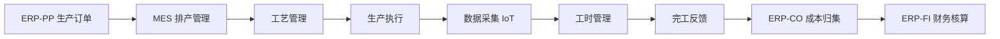
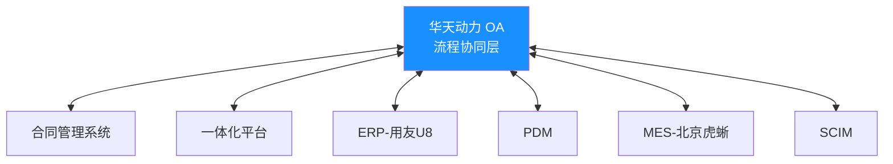

# 制造企业数字化运营平台
## 核心系统集成方案

<div class="text-center mt-8">
  <span class="text-lg opacity-70">版本 V2.1 · 2026-04-30</span>
</div>

<div class=" fixed bottom-5 right-5 flex gap-2">
  <span class="text-sm opacity-50">基于 Slidev 构建</span>
</div>

<!--
  使用说明：
  - 本模板使用 seriph 主题（深色背景，自动文本颜色）
  - 背景图片通过 URL 指定，可替换为本地路径
  - 封面页使用 layout: cover 自动居中布局
-->

---
layout: default
---

# 目录

<div class="grid grid-cols-2 gap-4 text-left">
- 系统供应商清单
- 总体集成拓扑
- 研发域集成链
- 采购供应链集成
- 制造执行闭环
- 质量管理集成
- OA系统集成关系
- 系统层次定位
</div>

<div class="mt-8 text-center opacity-60">
  → 点击任意页进入具体内容
</div>

<!--
  布局说明：
  - grid grid-cols-2：两列网格布局
  - text-left：文本左对齐
  - gap-4：网格间距
-->

---
layout: two-cols
---

# 系统供应商

| 系统 | 供应商 | 定位 |
|------|--------|------|
| ERP | 用友U8 | 企业资源计划核心层 |
| MES | 北京虎蜥 | 制造执行层 |
| OA | 华天动力 | 流程协同层 |
| PLM | 暂定 | 产品全生命周期管理 |

::right::

# 核心定位

<div class="p-4 rounded-lg bg-light-blue-500/20">
**用友U8** — 企业资源计划核心层

- PS/FI/CO/PP/MM/SD 模块
- 财务核算、成本控制
- 生产计划、采购管理
</div>

<div class="p-4 rounded-lg bg-green-500/20 mt-4">
**北京虎蜥 MES** — 制造执行层

- 排产管理、工艺管理
- 生产执行、数据采集
</div>

<!--
  two-cols 布局：
  - 左侧：表格展示系统供应商
  - 右侧：卡片式突出核心定位
  - bg-颜色-500/20：半透明背景色
-->

---
layout: center
---

# 总体集成拓扑

```
                    ┌─────────────────────────────────────────┐
                    │       客户交付一体化平台 / 项目管理          │
                    └──────────────┬──────────────────────────┘
                                   │ ERP-用友U8 项目主线
                    ┌──────────────▼──────────────────────────┐
                    │          ERP 核心层（用友U8）             │
                    │    PS │ FI │ CO │ PP │ MM │ SD            │
                    └──┬──────┬──────┬──────┬──────┬───────────┘
                       │      │      │      │      │
                    研发域   财务域  成本域  制造域  采购域
                       │
              ┌────────▼────────┐
              │  华天动力 OA     │  ← 流程协同层（横向贯穿各域）
              └─────────────────┘
```

<!--
  center 布局：内容居中显示
  代码块展示 ASCII 架构图
-->

---
layout: two-cols
---

# 研发域集成链

```
需求管理软件（研发工具集）
    ↓ 需求分解
┌─────────────────────────────────────────────┐
│         PLM 平台（暂定供应商）                │
│  （产品全生命周期管理）                        │
│  需求管理 → 概念设计 → 详细设计 → 工程发布     │
└──────────────────┬──────────────────────────┘
                   ↓ 受控发布（EBOM + 三维模型）
                 PDM（BOM管理 & 工艺数据管理）
                   ↓
        ┌──────────┴──────────┐
        ↓                     ↓
      CAPP                 ERP-PP（用友U8）
  （工艺设计）           （生产计划）
        ↓                     ↓
   工程解构               MES（北京虎蜥）
```

::right::

# MBD 关键作用

| 传递内容 | 接收方 | 意义 |
|---------|-------|------|
| 含标注的三维模型 | CAPP | 工艺设计直接读取模型 |
| 材料/公差定义 | CAPP → 计划管控 | 驱动下料管理 |
| 更改管理 | PDM → EBOM | BOM版本自动更新 |
| 设计资源 | PDM归档受控 | 唯一受控版本 |

> **MBD 是"无纸化制造"的起点**

<!--
  两列布局展示研发域流程和 MBD 表格
-->

---
layout: default
---

# 采购供应链集成

``` journey
participant ERP as ERP-PP（用友U8）
participant MM as ERP-MM（采购管理）
participant SCIM as SCIM（供应商协同门户）
participant Contract as 合同管理系统
participant WMS as WMS（仓储管理）
participant MES as MES（北京虎蜥）

ERP->MM: 物料需求
MM->SCIM: 采购订单 / 供应商协同
SCIM->Contract: 合同数据
Contract->WMS: 到货
WMS->MES: 领料出库
```

<!--
  使用 Mermaid 语法绘制流程图
  或使用 ASCII 图表
-->

---

# 制造执行集成闭环



<!--
  Mermaid 图表语法绘制制造流程闭环
  支持多种图表类型：flowchart, sequence, gantt 等
-->

---
layout: two-cols
---

# 质量管理横向集成

```
研发阶段          采购阶段              制造阶段           交付阶段
  LCA           供应商质量            现场质量            智能质量
品质策划   →   首件检验          →   产品检验        →   监控评价
文件审批      不合格品控制            数据发放            质量审核
               交付文件               工装制造            质量改进
                    ↓                    ↓                  ↓
              PDM（质量文件受控）←── 统一质量数据 ──→ ERP-用友U8-CO（质量成本）
```

::right::

# 关键指标

| 指标 | 目标值 | 当前值 |
|------|--------|--------|
| 首件检验合格率 | ≥99% | 98.5% |
| 批次合格率 | ≥99.5% | 99.2% |
| 质量问题关闭率 | ≥95% | 93.8% |

<!--
  两列布局：左侧流程图，右侧指标表格
-->

---
layout: center
---

# 华天动力 OA 系统

## 三大核心技术

<div class="grid grid-cols-3 gap-6 mt-8">
<div class="p-6 rounded-lg bg-blue-500/20">

### 工作流引擎
图形化流程设计，支持固定/分支/并行流程
</div>
<div class="p-6 rounded-lg bg-green-500/20">

### 智能报表
多维度数据分析，可视化报表生成
</div>
<div class="p-6 rounded-lg bg-orange-500/20">

### 低代码平台
可视化构建专属业务应用
</div>
</div>

<!--
  三列卡片布局展示核心功能
  bg-颜色/20：半透明背景
-->

---
layout: default
---

# OA 与本架构的集成关系



<!--
  Mermaid 架构图：展示 OA 与各系统的双向集成关系
-->

---
layout: two-cols
---

# 系统集成关系一览表

| 集成关系 | 传递数据 | 方向 |
|---------|---------|------|
| PLM → PDM | EBOM、三维模型 | 单向 |
| PDM → CAPP | MBD模型 | 单向 |
| PDM → ERP-PP | MBOM、分工 | 单向 |
| ERP-PP → MES | 生产订单 | 单向 |
| MES → ERP-PP/CO | 完工报告 | 反馈 |
| ERP-MM → SCIM | 采购订单 | 单向 |
| WMS ↔ ERP | 库存 | 双向 |
| **OA ↔ 全系统** | **审批流** | **双向** |

::right::

# 各系统层次定位

```
┌────────────────────────────────────┐
│  PLM：产品定义                      │
├────────────────────────────────────┤
│  OA：流程协同                       │
├────────────────────────────────────┤
│  ERP：用友U8 资源计划               │
├────────────────────────────────────┤
│  MES：北京虎蜥 制造执行             │
├────────────────────────────────────┤
│  WMS：仓储管理                      │
├────────────────────────────────────┤
│  SCIM：供应商协同                   │
└────────────────────────────────────┘
         ↓ 数据汇聚
┌────────────────────────────────────┐
│    数据底座 + 数字孪生              │
└────────────────────────────────────┘
```

<!--
  两列对比布局：集成关系表 + 层次定位图
-->

---
layout: cover
---

# 总结

<div class="text-left text-lg leading-relaxed">

**PLM 定义产品** — 产品全生命周期管理

**OA-华天动力协同流程** — 工作流引擎横向贯穿

**ERP-用友U8 计划资源** — 财务核算、成本控制

**MES-北京虎蜥执行制造** — 车间执行、过程管控

**WMS 管控物流** — 物料流转、仓储管理

**SCIM 协同供应商** — 外部供应链协同

</div>

<div class="mt-12 text-center text-xl">
**六者以数据驱动方式串联，支撑端到端运营**
</div>

---

# 谢谢

<div class="mt-8 text-center opacity-70">
  文档更新时间：2026-04-30
</div>

<!--
  结束页：总结要点 + 致谢
  封面页布局自动居中
-->

<style>
/* 自定义样式：渐入动画 */
.slidev-enter-enter {
  opacity: 0;
  transform: translateY(20px);
}
</style>
